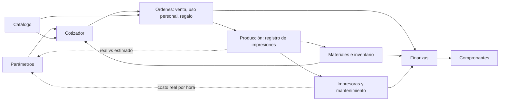

# 2. Dominio: módulos y reglas de negocio

## 2.1 Mapa de módulos



| Módulo | Responsabilidad |
|---|---|
| Parámetros | Tarifas y supuestos de costo, con vigencia; régimen tributario |
| Materiales e inventario | Marcas, materiales, colores, presentaciones, compras, rollos, insumos, repuestos, movimientos |
| Impresoras y mantenimiento | Activos, horas de uso, planes preventivos, incidentes |
| Cotizador | Motor de costos y de precios, cotizaciones con versiones |
| Catálogo | Productos, variantes, fichas técnicas, fotos, recetas de producción, precios de lista |
| Órdenes | Ventas, uso personal y regalos, con sus estados |
| Producción | Registro de cada impresión: rollos usados, tiempo, resultado |
| Finanzas | Cuentas, ingresos, egresos, cuentas por cobrar, inversión, reportes |
| Comprobantes | Nota de venta interna ahora; boleta o factura cuando haya RUC |

---

## 2.2 Parámetros

Los parámetros se agrupan en un **perfil de costos con fecha de vigencia**. Cambiar un valor crea una nueva versión; las cotizaciones anteriores conservan la versión con la que se calcularon.

| Parámetro | Valor inicial | Nota |
|---|---|---|
| Moneda / zona horaria | PEN (S/) / America/Lima | — |
| Tarifa eléctrica | ⚠️ **S/ 0.7556 por kWh** *(provisional)* | Pendiente: reemplazar con el valor de tu recibo. Referencia: Luz del Sur, BT5B residencial, más de 140 kWh al mes, IGV incluido (ver [Investigación §1.5](01-investigacion.md#tarifa-eléctrica-en-surquillo)) |
| Potencia promedio de la A1 mini | **57 W** | Es un dato de cada impresora, no del perfil; conviene medirlo |
| Costo de la impresora + AMS lite | **S/ 1,500** | Real. Llevaba **175 h** de uso al registrarla |
| Vida útil a amortizar | ⚠️ 5,000 h *(supuesto)* | Con S/ 1,500 son S/ 0.30 por hora. Si dura menos, el costo por hora sube |
| Horas de impresión por año | ⚠️ 500 h *(provisional)* | Pendiente: ¿desde cuándo tienen la impresora? Con eso salen las horas reales |
| Mantenimiento por hora | ⚠️ S/ 0.24 *(provisional)* | Regla inicial: ~8 % del valor de la impresora al año (S/ 120) ÷ 500 h. Se reemplaza por el gasto real |
| Valor de la hora de trabajo | ⚠️ S/ 15 *(provisional)* | S/ 3,000 al mes ÷ 208 h. La otra persona bordea S/ 25 |
| Tasa de fallo | 10 % | Se recalcula con el historial |
| Merma de material | 3 % | **Verificado:** los gramos del laminado ya incluyen la purga y la torre de limpieza. La merma solo cubre el cebado inicial y los restos del final del rollo |
| Margen objetivo | **50 %** | Decisión del taller. Margen sobre el precio, no markup |
| Precio mínimo por orden | ⚠️ *pendiente* | — |
| Redondeo | Múltiplos de S/ 0.50 | — |
| Régimen tributario | **Sin RUC** | Sin RUC, NRUS, RER, RMT o General |
| Tasa de IGV | 18 % | Solo se aplica en RER, RMT y General |
| Valorización del filamento al cotizar | Costo promedio del stock disponible | Alternativas: último costo de compra o costo de reposición manual |

**Dos personas, dos tarifas.** La hora de cada quien se guarda en su ficha de miembro. Las cotizaciones usan la tarifa del perfil (la del taller), pero al cerrar un trabajo se puede costear con la tarifa de quien realmente lo hizo. Con sueldos de S/ 3,000 y S/ 5,000 al mes sobre unas 208 horas, las referencias son **S/ 15 y S/ 25 por hora**.

---

## 2.3 Materiales e inventario

### Catálogo de filamentos

Tu idea de "cruzar tablas" es exactamente la normalización:

```
Marca          (Bambu Lab, eSun, Sunlu, Polymaker…)
Material       (PLA, PETG, TPU…)   + densidad, higroscópico, abrasivo
Línea/acabado  (Basic, Matte, Silk, CF…)
Color          (nombre + hex)
Presentación   (peso neto 1 kg / 500 g / 250 g, diámetro 1.75, tara del carrete, ¿recarga?)
──────────────────────────────────────────────────────────
SKU de filamento = Marca + Material + Línea + Color + Presentación
```

### Compras y rollos: el costo vive en cada rollo

```
Compra (proveedor, fecha, envío, otros costos, cuenta con la que pagaste)
 └── Línea de compra (SKU, cantidad, precio unitario)
      └── Rollo #1, Rollo #2…  (cada uno con su costo real)
```

- **Costo del rollo** = precio unitario + parte proporcional del envío y otros costos, repartidos por monto o por peso.
- Así, **un mismo SKU puede tener un rollo de S/ 65 y otro de S/ 79**, y cada impresión se costea con el rollo que realmente usó.
- **Stock de un SKU** = suma de los gramos restantes de sus rollos.
- **Costo por gramo de un SKU para cotizar** = promedio ponderado de los rollos disponibles (o el método elegido en Parámetros).

**¿Y si el mismo producto costó distinto?** Es lo normal, y el modelo ya lo resuelve: el verde lima entró a S/ 75 por ser un lote de prueba, aunque el mismo rollo en la misma tienda debería costar S/ 60. Cada rollo guarda lo que pagaste por él, vengan de proveedores distintos o de la misma tienda en otra fecha. Para cotizar eliges el método:

| Método | Qué usa | Cuándo conviene |
|---|---|---|
| Promedio ponderado | El costo medio de los gramos que tienes en el estante | Por defecto: refleja lo que realmente tienes |
| Último costo | Lo que pagaste en la última compra | Cuando los precios se mueven rápido |
| Costo de reposición | Lo que te costaría comprarlo hoy (campo del SKU) | **El más sano para cotizar:** con la venta tienes que poder reponer el rollo |

Para medir la ganancia real de un pedido ya entregado siempre se usa el costo del rollo que se consumió, no el método de cotización.
- Datos del rollo: código o QR, estado (`sellado`, `abierto`, `en uso`, `agotado`), fecha de apertura, último secado, ubicación (ranura 1–4 del AMS lite o estante) y peso restante (teórico y pesado).
- Una compra registra también el **egreso de dinero** en Finanzas.

### Otros artículos

| Tipo | Ejemplos | Unidad |
|---|---|---|
| Insumos de producto | Imanes, argollas, insertos, pintura, pegamento | Unidades o ml |
| Empaque | Bolsas, cajas, etiquetas, stickers | Unidades |
| Repuestos y consumibles de impresora | Boquilla, hotend, PTFE, cuchilla, placa, grasa | Unidades |
| Producto terminado | Artículos de catálogo ya impresos | Unidades |

### Movimientos

El stock nunca se edita: siempre se calcula a partir de movimientos.

| Tipo | Origen |
|---|---|
| `purchase` | Compra |
| `consumption` | Impresión exitosa |
| `waste` | Impresión fallida, purga, restos al final del rollo |
| `adjustment` | Pesaje o conteo físico |
| `maintenance` | Repuesto usado en un mantenimiento |
| `reservation` / `release` | Orden confirmada o cancelada (no cambia el stock físico, sí el **disponible**) |

**Alertas:** stock mínimo por SKU (en gramos) o por material + color, sin importar la marca.

---

## 2.4 Impresoras y mantenimiento

Como no nos conectamos a la impresora, **las horas de uso se calculan con las impresiones registradas**, más un ajuste manual inicial.

- **Impresora:** modelo (A1 mini), número de serie, activo asociado (costo y fecha de compra), potencia promedio, componentes instalados (boquilla, placa, AMS lite).
- **Plan preventivo:** tarea + disparador (**cada X horas o cada Y días, lo que ocurra primero**) + checklist + repuestos esperados.
- **Registro de mantenimiento:** fecha, horas de la impresora en ese momento, duración, repuestos usados (que generan movimientos de stock), costo y notas.
- **Incidente:** síntoma, causa, solución, tiempo fuera de servicio y costo; se puede enlazar a una impresión fallida.

### Plan inicial para la A1 mini

> Es una propuesta: hay que validarla con la [guía oficial](https://wiki.bambulab.com/en/a1-mini/maintenance) antes de cargarla.

| Disparador | Tarea |
|---|---|
| Cada impresión | Limpiar la placa (agua y jabón neutro, sin tocarla con los dedos); retirar la purga |
| Semanal | Limpiar residuos del hotend, del cortador y de la zona de purga; quitar polvo de los ventiladores |
| Cuando la impresora avise, o según la guía | Limpiar y lubricar los ejes |
| Mensual | Revisar correas, tornillería, cables en movimiento, engranajes del extrusor y tubos del AMS lite |
| Según desgaste | Boquilla o hotend, tubo PTFE, cuchilla del cortador, placa |
| Por evento | Calibrar tras cambiar hotend o placa; actualizar firmware |

---

## 2.5 Cotizador

### Cómo entran los datos de una pieza o placa

1. **Importar `.gcode.3mf`** (recomendado): en Bambu Studio, laminas y usas *Export plate sliced file*. Luego arrastras el archivo a la app y **el navegador lee** `slice_info.config`: tiempo y gramos por placa, además de tipo, color y gramos por filamento. El tiempo que se usa es `prediction` (el estimado total, no solo el de impresión) y el SKU se propone cruzando `tray_info_idx` con el color hex. Tú confirmas.
2. **Manual:** gramos por color, tiempo y número de placas.
3. **Desde el catálogo:** se usa la receta de producción de la variante.

### Fórmula de costo

```
Material    = Σ por filamento [ gramos × (1 + merma) × costo_por_gramo_del_SKU ]
Energía     = horas × potencia_kW_impresora × tarifa_kWh
Máquina     = horas × ( costo_activo / vida_útil_h  +  mantenimiento_por_hora )
Producción  = (Material + Energía + Máquina) / (1 − tasa_fallo)
Trabajo     = (min_preparación + min_postproceso) / 60 × tarifa_hora
Insumos     = Σ extras (imanes, argollas, empaque…)
───────────────────────────────────────────────────────────────
COSTO       = Producción + Trabajo + Insumos
```

Cada costo se clasifica según si sale del bolsillo:
- **Costo desembolsable:** material, energía e insumos. Es dinero que realmente sale.
- **Costo asignado:** máquina (amortización) y trabajo (tu tiempo). No es un pago puntual, pero sí es un costo.

Esta separación importa en regalos y uso personal (§2.7).

### Del costo al precio (solo en ventas)

```
Precio base      = COSTO / (1 − margen)
Ajustes          = − descuento por volumen  + recargo por urgencia  (+ comisión del canal)
Valor de venta   = máx(precio ajustado, precio mínimo)
IGV              = Valor de venta × 18 %      ← solo en RER, RMT y General
Precio final     = Valor de venta + IGV  →  redondeo
```

- **Sin RUC:** no hay IGV. **NRUS:** tampoco se desglosa IGV, porque va incluido en la cuota.
- En Perú, al consumidor se le muestra el precio **con impuestos incluidos**.

### Ejemplo

> Valores **ilustrativos** hasta tener los reales: PLA a S/ 75 por kg, A1 mini + AMS lite a S/ 2,000 con 5,000 h de vida útil, S/ 200 al año de mantenimiento en 1,000 h, trabajo a S/ 12 por hora.

Pieza de 80 g en dos colores, 4 h de impresión, 10 min de preparación, 10 min de post-proceso y S/ 1.00 de empaque:

| Concepto | Cálculo | S/ |
|---|---|---|
| Material | 80 × 1.05 × 0.075 | 6.30 |
| Energía | 4 × 0.057 × 0.7556 | 0.17 |
| Máquina | 4 × (2000/5000 + 200/1000) = 4 × 0.60 | 2.40 |
| Subtotal de producción | | 8.87 |
| Con fallo del 10 % | 8.87 / 0.90 | **9.86** |
| Trabajo | (20 / 60) × 12 | 4.00 |
| Insumos | Empaque | 1.00 |
| **COSTO** | | **14.86** |
| Precio con margen del 40 %, sin RUC | 14.86 / 0.60 = 24.77 | **25.00** |
| Precio con IGV (RER, RMT o General) | 24.77 × 1.18 = 29.23 | **29.50** |

### Ejemplo con datos reales

*Love potion*, la placa de 3 colores: **11.34 g y 43 minutos**, en PLA rojo de S/ 50 el kilo, con 10 minutos de trabajo entre preparación y post-proceso, un dulce de S/ 1.00 adentro y S/ 0.50 de empaque. Con los parámetros vigentes: máquina S/ 0.54 la hora, trabajo S/ 15 la hora, merma 3 %, fallos 10 % y margen 50 %.

| Concepto | Cálculo | S/ |
|---|---|---|
| Material | 11.34 g × 1.03 × 0.050 | 0.58 |
| Energía | 0.72 h × 0.057 kW × 0.7556 | 0.03 |
| Máquina | 0.72 h × 0.54 | 0.39 |
| Con fallo del 10 % | 1.00 / 0.90 | **1.11** |
| Trabajo | (10 / 60) h × 15 | 2.50 |
| Insumos | Dulce 1.00 + empaque 0.50 | 1.50 |
| **COSTO** | | **5.11** |
| Precio con margen del 50 % | 5.11 / 0.50 = 10.22 | **10.50** |

Esto confirma el precio de S/ 10 que ya tenían pensado y, sobre todo, muestra dónde está el límite: **a S/ 10 el costo no puede pasar de S/ 5**. Como la producción, el dulce y el empaque ya suman S/ 2.61, quedan **S/ 2.39 para mano de obra, o sea unos 9 minutos** a S/ 15 la hora. Si la misma pieza la trabaja la persona cuya hora vale S/ 25, el presupuesto baja a menos de 6 minutos.

Dos reglas prácticas que salen de la fórmula con margen del 50 %:

- **Cada sol de dulce sube el precio en S/ 2.** Por eso la versión con chocolates más caros se va sola a la franja de S/ 15 a S/ 20.
- **Cada minuto de trabajo sube el precio S/ 0.50.** El filamento, en cambio, pesa S/ 0.58 en toda la pieza: el negocio no se gana ni se pierde ahí, sino en el tiempo de manipulación.

### Cotizaciones

- Numeración por taller y año: `COT-2026-0001`. Si cambia el precio de una cotización enviada, se crea `v2`.
- Estados: `borrador → enviada → aceptada | rechazada | vencida`.
- Guardan una **copia de los parámetros** usados, tienen fecha de validez y se generan en **PDF en el navegador**.
- Una cotización puede combinar líneas de catálogo, piezas a medida y servicios (post-proceso, envío).

---

## 2.6 Catálogo

### Producto y variantes

- **Producto:** nombre, descripción, categoría, etiquetas, fotos, estado (`borrador`, `publicado`, `archivado`), **visible para el bot** (sí o no), plazo de producción en días.
- **Ficha técnica:** campos fijos (dimensiones en mm, peso aproximado, material, acabado, uso interior o exterior, cuidados) más **atributos libres** con nombre, valor y unidad (por ejemplo, "Personalizable: nombre de hasta 10 letras").
- **Variantes:** combinaciones de tamaño, material o color, cada una con su **precio de lista** y su **receta**.

### Receta de producción

```
Variante
 └── Receta (versión, vigencia)
      ├── Placas: unidades por placa, tiempo, miniatura, nombre del 3MF de origen
      │    └── Filamentos: ranura, material, color, SKU sugerido, gramos
      ├── Insumos y empaque por unidad
      └── Minutos de preparación y de post-proceso
```

- **Costo actual** de la variante = receta evaluada con los parámetros y costos de stock vigentes.
- **Precio de lista** = decisión fija, con historial de cambios.
- **Alerta:** "el margen de esta variante bajó del objetivo" cuando suben los costos.
- **Colores disponibles** = colores con stock suficiente para el material de la receta. El bot puede usarlos para decir "disponible en negro, blanco y rojo".

### "Añadir al catálogo"

El botón está disponible en una **línea de cotización, una orden o una impresión**:
1. Crea un producto en borrador con una variante.
2. Arma la receta con los datos del `.gcode.3mf` o de la entrada manual, incluidos insumos y tiempos.
3. Sugiere un precio de lista: costo ÷ (1 − margen), redondeado.
4. Tú completas fotos, descripción y características, y lo publicas.

---

## 2.7 Órdenes: venta, uso personal y regalo

Una **orden** siempre tiene un **propósito**:

| Propósito | Precio | Cómo cuenta en Finanzas | Ejemplo |
|---|---|---|---|
| **Venta** | Según §2.5 | Ingreso; el costo va a *costo de ventas* | Pedido de un cliente, venta de catálogo |
| **Uso personal** | S/ 0 | **Retiro del dueño**; no reduce la utilidad del negocio | Soporte para tu escritorio |
| **Regalo – Empresa** | S/ 0 | **Gasto de marketing o relaciones comerciales** | Muestra para un posible cliente corporativo |
| **Regalo – Personal** | S/ 0 | **Retiro del dueño** | Regalo de cumpleaños |
| **Regalo – Otros** | S/ 0 | Categoría configurable | Donación, sorteo |

- Las categorías de regalo son editables y cada una define su tratamiento contable.
- En uso personal y regalos se muestran el **costo desembolsable**, el **costo completo** y el **valor de referencia de venta**. Por ejemplo: "Este regalo te costó S/ 7.47 en material, luz y empaque, S/ 14.86 en costo completo, y equivale a una venta de S/ 25.00".
- **Estados:** `confirmada → en cola → en producción → post-proceso → lista → entregada → cerrada`, más `en espera` y `cancelada`.
- **Cobros (solo ventas):** anticipo y saldo, con medio de pago: **efectivo, Yape, Plin o transferencia**. Cada cobro es un movimiento de dinero.
- Al confirmar una orden se **reserva** el material.

---

## 2.8 Producción: registro de impresiones

Cada impresión, exitosa o fallida, registra: orden y línea (o ninguna, si es una prueba), impresora, placa, **tiempo estimado** (del 3MF) y **tiempo real**, **rollos usados con gramos estimados y reales**, resultado (`exitosa`, `fallida`, `cancelada`), causa del fallo (adhesión, atasco, spaghetti, capa desplazada, corte de luz…), porcentaje completado y notas.

Al cerrar una impresión:
1. Se generan los movimientos de stock: consumo si fue exitosa, merma si falló.
2. Se suman las horas a la impresora, lo que puede disparar un mantenimiento.
3. Se guarda su **costo real** (material, energía y máquina) con los parámetros vigentes.
4. Se actualizan las métricas de precisión (real ÷ estimado) y la tasa de fallo.

---

## 2.9 Finanzas

### Cuentas y movimientos de dinero

- **Cuentas:** dónde está el dinero. Iniciales: **Efectivo, Yape, Plin y Banco** (transferencias), configurables.
- **Movimientos:**

| Tipo | Ejemplos |
|---|---|
| Ingreso | Cobro de una orden, anticipo |
| Egreso | Filamento, repuestos, envíos, comisiones, publicidad, herramientas |
| Transferencia | De Yape al banco |
| Aporte del dueño | Dinero personal que pones en el negocio (por ejemplo, la compra de la impresora) |
| Retiro del dueño | Dinero o producto que sacas para ti |

- Categorías de ingreso y egreso configurables.
- **Activos:** impresora, AMS lite, secador… con costo y vida útil. Alimentan la tarifa de máquina.

### Dos miradas que no se deben mezclar

| Mirada | Pregunta que responde | Ejemplo |
|---|---|---|
| **Flujo de caja** | ¿Cuánto dinero entró y salió? | Pagaste S/ 150 en filamento en enero |
| **Rentabilidad** | ¿Cuánto gané con lo que vendí? | La orden X costó S/ 14.86 y se vendió en S/ 25 |

La luz es un buen ejemplo: el recibo se paga una vez al mes (flujo de caja), pero su costo se reparte entre las impresiones (rentabilidad).

### Reportes

- Flujo de caja mensual por cuenta.
- Estado de resultados simple: ventas − costo de ventas − gastos = utilidad.
- Rentabilidad por producto, cliente y canal.
- Costo de uso personal y regalos, por categoría.
- **Recuperación de la inversión:** cuánto falta para pagar la impresora.
- Cuentas por cobrar (órdenes entregadas con saldo pendiente).
- Precisión de las estimaciones y tasa de fallo.
- **Ventas del mes frente al límite del NRUS** (S/ 8,000), cuando aplique.

---

## 2.10 Comprobantes y SUNAT

| Situación | Qué emite la app | Datos del cliente |
|---|---|---|
| **Sin RUC** (hoy) | **Nota de venta interna** en PDF, con la leyenda "Documento interno – no es comprobante de pago" | Opcionales |
| **NRUS** | Boletas, **sin** desglose de IGV | DNI cuando corresponda |
| **RER, RMT o General** | Boletas y facturas **con** IGV al 18 % | DNI, RUC o carné de extranjería |

- El **comprobante** guarda tipo, serie, número, fecha, documento del cliente, valor de venta, IGV, total, estado ante SUNAT y enlaces al PDF y al XML.
- **La emisión electrónica no se construye en la app.** A futuro se conectará con un proveedor de facturación electrónica mediante su API, o se registrará el comprobante emitido por fuera.
- Mientras tanto, los clientes y las órdenes ya guardan los campos necesarios, así que formalizarse no obliga a rediseñar nada.

---

## 2.11 Flujos principales

**A. Compra de filamento**
Registrar la compra (proveedor, líneas, envío, cuenta) → se crean los rollos con su costo → movimientos `purchase` → egreso de dinero → se recalculan el stock y el costo promedio.

**B. Cotización a medida**
Solicitud → laminar en Bambu Studio → importar `.gcode.3mf` → confirmar SKUs, tiempos e insumos → costo → precio → PDF → enviar → aceptada → orden y reserva → impresiones → entrega y cobro → cierre (real vs estimado) → *¿Añadir al catálogo?*

**C. Venta de catálogo**
Elegir variante, color y cantidad → precio de lista con descuento por volumen → orden → reserva → producción (o salida de producto terminado) → entrega y cobro.

**D. Regalo o uso personal**
Orden con propósito y categoría → misma producción → costo desembolsable y costo completo → movimiento contable según la categoría.

**E. Cierre de mes**
Conciliar cuentas → pesar rollos abiertos y registrar ajustes → revisar la tarifa eléctrica y los parámetros → revisar márgenes del catálogo → revisar mantenimientos pendientes → **exportar respaldo**.
