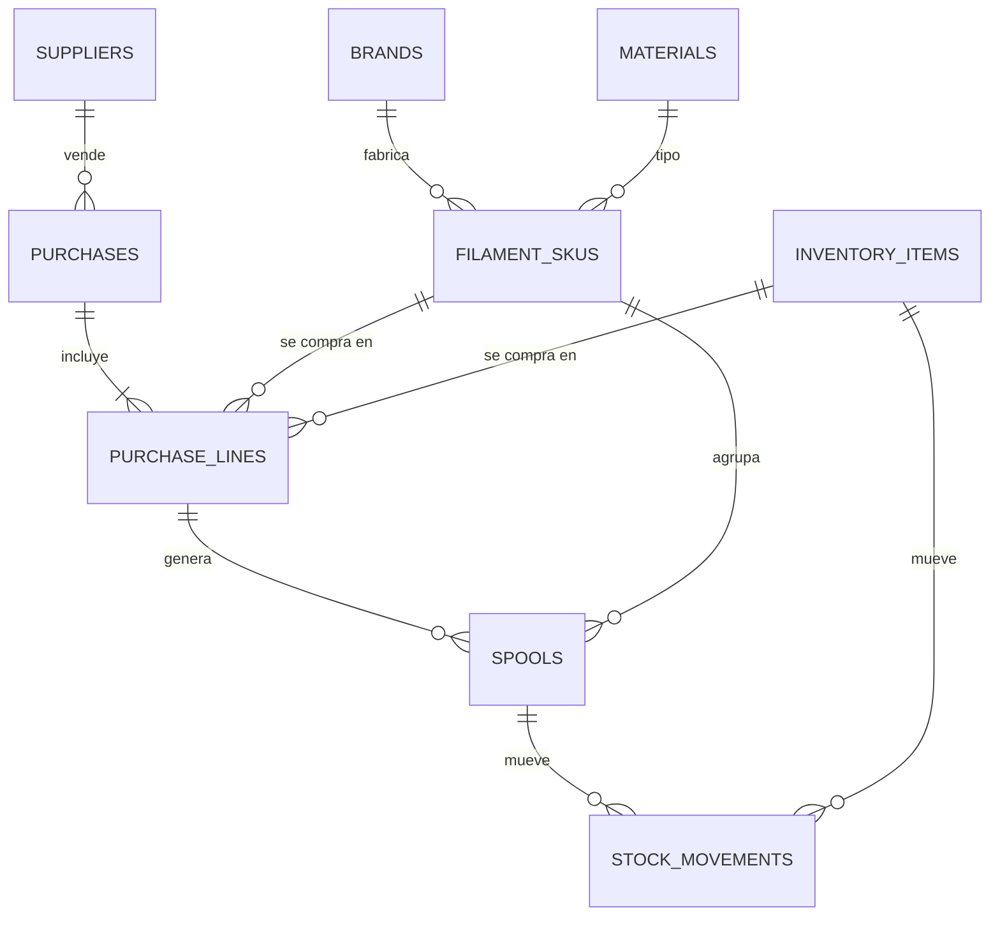
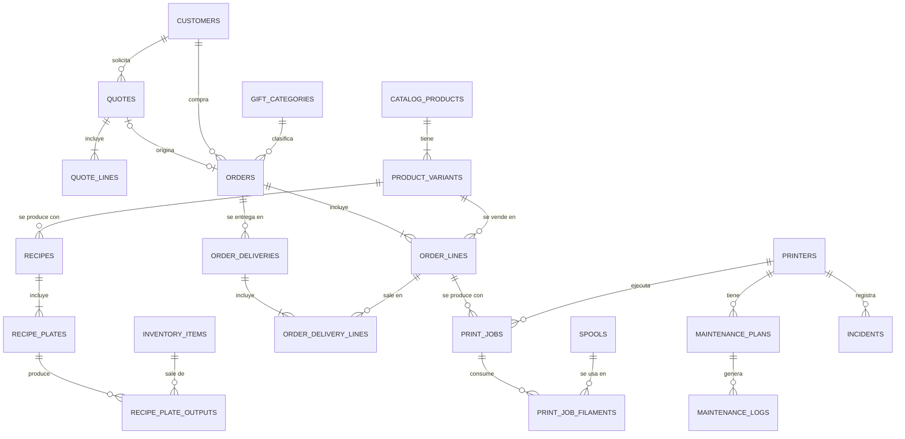
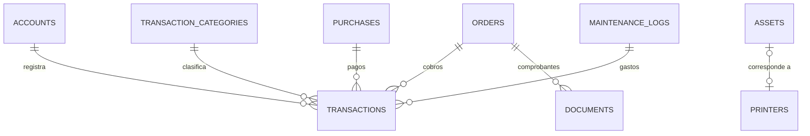

# 3. Modelo de datos (conceptual)

> Es un modelo **conceptual**, no SQL definitivo. Los nombres van en inglés (serán tablas reales) y las descripciones en español.

## 3.1 Convenciones

| Tema | Convención |
|---|---|
| Nombres | `snake_case`, tablas en plural y en inglés |
| Identificadores | `id uuid` |
| Multi-taller | **Todas** las tablas de negocio llevan `workspace_id` y políticas RLS por membresía, aunque hoy haya un solo usuario |
| Permisos | Cada tabla es del día a día, de configuración o un libro, con las políticas que le tocan (§3.5, ADR-025) |
| Nombres únicos | Sin distinguir mayúsculas ni espacios alrededor: índices sobre `lower(btrim(name))` en canales, cuentas, categorías de dinero y de regalo, marcas, materiales, acabados, impresoras, insumos y el color del filamento (`*_name_ci_key`, `filament_skus_identity_ci_key`) |
| Auditoría | `created_at`, `created_by`, `updated_at` |
| Borrado | **Nunca se borra un registro financiero.** Se usa `archived_at` o una operación inversa (anulación) |
| Dinero | `numeric(12,2)` en soles; decimales exactos en TypeScript, nunca `float` |
| Gramos | `numeric(10,2)` |
| Tiempo | `integer` en segundos |
| Porcentajes | `numeric(5,4)` (0.1800 = 18 %) |
| Datos flexibles | `jsonb` para atributos de catálogo, copias de parámetros y metadatos del 3MF |
| Saldos | **Vistas** calculadas a partir de movimientos, no columnas editables |
| Numeración | Función por taller y año (`COT-2026-0001`, `ORD-2026-0001`) |

## 3.2 Tablas por módulo

### Núcleo y parámetros

| Tabla | Columnas clave |
|---|---|
| `workspaces` | name, currency (`PEN`), timezone, tax_regime (`none`, `nrus`, `rer`, `rmt`, `general`), ruc, legal_name. La aplicación formatea siempre en soles y en hora de Lima, así que Configuración muestra la moneda y la zona y no ofrece cambiarlas; las funciones de la base sí leen `timezone` (`app.workspace_day`) |
| `workspace_members` | workspace_id, user_id, role (`owner`, `operator`, `viewer`; qué puede cada uno, en §3.5). La base no deja al taller sin dueño (`workspace_members_keep_an_owner`) |
| `workshop_settings` | print_first_start, print_last_start, print_end_by (la ventana de impresión: hoy 6:00, 23:00 y medianoche), changeover_default_minutes, hold_default_days, hold_default_time (un separo vence a las 23:00 del día siguiente), order_payment_category_id y purchase_payment_category_id (en qué categoría de Caja queda un cobro de pedido y un pago de compra cuando nadie elige otra; sin elegir, la única categoría activa de esa dirección; la de los cobros queda marcada como de ventas al elegirla), **default_channel_id** (el canal de las ventas directas, que la Venta rápida trae elegido y `quick_sale` usa si la venta no nombra uno; sin elegir, ninguno, y la Venta rápida y Configuración avisan que falta. Clave foránea compuesta contra `sales_channels (id, workspace_id)`: no puede ser de otro taller. `app.default_channel` aplica la regla). Una fila por taller (ADR-021) |
| `cost_profiles` | valid_from, energy_rate_kwh, labor_rate_hour, failure_rate, material_waste_rate, target_margin, min_order_price, rounding_step, igv_rate, material_valuation (`weighted_avg`, `last_cost`, `replacement`). Una versión programada (que todavía no empezó) se corrige o se quita; la vigente y las anteriores no se tocan, y ninguna empieza antes de hoy (el día del taller). Lo impone `cost_profiles_versions_stay_put` |

### Materiales e inventario

| Tabla | Columnas clave |
|---|---|
| `brands` | name |
| `materials` | code (PLA, PETG…), density_g_cm3, hygroscopic, abrasive |
| `filament_skus` | brand_id, material_id, finish_id (Basic, Matte…), color_name (obligatorio: un `check` rechaza el vacío y los solo espacios), color_hex, net_weight_g, diameter_mm, spool_tare_g, is_refill, min_stock_g. Un disparador (`filament_skus_guard_ranges`) rechaza con su `P0001` lo que es un error de tipeo: diámetro fuera de 1 a 3 mm, peso neto fuera de 1 a 10 000 g, tara de más de 5 000 g, mínimo de más de 100 000 g y costo de reposición de más de S/ 10 000 por kg. Solo juzga el número que se escribe: uno viejo fuera de rango se puede renombrar o desactivar sin corregirlo |
| `suppliers` | name, contact, notes |
| `purchases` | supplier_id, purchased_at, shipping_cost, other_costs, allocation (`by_amount`, `by_weight`), document_ref, note, **purchase_key** (la llave con que la pantalla la pidió: la misma llave devuelve la misma compra), **total_by_line** (cómo suma su total `purchase_payment_status`: falso solo en las compras que ya existían en `20261023170000`, que conservan el total con que se pagaron). Se escribe solo con `register_purchase`; lo pagado se deriva de los egresos (`purchase_payment_status`) |
| `purchase_lines` | purchase_id, filament_sku_id \| inventory_item_id, quantity (tres decimales; los rollos y lo que se cuenta por unidad, par o caja, enteros), unit_price (seis decimales; el de un rollo, en céntimos), allocated_extra_cost, expires_on |
| `purchase_payment_requests` | request_key, transaction_id. La llave con que se pidió cada pago de compra: si llega dos veces, `record_purchase_payment` devuelve el pago que ya escribió. Como un libro: se lee y se agrega, nadie la cambia ni la borra (sin el privilegio, `20261023200000_request_keys_are_kept.sql`) |
| `item_movement_requests` | request_key, inventory_item_id, result. La llave con que se pidió cada movimiento a mano de un insumo, y lo que respondió: si llega dos veces (la respuesta se perdió y se reintentó), `move_item_stock` devuelve esa respuesta y no mueve el stock otra vez. Como un libro, igual que la anterior |
| `spools` | filament_sku_id, purchase_line_id, code (la etiqueta pegada en el rollo; la pone `register_purchase`, con el material: `PETG-NEGRO-01`, el siguiente número libre de ese material y color, bajo un candado), initial_weight_g, unit_cost, status (lo mueve un disparador sobre `stock_movements`: el primer consumo abre el rollo, y sin gramos pasa a `empty`. Marcarlo `empty` o `discarded` con gramos escribe el movimiento que los saca del stock: un `adjustment` o una `waste`, con origen `spool_status`. Mientras una impresión lo usa no se marca así (`app.guard_spool_status`, desde `20261027130000`): primero se cierra la impresión con lo que gastó; el cierre mismo sí puede dejarlo agotado. Agotado o descartado, sin gramos, no vuelve a uso a mano: vuelve pesándolo. Un pesaje que encuentra filamento reabre solo un rollo agotado. Uno descartado vuelve únicamente si el pesaje lo dice (`weigh_spool` con `p_reopen`), y la base rechaza cualquier movimiento que le deje gramos sin eso), opened_at, last_dried_at, location |
| `inventory_items` | kind (`supply`, `packaging`, `spare_part`, `finished_good`, **`part`**), name, unit (obligatoria: un `check` rechaza el vacío y los solo espacios), min_stock (hasta 1 000 000: `inventory_items_guard_ranges`, el mismo tope de una línea de compra), product_variant_id |
| `stock_movements` | spool_id \| inventory_item_id, type (`purchase`, `consumption`, `waste`, `adjustment`, `maintenance`, `production`, `delivery`; `reservation` y `release` existen en el enum pero un `check` los prohíbe: lo separado se calcula, ADR-021), quantity (con signo), unit_cost, source_type, source_id, occurred_at, note |
| *vista* `spool_balances` | Gramos restantes y costo restante por rollo |
| *vista* `filament_sku_stock` | Gramos en mano y costo promedio ponderado por SKU, de los rollos con gramos. Un rollo agotado o descartado no tiene: al marcarlo así sus gramos salieron con un movimiento, y por eso tampoco cuentan para el plan |
| *vista* `inventory_balances` | Existencias por artículo |
| *vista* `purchase_payment_status` | Total, pagado y pendiente por compra, de los egresos ligados. **El total es la suma de sus líneas, cada una redondeada a céntimos, más el envío y los otros costos**: la misma cuenta que `planPurchase` (la vista previa), `register_purchase` y los movimientos que valorizan el stock. Hasta `20261023170000_purchase_total_by_line.sql` redondeaba una sola vez al final, y con dos líneas de fracciones de céntimo se pagaba un céntimo distinto de lo que decía la vista previa. **Las compras que ya existían conservan esa suma** (`purchases.total_by_line` falso): se pagaron por ella, y sumarlas de nuevo dejaba una pagada entera con «Falta S/ 0.01» |
| *vista* `part_stock` | Piezas impresas en el estante, con su costo por unidad y de dónde sale (`produced`, `standard`, `unknown`). El costo es el **promedio ponderado de los movimientos de producción**, no el de las compras: una pieza no se compra nunca (ADR-016) |

### Impresoras y mantenimiento

| Tabla | Columnas clave |
|---|---|
| `printers` | name, model, serial, asset_id, avg_power_w, initial_hours_s, status |
| `printer_components` | printer_id, kind (`nozzle`, `plate`, `ams`…), description, installed_at, hours_at_install |
| `maintenance_plans` | printer_id, task, every_hours, every_days, checklist (jsonb), expected_parts (jsonb) |
| `maintenance_logs` | printer_id, plan_id, performed_at, printer_hours_at, duration_min, cost, notes |
| `incidents` | printer_id, print_job_id, occurred_at, symptom, cause, fix, downtime_min, cost |
| *vista* `printer_usage` | Horas acumuladas por impresora |
| *vista* `maintenance_due` | Tareas vencidas o próximas |

### Catálogo

| Tabla | Columnas clave |
|---|---|
| `catalog_products` | name (**único en el taller**, sin distinguir mayúsculas ni espacios de más), slug (único), description, category, tags, status, bot_visible, specs (jsonb), care_notes, lead_time_days |
| `product_variants` | product_id, name (**único dentro del producto**, igual que el del producto), options (jsonb: color, tamaño, material), list_price (vacío o mayor que cero), active. **Una variante que está en una cotización, un pedido o el inventario no se borra: se desactiva** |
| `product_media` | product_id, variant_id, storage_path, sort_order |
| `recipes` | variant_id, version, valid_from (el día del taller), setup_minutes, minutes_per_unit, note, active (**una sola activa por variante**), **assembled** (si el producto pasa por «Armar». Si no, se entrega descontando directo sus piezas y su empaque) |
| `recipe_plates` | recipe_id, label, plate_index, units_per_run (productos por corrida, para el costeo; puede tener decimales), print_time_s, source_file_name, thumbnail_path, slicer_metadata (jsonb) |
| `recipe_plate_outputs` | recipe_plate_id, inventory_item_id (una pieza, `kind = part`), units_per_run (**entero**), position. **Lo que sale de una corrida al estante.** Una placa puede dar varias piezas distintas a la vez: 7 tapas y 7 cuerpos (ADR-020). Agregar una salida, o cambiarle la pieza, mete esa pieza en la receta, una por producto. Quitarla de la receta después se respeta: guardar otra vez la misma salida no la vuelve a meter |
| `recipe_plate_filaments` | recipe_plate_id, slot, material_id, color_hex, filament_sku_id, grams |
| `recipe_items` | recipe_id, inventory_item_id, quantity_per_unit (**entera si es una pieza impresa**; un insumo sí lleva decimales: 66 g de dulces) |
| `price_tiers` | variant_id, min_quantity, unit_price (**mayor que cero**), valid_from (el día del taller, nunca el de UTC), note. Rige el escalón más alto cuyo mínimo se alcanza (`price_for_quantity`) |
| `price_history` | variant_id, list_price, valid_from, reason |

**Lo que el catálogo deja en la base** (no en la pantalla):

- **Nada que un documento use se borra.** Un disparador en `product_variants` rechaza, con un `P0001` que dice dónde, borrar una variante que está en una cotización, un pedido o el inventario como producto armado; vale también al borrar el producto entero. `variant_usage` da el mismo conteo a la pantalla, que ofrece «Desactivar» en su lugar. Una placa con una impresión en la cola o imprimiéndose tampoco se quita. Borrar sigue siendo solo del dueño; la pantalla no se lo ofrece al operador. Las dos reglas valen mientras el taller exista: borrar un taller entero (uno de prueba) se lleva todo en cascada.
- **Desactivar una variante con algo pendiente se pregunta antes.** `variant_usage` dice también cuántas cotizaciones suyas siguen en borrador o enviadas (`open_quotes`, una por número), cuántos pedidos suyos siguen sin entregar (`open_orders`) y cuántas unidades armadas hay en el estante (`on_hand`). Una variante desactivada sale de Armar, del conteo del estante y del cotizador: sus cotizaciones abiertas se pueden aceptar con su precio, pero una versión nueva la cotiza por costo. La pantalla lo avisa y pide confirmar, sea con «Desactivar variante» o con la casilla «Variante activa».
- **`create_recipe`** crea la receta (o la versión siguiente si todas estaban desactivadas) bloqueando la variante: dos pestañas no crean dos versiones activas. Un índice único parcial (`recipes_one_active_per_variant`) es la red.
- **`duplicate_variant`** copia la variante con su receta activa, cómo se entrega (`assembled`), sus placas, lo que sale de cada una, sus filamentos, sus piezas e insumos tal como están en el original (con su cantidad, y sin las piezas que se le quitaron aunque una placa las siga sacando) y su escalera. No copia el código interno ni los precios en cero. Mientras copia las salidas, el disparador que mete en la receta lo que sale de una placa (`app.plate_output_joins_recipe`) no agrega nada: así la copia no depende de borrar después, que la seguridad por fila solo le permite al dueño.
- **`current_recipes`**, la receta con la que trabaja el plan, es la activa de cada variante (y si ninguna lo está, la de versión más alta): la misma que muestra la pantalla. Desde `20261027140000_the_active_recipe_is_the_one_used.sql` eligen igual `assemble_product`, `deliver_order`, `quick_sale`, `app.assembly_unit_cost` y las vistas `assembly_options`, `assembly_components` y `shelf_count_items`: lo que la pantalla enseña es lo que la base mueve.
- **`import_plates`** guarda las placas revisadas de un archivo laminado con las piezas nuevas que se nombraron al revisarlo, todo o nada, también para el operador.
- Los nombres se comparan con `app.catalog_name_key` (sin mayúsculas ni espacios de más). La pantalla, además, compara sin tildes.
- Piezas enteras y precios mayores que cero los vigilan disparadores que solo miran lo que se escribe: un valor viejo que no cumple se queda hasta que alguien lo edite, y la pantalla lo marca.
- `supabase/tests/catalog-rules.sql` prueba estas reglas como el dueño y como el operador, con la seguridad por fila, sobre la base local con la semilla. Cada prueba se deshace al terminar.

### Clientes, cotizaciones y órdenes

| Tabla | Columnas clave |
|---|---|
| `customers` | kind (`person`, `company`), name, doc_type (`dni`, `ruc`, `ce`, `none`), doc_number, phone, email, notes, **walk_in** («Clientes varios», el de las ventas rápidas sin nombre: uno por taller, por índice único; lo crea `app.walk_in_customer` con la primera y se puede renombrar. No debe: solo compra por `quick_sale`, que con saldo pide a una persona (`app.walk_in_buys_on_the_spot` rechaza cualquier otro pedido suyo), y ningún otro cliente puede llevar su nombre ni los genéricos: «Clientes varios», «Cliente varios», «Cliente al paso» y «Clientes al paso» (`app.is_walk_in_name` y `app.walk_in_name_is_taken`, comparados con `app.name_key`; la pantalla usa la misma lista, `GENERIC_CUSTOMER_NAMES`). ADR-024) |
| `sales_channels` | name, commission_rate (solo la usa el cotizador, para el precio de lo hecho a medida), active. Único `(id, workspace_id)` para que el canal por defecto no sea de otro taller |
| `quote_requests` | channel_id, contact, description, attachments, status (`new`, `awaiting_slicing`, `quoted`, `discarded`), quote_id |
| `quotes` | number, version, parent_quote_id, customer_id (obligatorio al guardar desde el 2026-10-08; las viejas sin cliente lo eligen al aceptarse), channel_id, status, valid_until, cost_profile_snapshot (jsonb), subtotal, discount, tax, total, **held_at** (cuándo separó: su lugar en la fila), **hold_until** (hasta cuándo separa), **save_key** (la llave con que el Cotizador pidió guardarla: única por taller, así un doble envío deja una sola). El separo nace al enviarla y termina al cerrarla (ADR-021). **El estado solo avanza** (`app.guard_quote_status`): borrador → enviada → aceptada, rechazada o vencida, y una cerrada no cambia más; se acepta solo creando su pedido; solo la última versión de un número se envía, se acepta, o empieza o alarga un separo, y un documento con pedido vivo (`app.quote_document_order`, en cualquiera de sus versiones) no vuelve a enviarse ni separa. Una versión vieja enviada sigue separando hasta que se envíe o se acepte una más nueva, y solo puede soltar: enviar o aceptar una versión suelta el separo de las demás (`app.release_other_versions`) |
| `quote_lines` | quote_id, kind (`catalog`, `custom`, `service`), product_variant_id, description, quantity, plates (jsonb), items (jsonb), prep_min, post_min, unit_cost, unit_price, line_total |
| `gift_categories` | name, accounting_treatment (`marketing`, `owner_draw`, `other`) |
| `orders` | number, purpose (`sale`, `personal`, `gift`), gift_category_id, recipient, customer_id, quote_id, channel_id, status, due_date, total, **priority_at** (quién va primero en el reparto), **hold_until** (solo en espera: hasta cuándo conserva lo separado), **quick_sale_key** (la llave con que la Venta rápida pidió el pedido: única por taller, así una venta pedida dos veces —la conexión se cortó después de guardar y se volvió a tocar «Vender»— queda en un solo pedido, ADR-024), **create_key** (lo mismo para «Nuevo pedido», por `create_order`) |
| `order_priority_changes` | order_id, from_priority_at, to_priority_at, passed_kind, passed_id, passed_label, reason, changed_by, changed_at. Cada «Pasar adelante», con motivo |
| `order_lines` | order_id, product_variant_id, quote_line_id, description, quantity, unit_price, estimated_cost |
| `order_deliveries` | order_id, delivered_at, note, **delivery_key** (la llave con que la ficha pidió registrar esa entrega: única por taller, así una entrega pedida dos veces —un doble clic, o el navegador que reenvió un POST cuya respuesta se perdió— sale una sola vez; `deliver_order`). Cada vez que algo del pedido sale del taller: un pedido se entrega en partes |
| `order_delivery_lines` | delivery_id, order_line_id, quantity, unit_cost (lo que costó cada unidad que salió, al promedio del estante; nulo si la línea no saca nada) |
| `order_payment_keys` | workspace_id, payment_key, order_id, transaction_id. La llave con que la ficha del pedido pidió cada cobro (`collect_order_payment`): la misma llave devuelve el cobro que ya se hizo. Solo crece: nadie la edita ni la borra |
| *vista* `order_line_delivery_status` | Por línea: lo pedido, lo entregado y lo pendiente. Un pedido entregado o cerrado antes de que existieran las entregas cuenta como entregado entero |
| *vista* `order_production_summary` | Estimado contra real de un pedido: el costo estimado de sus líneas, las impresiones ligadas (solo lo hecho a medida, con la producción en bolsa común) y lo que costó lo entregado al salir del estante, con su mano de obra (`delivered_cost`, ADR-022), redondeado por línea antes de sumar, como Resultados. Entre los fallidos (`failed_jobs`) cuenta también la cancelada que corrió, como `failure_stats` y Resultados (`20261027160000`) |
| *vista* `finished_good_costs` | Lo que vale una unidad de cada producto armado en el estante (`app.produced_unit_cost`, la misma con que sale al entregarse). La Venta rápida lo muestra antes de vender |
| `order_status_history` | order_id, from_status, to_status, changed_by, changed_at, note. Lo escribe un disparador, no la aplicación |
| `opportunities` | customer_id, title, stage (`nuevo`, `cotizado`, `negociando`, `ganado`, `cerrado`, `perdido`), owner, expected_close, amount, blocked_reason, note. Las cotizaciones y los pedidos la referencian **de forma opcional** (ADR-015) |
| `opportunity_stage_history` | opportunity_id, from_stage, to_stage, changed_by, changed_at. Por disparador |
| *vista* `opportunity_board` | El tablero con sus cuentas. Las columnas se llaman `quote_count` y `order_count` **a propósito**: una columna de vista llamada igual que una tabla la lee PostgREST como relación embebida |

### Producción

| Tabla | Columnas clave |
|---|---|
| `print_jobs` | order_line_id, recipe_plate_id, printer_id, label, status, started_at, finished_at, estimated_time_s, actual_time_s, units_produced, failure_cause, percent_complete, slicer_metadata (jsonb), material_cost, energy_cost, machine_cost, note, request_key (única por taller: la llave de la pantalla al crear o encolar, para que un doble envío no cree dos). **Una impresora imprime un trabajo a la vez**: un disparador rechaza el segundo. **Solo avanza por su flujo** (`20261024100000_print_jobs_follow_their_flow.sql`, T3-01): entra a la cola como `planned` (por la API no se crea ya iniciado ni cerrado), pasa a `printing` solo por `start_print_job` y a `success` o `failed` solo por `complete_print_job`; de imprimir no vuelve a la cola. Cancelar desde la cola lo que nunca corrió (sin tiempo ni costo) se puede directo: así lo hace `cancel_order`. **Cerrado, no se reabre, no se edita** en tiempo, costos, piezas, impresora ni enlaces (salvo que se borre la línea o la placa y el enlace quede en nulo) **y no se borra**, tampoco por el dueño; el nombre y la nota siguen editables. **Abierto, lo que registra el cierre** (inicio, fin, tiempo real, piezas, causa, porcentaje y costos) **lo escriben solo `start_print_job` y `complete_print_job`** (`20261024140000_close_checks_what_the_tab_saw.sql`); cancelar desde la cola pone la hora de fin y deja vacío lo demás |
| `print_job_filaments` | print_job_id, spool_id, slot, estimated_g, actual_g. Los de un trabajo cerrado no se agregan, cambian ni borran: lo que gastó ya está en el kardex. En uno abierto, `estimated_g` va de 0 a 100000 y `actual_g` lo escribe solo el cierre |
| *vista* `shelf_count_items` | Lo que se cuenta en «Contar el estante»: cada pieza activa y cada variante que se arma (aunque nadie la haya armado todavía), con lo que la aplicación cree que hay y lo que vale una unidad. Una variante que nadie armó vale lo que costaría armar una hoy (`app.assembly_unit_cost`): sus componentes más los minutos por unidad de la receta, sin la preparación |
| *vista* `changeover_estimate` | Minutos medidos entre el fin estimado de una impresión y el inicio de la siguiente, con su percentil 75. El plan lo usa desde cinco muestras |
| *vista* `production_needs` | Por variante: lo que falta **entregar** en los pedidos abiertos (no en espera), lo armado y lo que falta producir |
| *vista* `failure_stats` | Por impresora, cuántas impresiones se intentaron (`closed_jobs`) y cuántas fallaron (`failed_jobs`), por cantidad y no por costo, y la causa más común (vacía si dos empatan). **Una cancelada que corrió cuenta como intento fallido**, igual que en Resultados; una cancelada sin tiempo no cuenta (`20261024150000_assembly_once_and_old_tabs.sql`) |

### Finanzas y comprobantes

| Tabla | Columnas clave |
|---|---|
| `accounts` | name, kind (`cash`, `bank`, `wallet`), opening_balance (hasta S/ 1,000,000 en un sentido u otro), opening_balance_on (por defecto, hoy en Lima; **nunca posterior a hoy en el taller**), default_payment_method, active |
| `transaction_categories` | name, direction (`income`, `expense`), **sales** (categoría de ventas: solo de ingreso; la usan los cobros de pedidos y la Venta rápida, y un ingreso sin pedido no puede usarla. Se marca en Configuración; solo el dueño la desmarca, la de los cobros de pedidos no se desmarca mientras esté elegida, y la última activa no se desactiva ni se desmarca), **capital** (categoría de capital: solo la usan los aportes y retiros del dueño, y ellos solo usan las de capital o ninguna; nunca de ventas). La elegida para cobros o para pagos de compras no se desactiva ni pasa a ser de capital mientras esté elegida |
| `transactions` | account_id, **counter_account_id**, type (`income`, `expense`, `transfer`, `owner_contribution`, `owner_draw`), category_id, amount (siempre positivo, hasta S/ 1,000,000), occurred_at (no futura), payment_method, order_id, purchase_id, maintenance_log_id, counterparty, reference, note, **voided_at / void_reason / voided_by**, **entry_key** (llave de la pantalla, única por taller: el mismo movimiento enviado dos veces se escribe una) |
| `assets` | name, acquired_at, cost, useful_life_hours, printer_id |
| `documents` | order_id, type (`internal_note`, `boleta`, `factura`, `credit_note`), series, number, issued_at, customer_doc_type, customer_doc_number, taxable_amount, igv_amount, total, sunat_status, pdf_path, xml_path, provider_ref |
| *vista* `transaction_entries` | El libro, cuenta por cuenta: desdobla la transferencia en sus dos patas. `before_opening` marca la pata con fecha (en la hora del taller) anterior a la apertura de su cuenta |
| *vista* `account_balances` | Saldo por cuenta: el de apertura más lo que se movió desde su fecha. Lo anterior ya está dentro del saldo de apertura: no lo cambia y se cuenta aparte (`movements_before_opening`, `net_before_opening`) |
| *vista* `order_payment_summary` | Total, cobrado y saldo por pedido de venta |
| *vista* `receivables` | Órdenes entregadas con saldo pendiente, con los días de atraso contados **en el día del taller** (`app.workspace_day`), no en el del servidor: desde las 19:00 en Lima, `current_date` ya es mañana (T4-11). «Hoy» la lee igual que Por cobrar |
| *vista* `monthly_income_statement` | Ventas, costo de ventas, gastos, producción no vendida, otros ingresos y utilidad por mes, en la hora del taller. **El costo de ventas de una línea de catálogo es lo entregado a lo que costó al salir del estante** (`order_delivery_lines.unit_cost`, con la mano de obra) **más lo pendiente a su estimado**, redondeado por línea; lo hecho a medida, su estimado o sus impresiones (ADR-022, `20261020110000_cost_of_sales_from_the_shelf.sql`). La producción no vendida incluye los moldes, herramientas y pruebas con sus intentos fallidos, el conteo del estante y, desde `20261020120000_failed_prints_are_unsold_production.sql`, las impresiones fallidas que ningún estimado paga (`uncovered_failed_prints`): no restan las ligadas a una línea de una venta viva que todavía se cuenta a su estimado. **Lo que sale del inventario sin venderse** (`stock_written_off`, la última columna, desde `20261027120000_results_see_what_leaves_the_stock.sql`, ADR-023 punto 7) también es producción no vendida: los rollos marcados agotados o descartados con gramos, los pesajes, y las mermas y los conteos a mano de insumos, empaques y repuestos, menos lo que pesajes y conteos encontraron de más, al costo con que salió. No suman una entrada a mano, el primer conteo de un artículo que nunca tuvo movimientos (es su stock inicial, como una entrada) ni un consumo a mano: el insumo de una línea a medida ya está en su estimado, que es su costo de ventas, y un repuesto ya lo paga el costo de máquina de cada impresión; restarlo aquí lo contaba dos veces. **Una impresión cancelada que corrió** (con tiempo real) cuenta como un intento fallido desde `20261024120000_cancelled_prints_reach_results.sql` (T3-08): herramienta o prueba, falla de producción o costo de su línea, igual que una fallida; una cancelada sin tiempo nunca corrió y sigue fuera. **Los otros ingresos** (`other_income`: ingresos de Caja que no cobran un pedido, como un reembolso) **suman a la utilidad neta** en su propia línea desde `20261019110000_other_income_in_net_profit.sql` (E5-01, ADR-024). Aparte, las impresiones fallidas de producción sobre lo impreso para producir (`print_cost`, sin moldes, herramientas ni pruebas) contra la reserva por fallos (ADR-023) |

Construido el 2026-10-04 (migración `20261004130000_finance.sql`). Las reglas de este módulo están en [ADR-014](05-decisiones.md): el saldo se deriva, la transferencia es **una** fila con dos cuentas, nada se borra sino que se anula con motivo, y `orders.payment_status` es una proyección que recalcula un disparador y que la aplicación nunca escribe. Queda fuera `documents` (boletas y facturas): el taller todavía no tiene RUC.

**El saldo empieza en la fecha de apertura** (decisión del dueño, 2026-10-07, migración `20261018110000_balance_starts_at_opening.sql`). El saldo de apertura es lo que había en la cuenta ese día, así que un movimiento con fecha anterior ya está dentro de él. Se puede registrar y sigue contando en Resultados de su mes, pero no cambia el saldo de esa cuenta. El día se compara en la hora del taller, y en una transferencia cada pata se juzga con su propia cuenta. Caja avisa antes de guardar, el libro marca esos movimientos y Cuentas explica por qué no movieron el saldo.

Dos reglas se declaran en el esquema para que la aplicación no pueda saltárselas: un movimiento no puede apuntar a una cuenta de otro taller (clave foránea compuesta contra `accounts (id, workspace_id)`) y un ingreso no puede caer en una categoría de egreso (columna generada `expected_direction` con clave foránea compuesta contra `transaction_categories (id, direction)`). Y un disparador (`app.loose_income_is_not_a_sale`) rechaza un ingreso sin pedido en una categoría de ventas, al escribirlo o al cambiarle el tipo, la categoría o el pedido: anular uno viejo sigue siendo posible.

**El libro se cuida en la base** (tercera pasada, T5-01; migración `20261022110000_ledger_guards.sql`). Las reglas de un cobro vivían solo en `record_payment`, y Caja escribía directo en la tabla. Ahora cuatro disparadores con nombre propio valen para cualquier forma de escribir:

- `transactions_guard_entry` (`app.guard_ledger_entry`), antes de insertar. La cuenta está activa; una transferencia sí puede **salir** de una desactivada, para vaciarla (T5-12), pero no llegar a una (T5-03). La fecha ya pasó, con cinco minutos de holgura por el reloj del teléfono (T5-08): vale para Caja, los cobros y los pagos de compras. La categoría es del taller, está activa y corresponde al tipo: una transferencia no lleva, y una de capital es solo de aportes y retiros (T5-06). El monto no pasa de `app.ledger_amount_limit()`, S/ 1,000,000 (T4-15). Contra un pedido o una compra repite las reglas de `record_payment` y `record_purchase_payment`, con el mismo candado: pedido del taller, venta, no cancelado, sin cobrar de más; una devolución, no más de lo cobrado, y nunca contra una venta a «Clientes varios» si la deja debiendo (ninguna pantalla escribe devoluciones, pero la API sí podía); una compra, no más de lo que falta pagar. Corre después de `transactions_default_category`, que pone la categoría.
- `transactions_only_voiding` (`app.guard_ledger_change`), antes de actualizar. **Nada de lo escrito se edita, ni por el dueño**: el único cambio es anular, una vez, por el dueño y con motivo. No se anula dos veces ni se desanula. El cobro de una venta a «Clientes varios» no se anula (T5-05, ADR-024), y la negativa dice las dos salidas: una transferencia si el dinero entró en otra cuenta, un egreso si nunca llegó. Anular una devolución tampoco deja su pedido cobrado de más. Bloquea el pedido como lo bloquea un cobro.
- `transactions_never_deleted` (`app.ledger_is_never_deleted`): no se borra mientras su taller exista. Un taller entero que se borra se lleva su libro, como el catálogo (`20261025170000`): cuando la cascada llega aquí el taller ya no está. Nadie puede borrar un taller por la API: `workspaces` no tiene política de borrar.
- `accounts_guard_opening` (`app.guard_account_opening`): la fecha de apertura no es posterior a hoy en el taller y el saldo de apertura tiene el mismo tope (T5-02). Solo juzga lo que cambia: una cuenta que ya tuviera una fecha futura no queda trabada, y la migración solo la avisa.

Sin un usuario con sesión (una migración, la consola SQL) se confía en quien llama, como en `guard_sales_category`. Las políticas de la tabla son del área base (ADR-025); estos disparadores valen digan lo que digan.

**Anular es `void_transaction(p_id, p_reason)`**, solo para el dueño, con motivo obligatorio. Corre como su dueño (`security definer`) porque las políticas pueden no dejar ningún `update` abierto, y comprueba ella misma quién llama. Si el movimiento ya estaba anulado lo dice con su motivo (T5-10, T1-21).

**Las categorías de capital** (`20261022100000_capital_categories.sql`). Qué nombre es de capital lo dice una sola función, `app.category_name_is_capital`, sin distinguir mayúsculas ni tildes:

- de ingreso, la que habla de aporte o de capital («Aporte del dueño», «Aportes de socios», «Capital social»), salvo que hable de venta («Venta de bienes de capital»);
- de egreso, la que habla de retiro o de capital **junto** al dueño, los socios, los propietarios o los accionistas («Retiro del dueño», «Retiros de socios»), la devolución o el retiro de capital o de utilidades, y los dividendos. «Capital» solo no basta: «Bienes de capital» es equipo, un gasto del taller. Un «Retiro» a secas tampoco: puede ser recoger un paquete.

La migración marcó las que solo guardaban aportes o retiros vivos y ningún ingreso o egreso, y las de nombre de capital. Nunca una de ventas ni la elegida para cobros o pagos. Las que además tenían ingresos o egresos vivos las lista con NOTICE, para revisarlos: no toca ningún movimiento.

Después, `transaction_categories_capital_by_name` (`app.mark_capital_by_name`) marca por su nombre la categoría que se **crea o se renombra**: «Otros ingresos» renombrada «Aporte de socios» deja de ofrecerse en Caja › Ingreso. Renombrar solo agrega la marca, nunca la quita, porque pudo venir de lo que guardaba y no del nombre. El mismo disparador rechaza con palabras una categoría de capital y de ventas a la vez («créala aparte»), antes de que la restricción `transaction_categories_capital_is_not_sales` conteste con su nombre. Y renombrar así la elegida para cobros o para pagos de compras se rechaza (`app.keep_payment_categories`): primero hay que elegir otra.

**Límite conocido, hasta que Configuración tenga la casilla «Es de capital»** (pantalla del área base): una categoría de capital no se marca a mano ni se le quita la marca desde la pantalla. La que se marcó por error sigue siendo de capital aunque se renombre; para usarla en ingresos o egresos hay que crear otra.

**Los cobros solo caen en una categoría de ventas** (`20261022120000_collections_stay_sales.sql`, T5-07). El respaldo de `app.default_category` para un cobro es la única categoría de ventas activa, ya no la única de ingreso: con «Venta de productos» desactivada, «Aporte del dueño» se llevaba todos los cobros. El de un pago de compra es la única de egreso que no es de capital. La última de ventas activa no se desactiva ni se desmarca, y la elegida para cobros o para pagos de compras no se desactiva ni pasa a ser de capital mientras esté elegida (`app.keep_payment_categories`). Al revés, una de capital no se puede elegir para cobros ni para pagos de compras (`app.payment_categories_not_capital`, `20261022150000_payment_categories_not_capital.sql`): elegirla para los cobros chocaba con la regla de que una de capital no es de ventas, con un mensaje ilegible.

**Una llave por movimiento** (`20261022140000_ledger_entry_keys.sql`). Caja inserta con `on conflict do nothing` sobre `(workspace_id, entry_key)`, y `record_payment` recibe `p_key` (último y opcional) y con ella devuelve el cobro que ya escribió. La pantalla conserva la llave mientras el formulario no cambie.

### Transversales

| Tabla | Columnas clave |
|---|---|
| `attachments` | entity_type, entity_id, storage_path, mime_type, size_bytes |
| `activity_log` | actor_kind (`user`, `mcp_private`, `mcp_public`), actor_id, action, entity_type, entity_id, summary, occurred_at. **Auditoría de lo que hacen los agentes de IA** |

## 3.3 Diagramas

### Inventario

### Ventas, catálogo y producción

### Finanzas

## 3.4 Operaciones atómicas

Estas operaciones escriben en varias tablas y deben hacerlo **todo o nada**. Serán funciones de Postgres (RPC):

| Operación | Escribe en |
|---|---|
| `register_purchase` | `purchases`, `purchase_lines`, `spools`, `stock_movements`, `transactions` |
| `accept_quote` | `quotes` (estado y fin del separo), `orders`, `order_lines`, `order_status_history`. El pedido hereda el lugar del separo si seguía vigente (`priority_at = held_at`); si no, va al final. Copia cliente, canal, oportunidad y las líneas (las a medida, sin variante). Rechaza la cotización que ya tiene pedido, en cualquiera de sus versiones |
| `create_print_job` | `print_jobs`, `print_job_filaments`: un trabajo planificado con sus rollos, todo o nada. Sin pedido pide qué se imprime (hasta 200 caracteres); rechaza el mismo rollo dos veces, gramos que no son un número de 0 a 100000 y un estimado de más de 100000 minutos con su `P0001`. La misma llave (`p_request_key`) devuelve el trabajo que ya hizo. **No acepta un rollo «Agotado» o «Descartado»**, ni uno de otro taller (`print_job_filaments_roll_in_use`, desde `20261027130000_no_print_with_a_spent_roll.sql`): dice cuál y qué hacer (pesarlo si todavía tiene filamento) |
| `start_print_job` | `print_jobs` (a `printing`), `print_job_filaments` (los rollos de un trabajo que «Por lanzar» encoló sin ellos). Bloquea el trabajo y exige que siga `planned`: desde una pestaña vieja dice si ya se inició o en qué se cerró, y no toca nada. No inicia con un rollo «Agotado» o «Descartado», ni el que se elige ni el que el trabajo ya tenía de la cola (`print_jobs_start_with_rolls_in_use`) |
| `complete_print_job` | `print_jobs`, `print_job_filaments`, `stock_movements` (consumo o merma; y, si salió bien, las piezas que salieron como `production`, con el costo de la placa repartido por igual entre todas las unidades). Rechaza una pieza que la placa no da, más de las que da o **una fracción** (las piezas salen enteras), y un rollo que no es del trabajo. **Los gramos se redondean a centésimas** antes de escribirlos, así el trabajo y el kardex dicen lo mismo. **Una cancelada que corrió descuenta como merma** lo que dice quien cierra que gastó; sin tiempo no corrió, y entonces no puede haber gastado filamento. **Exige el estado en que la pantalla vio el trabajo** (`p_expected_status`): desde una pestaña vieja, un trabajo que otra inició no se cierra sin sus rollos ni se cancela mientras imprime. Si la impresión corrió, pide los gramos de **cada** rollo del trabajo, una vez cada uno. Gramos, costos, tiempo, porcentaje y piezas tienen que ser números de verdad ('NaN' pasaba todas las comparaciones) dentro de los topes de la pantalla. El tiempo, los costos y la causa son los del cierre (`20261024140000_close_checks_what_the_tab_saw.sql`). `p_expected_status` tiene un valor por defecto solo para que la pantalla anterior, que no lo manda, lea que tiene que recargar en vez de «no existe la función»: sin él no se cierra nada (`20261024150000_assembly_once_and_old_tabs.sql`). **No descuenta gramos de un rollo «Agotado» o «Descartado»**: lo que tenía ya salió del stock al marcarlo así; con 0 g pasa (`20261027130000_no_print_with_a_spent_roll.sql`). Desde esa misma migración un rollo no se marca así mientras se imprime, así que el caso queda solo para lo marcado antes. Corre como su dueño, exige operar en el taller y lee solo los rollos, la placa y las piezas de ese taller (§3.5) |
| `create_order` | **Nuevo pedido**: `document_counters`, `orders`, `order_lines`, `order_status_history`, en una transacción (el número no se pierde si algo falla). Recibe las líneas como JSON (cantidad entera; precio y costo números, revisados contra lo que caben las columnas, con la línea en el mensaje); una línea de catálogo se nombra «Producto — variante» en la base y tiene que estar activa y de un producto no archivado. Una venta de S/ 0 se rechaza con el texto de la Venta rápida. El día es el del taller. La misma llave (`p_create_key`) devuelve el pedido que ya hizo |
| `save_quote` | **El Cotizador**: `document_counters` (si es nueva), `quotes`, `quote_lines`, `quote_requests` (la marca cotizada). Siempre con cliente, y no «Clientes varios». Una versión nueva toma la siguiente a la última de su número y se rechaza si el documento ya tiene pedido vivo. Revisa cantidades enteras, montos y minutos; no vuelve a calcular precios. La misma llave (`p_save_key`) devuelve la cotización que ya hizo |
| `collect_order_payment` | Lo que escribe `record_payment`, más `order_payment_keys`. Es como la ficha del pedido cobra: una vez por llave (`p_payment_key`, que desde `20261027150000` va a `record_payment` como `p_key` y queda en `transactions.entry_key`; usada en otro pedido se rechaza), sin fecha futura (cinco minutos de margen) |
| `deliver_order` | `order_deliveries`, `order_delivery_lines`, `stock_movements` (`delivery`), estado del pedido, y las impresiones de catálogo que se sueltan (`print_jobs`). Todo o nada: si falta algo no mueve nada y dice qué falta. No acepta fecha futura. **Una vez por llave** (`p_delivery_key`, desde `20261026170000_delivery_once.sql`, que cambió la firma: la función se soltó y se volvió a crear con cinco argumentos, y quien la recree tiene que soltar esa misma firma o quedan dos y PostgREST no sabe a cuál llamar): la misma llave devuelve la entrega que ya hizo, aunque haya sido la última y el pedido ya esté entregado, y usada en otro pedido se rechaza. La Venta rápida la llama sin llave: la suya es la de la venta. Las últimas unidades de una línea a medida no salen mientras le quede una impresión planificada o en curso: se cierra «Exitosa» o se cancela en Producción (ADR-020); y nada nuevo se imprime para una línea ya entregada entera (`app.no_prints_for_delivered_lines`). Una impresión de catálogo atada a una línea que sale entera (de antes del ADR-021) se suelta del pedido y sigue como trabajo suelto, con el nombre de la línea y una nota. Lo que se arma saca el producto terminado, al valor con que entró (mano de obra incluida); lo que no, sus piezas y su empaque, y la línea suma los minutos por unidad de la receta, sin la preparación (`app.recipe_unit_labor`, a la tarifa del día de la entrega). Una línea que no sacó nada del estante queda sin costo (`unit_cost` nulo) aunque su receta tenga minutos: Resultados la deja en su estimado |
| `quick_sale` | La **Venta rápida** (ADR-024): `document_counters`, `customers` (el nuevo, o «Clientes varios» la primera vez), `orders` (con su canal), `order_lines`, `order_status_history` (los dos pasos con «Venta rápida.»), y lo que escriben `deliver_order` y `record_payment`, que llama en vez de repetir. Recibe las líneas con su precio (un costo que llegue no se lee: la línea guarda como estimado lo que la entrega dice que costó cada unidad al salir del estante, ADR-022), el cliente o un nombre y teléfono, el canal (`p_channel_id`, activo y del taller; nulo es el canal por defecto), la cuenta, el medio, el monto cobrado (cero es «me paga después»), la fecha (nula es ahora; no futura) y la llave de la venta (`p_sale_key`). Solo vende productos **armados** (la receta activa, o la más alta si ninguna lo está, `assembled`): un kit sale en piezas, o en nada si no tiene, y va por un pedido normal. Cantidades y precios son números JSON: un texto como `"NaN"` pasaría todas las comparaciones y dejaría el mes de Resultados en NaN. Pregunta el rol al principio (`app.require_operator`) y escribe sus montos con doce cifras, como el resto (`20261027140000`). Lo que queda por cobrar necesita a alguien que lo deba: con saldo, «Clientes varios» se rechaza. La misma llave devuelve el pedido que ya hizo, sin repetir nada (un candado por llave hace esperar a la segunda llamada simultánea). Todo o nada: lo que no alcanza, un cobro mayor al total o una cuenta desactivada se rechazan con su `P0001` y no queda nada. No sabe qué está separado: eso lo dice el plan, en la pantalla |
| `count_shelf` | `stock_movements` (origen `shelf_count`: lo que sobra como `production`, lo que falta como `adjustment`), `inventory_items` (el producto terminado de una variante que nunca se armó). Todo o nada; pide costo para lo que entra sin uno conocido. Lo contado es un entero de 0 a 100000 y el costo por unidad, de S/ 0 a S/ 100000: un conteo de 'NaN' dejaba el saldo del artículo en NaN. Un producto entra al valor de lo armado, o si nadie lo armó, a `app.assembly_unit_cost` |
| `planning_snapshot` | Nada: lee. Devuelve en una sola instantánea todo lo que necesita `plan` (`PlanInput`, `packages/domain/src/plan-types.ts`). El filamento de un trabajo sale de sus rollos (`print_job_filaments`, el SKU de cada rollo) y solo cae en su placa si no tiene rollos todavía; cada trabajo trae `label`, el nombre que muestra su tarjeta (T3-10, T3-12) |
| `set_quote_hold`, `set_order_hold` | `quotes.hold_until` o `orders.hold_until`. Un momento pasado es «soltar ya»; volver a separar algo vencido lo manda al final de la fila |
| `prioritize_order` | `orders.priority_at`, `order_priority_changes`. Nunca se niega: pone el pedido justo delante del otro y deja el rastro |
| `register_purchase` | **La compra entera**, en una transacción: `purchases`, `purchase_lines`, `spools` (uno por rollo, con su etiqueta), `stock_movements` (`purchase`) y, si se pagó al momento, lo que escribe `record_purchase_payment` por lo que la base dice que cuesta. Recibe el plan de la pantalla (`planPurchase`: la parte del envío de cada línea, el costo de cada rollo y el de cada unidad) y comprueba que cuadre al céntimo antes de escribirlo. Rechaza con su `P0001` lo que pasa los topes del dominio (`PURCHASE_LIMITS`: 500 rollos, 1 000 000 de unidades, S/ 100 000 por unidad y de envío, S/ 1 000 000 la compra), rollos fraccionarios, lo que se cuenta por unidad con decimales, más decimales de los que guarda la columna, una pieza impresa o un producto (se producen, no se compran), un filamento o un artículo desactivado y una fecha futura. Si el pago se rechaza, no queda nada de la compra. La misma llave (`p_purchase_key`) devuelve la compra que ya hizo |
| `record_purchase_payment` | `transactions` (egreso ligado a la compra). Rechaza pagar de más (ADR-019) y una fecha futura. La misma llave (`p_payment_key`, en `transactions.entry_key` desde `20261027150000`) devuelve el pago que ya escribió, y usada en otra compra se rechaza. `purchase_payment_requests` ya no se escribe: se lee para las llaves de antes |
| `set_spool_status` | `spools.status` y, por sus disparadores, el movimiento que saca del stock lo que tenía un rollo que se marca agotado o descartado. Rechaza el cambio si el rollo ya no está en el estado que mostraba la pantalla (`p_expected`), la vuelta a uso de un rollo sin gramos, y marcar agotado o descartado un rollo que una impresión está usando: se cierra primero la impresión con lo que gastó, así eso queda en su costo y no como pérdida (`20261027130000`). Devuelve los gramos que salieron y lo que valían |
| `weigh_spool` | `stock_movements` (`adjustment`, origen `weighing`). Recibe lo que dijo la balanza y la tara; la diferencia la calcula contra lo que el rollo tiene en ese momento, con el rollo bloqueado, como `count_shelf`. Pesar dos veces lo mismo deja el rollo donde dijo la balanza, y la segunda vez no escribe nada. Un rollo descartado con filamento en la balanza se rechaza, salvo que `p_reopen` diga que vuelve a usarse: pesarlo para anotar lo que se botó no lo devuelve al stock |
| `move_item_stock` | `stock_movements` (origen `manual`) de un insumo, empaque o repuesto: entrada, salida (consumo o merma) o conteo. La diferencia de un conteo y el «no puedes sacar más de lo que hay» se juzgan contra lo que hay al guardar, con el artículo bloqueado. Las piezas y los productos se mueven solo por sus flujos (ADR-020). La misma llave (`p_request_key`) devuelve lo que respondió la primera vez, también para una salida que ya dejó el estante en cero. Un conteo deja en `source_id` el artículo que contó (así Resultados lo separa de una entrada), salvo el primero de un artículo que nunca tuvo movimientos: es su stock inicial y queda como una entrada |
| `record_payment` | `transactions`, estado de la orden. Con `p_key`, el mismo cobro dos veces se escribe una; la llave de un cobro de otro pedido se rechaza en vez de devolver ese cobro (`20261027150000`). Montos con doce dígitos en sus mensajes |
| `void_transaction` | `transactions` (`voided_at`, `void_reason`, `voided_by`). Solo el dueño, con motivo; rechaza lo ya anulado, el cobro de una venta a «Clientes varios» y la devolución que dejaría su pedido cobrado de más |
| `log_maintenance` | `maintenance_logs`, `stock_movements` (repuestos), `transactions` |
| `save_printer` | `assets` y `printers`, juntos o nada: guardar la impresora ya no deja el costo del activo cambiado si la impresora falla. Solo el dueño; el nombre no se repite sin importar mayúsculas |
| `cancel_order` | Estado del pedido y sus impresiones planificadas (se cancelan o quedan sueltas, según responda la persona). Un pedido ya cancelado o entregado lo dice primero (`P0001`), antes de comparar la cola. Con cobros vivos no se cancela: al dueño se le dice que los anule en Caja, al operador que se lo pida (`app.guard_settled_order`) |
| `assemble_product` | `stock_movements` (consumo de piezas, insumos y empaque, y la entrada del producto como `production`). **Todo o nada:** si falta un componente no mueve nada y lanza un `P0001` con qué falta y cuánto, que la pantalla muestra tal cual. Rechaza una receta vacía, un producto que no se arma y **unidades que no son enteras** o pasan de 10000, y bloquea lo que va a consumir. **El producto entra a lo que consumió más la mano de obra de la receta** (ADR-022): los minutos por unidad por cada una y la preparación una vez por armado, a la tarifa del perfil vigente ese día en el taller (`app.recipe_labor_cost`, la regla de `laborCost` en el dominio). **Arma una vez por envío:** la pantalla manda la llave del envío (`p_request_key`), que queda como `source_id` de los movimientos del armado, y la misma llave otra vez devuelve lo que ya armó sin mover nada; con otra cantidad u otro producto se rechaza. Sin llave arma como antes (`20261024150000_assembly_once_and_old_tabs.sql`) |

Escritas hasta hoy: `create_print_job`, `start_print_job`, `complete_print_job`, `record_payment`, `collect_order_payment`, `void_transaction`, `register_purchase`, `record_purchase_payment`, `set_spool_status`, `weigh_spool`, `move_item_stock`, `assemble_product`, `deliver_order`, `quick_sale`, `create_order`, `save_quote`, `count_shelf`, `accept_quote`, `cancel_order`, `set_quote_hold`, `set_order_hold`, `prioritize_order` y `save_printer`. Falta `log_maintenance`.

**Una llave por envío, en la fila que el envío crea.** Lo que la pantalla manda con una llave (para que un reintento tras una respuesta perdida no lo haga dos veces) la guarda en la fila que crea, única por taller: `orders.quick_sale_key` y `create_key`, `quotes.save_key`, `purchases.purchase_key`, `order_deliveries.delivery_key`, `print_jobs.request_key`, el `source_id` de los movimientos de un armado. **Un movimiento de dinero la guarda en `transactions.entry_key`**, lo escriba Caja, `record_payment` (`p_key`), `collect_order_payment` o `record_purchase_payment` (`20261027150000_one_key_per_money_movement.sql`; antes ventas y compras tenían cada una su tabla). Quedan dos tablas aparte: `order_payment_keys`, que se sigue escribiendo solo porque la ficha del pedido pregunta ahí si un cobro cuya respuesta se perdió quedó registrado (cuando pregunte en `transactions`, se suelta), y `item_movement_requests`, porque un conteo de `move_item_stock` que no cambia nada no escribe ningún movimiento y aun así la misma llave tiene que dar la misma respuesta. `purchase_payment_requests` ya no se escribe y guarda las llaves de antes.

**«Entregado» lo pone la entrega.** Un disparador rechaza pasar un pedido a `delivered` o `closed` a mano mientras quede algo por entregar: el único camino es `deliver_order`, que lo pasa solo cuando ya no queda nada pendiente. La cuenta de una compra no se guarda en `purchases`: se elige al registrarla (`register_purchase`, `p_account_id`) y queda en el egreso que la paga.

## 3.5 Permisos

La matriz es decisión del dueño (ADR-025) y vive en las políticas: la pantalla solo la lee para no ofrecer lo que la base va a negar. `supabase/tests/permisos.sql` la verifica entera.

| Forma | Tablas | Leer | Agregar y cambiar | Borrar |
|---|---|---|---|---|
| **Día a día** (`app.apply_workspace_rls`) | Todas las demás: catálogo, recetas, insumos y filamentos, compras, rollos, clientes, cotizaciones, pedidos, trabajos de impresión, mantenimiento hecho, incidentes… | Cualquier miembro | Dueño y operador (`app.can_operate`) | Dueño |
| **Configuración** (`app.apply_owner_rls`) | `cost_profiles`, `workshop_settings`, `sales_channels`, `accounts`, `transaction_categories`, `gift_categories`, `printers`, `assets`, `printer_components`, `maintenance_plans` | Cualquier miembro | Dueño | Dueño |
| **Libros** (`app.apply_ledger_rls`) | `transactions`, `stock_movements`, `order_deliveries`, `order_delivery_lines` | Cualquier miembro | Agregar: dueño y operador, en `transactions`. En `stock_movements`, nadie con un insert directo: lo escriben sus flujos (las funciones del estante, y la compra, el pesaje, el estado del rollo y `move_item_stock` para rollos, insumos, empaques y repuestos del propio taller). Las entregas, solo `deliver_order`. **Cambiar: nadie** | **Nadie** |
| Propias | `workspaces` (cambia el dueño; crea cualquiera con sesión), `workspace_members` (el dueño), `document_counters` (solo la función de numeración) | Miembros | — | — |

- «Cualquier miembro» incluye «Solo lectura», que no escribe nada.
- Al cambiar, la política ve la fila con ser miembro y exige el rol en la fila escrita: quien no puede recibe un error, no un cambio de cero filas, y el operador puede bloquear la impresora al iniciar un trabajo.
- En los libros no hay ni política ni privilegio de `update`, `delete` o `truncate` para `anon`, `authenticated` ni `service_role`. El dinero se anula (`void_transaction`, solo el dueño); el stock se corrige con otro movimiento. `stock_movements_are_permanent` impide además que un rollo o un artículo con historial se borre llevándose sus movimientos en cascada.
- Las funciones `security definer` no pasan por las políticas y exigen ellas mismas el rol, **al principio**: `void_transaction` el dueño (a quien no lo es, 42501 con su frase, desde `20261027170000`), y las que escriben el estante (`complete_print_job`, `assemble_product`, `count_shelf`, `deliver_order`) que quien llama opere en el taller de lo que tocan (`app.require_operator`: «Solo lectura» recibe un 42501 con su frase; alguien de otro taller, el «no encontramos» de la función). Llevan el `search_path` vacío y `anon` no las ejecuta. Como ven todos los talleres, **cada lectura se queda en el taller que comprobaron**: la receta y sus líneas, las líneas del pedido, los rollos y la placa del trabajo. Las demás son `security invoker`: el operador puede todo lo que hacen porque solo agregan a los libros lo que la política le deja.
- Las fotos (`storage.objects`, carpeta del taller) siguen la misma regla que el catálogo: subir, reemplazar y borrar es de dueño y operador.
- **El estante solo se mueve por sus flujos** (ADR-020, ADR-025 punto 9): una pieza o un producto entra y sale solo por `complete_print_job`, `assemble_product`, `count_shelf` y `deliver_order`, y una entrega solo la escribe `deliver_order`. Un insert directo de una pieza, un producto o una entrega se rechaza con 42501. `quick_sale` sigue siendo `security invoker`: el estante y la entrega los escribe `deliver_order`, que llama.
- **Cada movimiento de stock es del taller de lo que mueve** (`stock_movements_stay_in_their_workshop`, para cualquiera que escriba, consola incluida): la llave foránea solo dice que el rollo o el artículo existen, no de qué taller son.
- **El stock de rollos e insumos también se mueve solo por sus flujos** (`20261027110000`): la política de insert de `stock_movements` exige `app.in_stock_flow()`, que dicen `register_purchase`, `weigh_spool` y `move_item_stock` en su función de `public`, y el disparador que saca lo que tenía un rollo que se marca agotado o descartado. Lo dicen en `app.stock_flow`, solo para su transacción y solo mientras escriben; la API no puede ponerlo, porque solo llega a las funciones de `public`. Antes, un POST directo con origen `manual`, `weighing` o `spool_status` fabricaba una pérdida o una ganancia en Resultados con el costo que quisiera.
- **Lo de un taller apunta solo a lo de su taller** (ADR-025 punto 10, `20261027090000_each_workshop_points_to_its_own.sql`). La llave foránea solo dice que la fila de destino existe, y la política mira el taller de la fila que se escribe, no el de su destino: alguien de otro taller podía colgar una línea en la receta de este, y una función que corre como su dueño la leía. Ahora un disparador en cada tabla que apunta a otra (`<tabla>_same_workshop`, con `app.points_within_its_workshop`) rechaza la fila cuyo destino es de otro taller, la escriba quien la escriba. Ya lo vigilaban por su cuenta `stock_movements`, `print_job_filaments`, `recipe_plate_outputs` y `transactions` (llaves que llevan el taller y `guard_ledger_entry`). La migración, antes de crear la red, busca las filas que ya apunten a otro taller y, si hay alguna, se detiene y dice cuántas hay en cada `tabla.columna → destino`; para verlas: `select x.* from public.<tabla> x join public.<destino> p on p.id = x.<columna> where p.workspace_id <> x.workspace_id`. `permisos.sql` comprueba que toda llave entre tablas de un taller tenga su guardia: una tabla nueva que apunte a otra la necesita.
