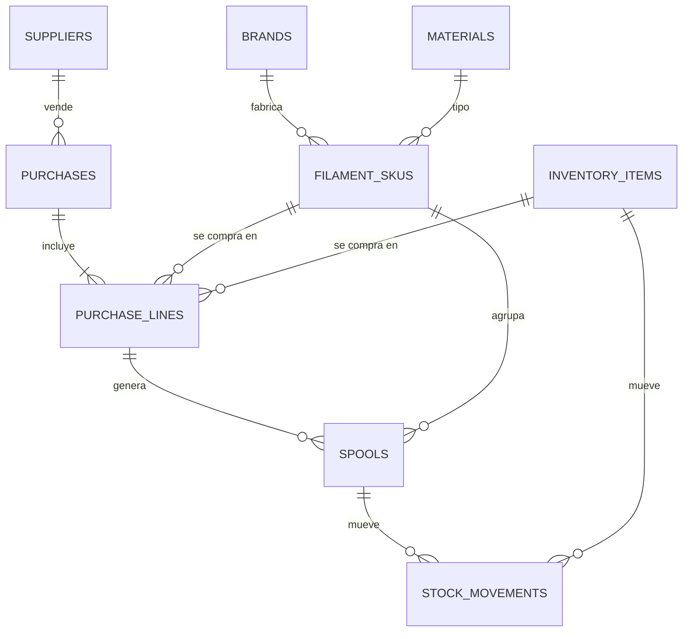
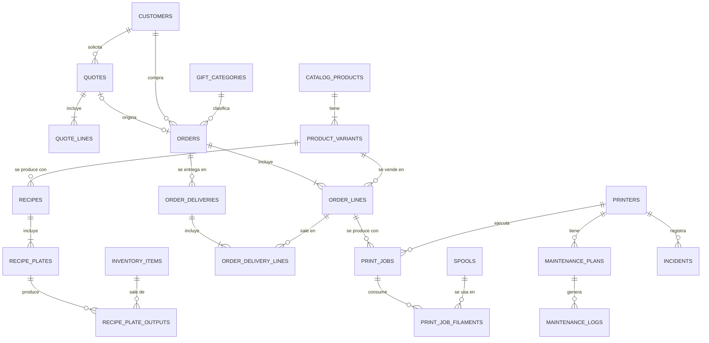
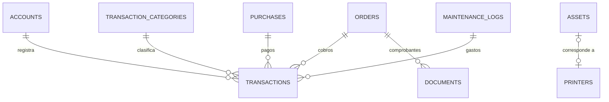

# 3. Modelo de datos (conceptual)

> Es un modelo **conceptual**, no SQL definitivo. Los nombres van en inglés (serán tablas reales) y las descripciones en español.

## 3.1 Convenciones

| Tema | Convención |
|---|---|
| Nombres | `snake_case`, tablas en plural y en inglés |
| Identificadores | `id uuid` |
| Multi-taller | **Todas** las tablas de negocio llevan `workspace_id` y políticas RLS por membresía, aunque hoy haya un solo usuario |
| Permisos | Cada tabla es del día a día, de configuración o un libro, con las políticas que le tocan (§3.5, ADR-025) |
| Nombres únicos | Sin distinguir mayúsculas ni espacios alrededor: índices sobre `lower(btrim(name))` en canales, cuentas, categorías de dinero y de regalo, marcas, materiales, acabados, impresoras, insumos y el color del filamento (`*_name_ci_key`, `filament_skus_identity_ci_key`) |
| Auditoría | `created_at`, `created_by`, `updated_at` |
| Borrado | **Nunca se borra un registro financiero.** Se usa `archived_at` o una operación inversa (anulación) |
| Dinero | `numeric(12,2)` en soles; decimales exactos en TypeScript, nunca `float` |
| Gramos | `numeric(10,2)` |
| Tiempo | `integer` en segundos |
| Porcentajes | `numeric(5,4)` (0.1800 = 18 %) |
| Datos flexibles | `jsonb` para atributos de catálogo, copias de parámetros y metadatos del 3MF |
| Saldos | **Vistas** calculadas a partir de movimientos, no columnas editables |
| Numeración | Función por taller y año (`COT-2026-0001`, `ORD-2026-0001`) |

## 3.2 Tablas por módulo

### Núcleo y parámetros

| Tabla | Columnas clave |
|---|---|
| `workspaces` | name, currency (`PEN`), timezone, tax_regime (`none`, `nrus`, `rer`, `rmt`, `general`), ruc, legal_name. La aplicación formatea siempre en soles y en hora de Lima, así que Configuración muestra la moneda y la zona y no ofrece cambiarlas; las funciones de la base sí leen `timezone` (`app.workspace_day`) |
| `workspace_members` | workspace_id, user_id, role (`owner`, `operator`, `viewer`; qué puede cada uno, en §3.5). La base no deja al taller sin dueño (`workspace_members_keep_an_owner`) |
| `workshop_settings` | print_first_start, print_last_start, print_end_by (la ventana de impresión: hoy 6:00, 23:00 y medianoche), changeover_default_minutes, hold_default_days, hold_default_time (un separo vence a las 23:00 del día siguiente), order_payment_category_id y purchase_payment_category_id (en qué categoría de Caja queda un cobro de pedido y un pago de compra cuando nadie elige otra; sin elegir, la única categoría activa de esa dirección; la de los cobros queda marcada como de ventas al elegirla), **default_channel_id** (el canal de las ventas directas, que la Venta rápida trae elegido y `quick_sale` usa si la venta no nombra uno; sin elegir, ninguno, y la Venta rápida y Configuración avisan que falta. Clave foránea compuesta contra `sales_channels (id, workspace_id)`: no puede ser de otro taller. `app.default_channel` aplica la regla). Una fila por taller (ADR-021) |
| `cost_profiles` | valid_from, energy_rate_kwh, labor_rate_hour, failure_rate, material_waste_rate, target_margin, min_order_price, rounding_step, igv_rate, material_valuation (`weighted_avg`, `last_cost`, `replacement`). Una versión programada (que todavía no empezó) se corrige o se quita; la vigente y las anteriores no se tocan, y ninguna empieza antes de hoy (el día del taller). Lo impone `cost_profiles_versions_stay_put` |

### Materiales e inventario

| Tabla | Columnas clave |
|---|---|
| `brands` | name |
| `materials` | code (PLA, PETG…), density_g_cm3, hygroscopic, abrasive |
| `filament_skus` | brand_id, material_id, finish (Basic, Matte…), color_name, color_hex, net_weight_g, diameter_mm, spool_tare_g, is_refill, min_stock_g |
| `suppliers` | name, contact, notes |
| `purchases` | supplier_id, purchased_at, shipping_cost, other_costs, allocation_method (`by_amount`, `by_weight`), account_id, document_ref |
| `purchase_lines` | purchase_id, item_kind (`filament`, `item`, `asset`), filament_sku_id \| inventory_item_id, quantity, unit_price, allocated_extra_cost |
| `spools` | filament_sku_id, purchase_line_id, code (la etiqueta pegada en el rollo; los nuevos llevan el material: `PETG-NEGRO-01`), initial_weight_g, unit_cost, status (lo mueve un disparador sobre `stock_movements`: el primer consumo abre el rollo, y sin gramos pasa a `empty`), opened_at, last_dried_at, location |
| `inventory_items` | kind (`supply`, `packaging`, `spare_part`, `finished_good`, **`part`**), name, unit, min_stock, product_variant_id |
| `stock_movements` | spool_id \| inventory_item_id, type (`purchase`, `consumption`, `waste`, `adjustment`, `maintenance`, `production`, `delivery`; `reservation` y `release` existen en el enum pero un `check` los prohíbe: lo separado se calcula, ADR-021), quantity (con signo), unit_cost, source_type, source_id, occurred_at, note |
| *vista* `spool_balances` | Gramos restantes y costo restante por rollo |
| *vista* `filament_sku_stock` | Gramos en mano, reservados, disponibles y costo promedio ponderado por SKU |
| *vista* `inventory_balances` | Existencias por artículo |
| *vista* `part_stock` | Piezas impresas en el estante, con su costo por unidad y de dónde sale (`produced`, `standard`, `unknown`). El costo es el **promedio ponderado de los movimientos de producción**, no el de las compras: una pieza no se compra nunca (ADR-016) |

### Impresoras y mantenimiento

| Tabla | Columnas clave |
|---|---|
| `printers` | name, model, serial, asset_id, avg_power_w, initial_hours_s, status |
| `printer_components` | printer_id, kind (`nozzle`, `plate`, `ams`…), description, installed_at, hours_at_install |
| `maintenance_plans` | printer_id, task, every_hours, every_days, checklist (jsonb), expected_parts (jsonb) |
| `maintenance_logs` | printer_id, plan_id, performed_at, printer_hours_at, duration_min, cost, notes |
| `incidents` | printer_id, print_job_id, occurred_at, symptom, cause, fix, downtime_min, cost |
| *vista* `printer_usage` | Horas acumuladas por impresora |
| *vista* `maintenance_due` | Tareas vencidas o próximas |

### Catálogo

| Tabla | Columnas clave |
|---|---|
| `catalog_products` | name, slug, description, category, tags, status, bot_visible, specs (jsonb), care_notes, lead_time_days |
| `product_variants` | product_id, name, options (jsonb: color, tamaño, material), list_price, active |
| `product_media` | product_id, variant_id, storage_path, sort_order |
| `recipes` | variant_id, version, valid_from, setup_minutes, minutes_per_unit, note, active, **assembled** (si el producto pasa por «Armar». Si no, se entrega descontando directo sus piezas y su empaque) |
| `recipe_plates` | recipe_id, label, plate_index, units_per_run (productos por corrida, para el costeo), print_time_s, source_file_name, thumbnail_path, slicer_metadata (jsonb) |
| `recipe_plate_outputs` | recipe_plate_id, inventory_item_id (una pieza, `kind = part`), units_per_run, position. **Lo que sale de una corrida al estante.** Una placa puede dar varias piezas distintas a la vez: 7 tapas y 7 cuerpos (ADR-020) |
| `recipe_plate_filaments` | recipe_plate_id, slot, material_id, color_hex, filament_sku_id, grams |
| `recipe_items` | recipe_id, inventory_item_id, quantity_per_unit |
| `price_history` | variant_id, list_price, valid_from, reason |

### Clientes, cotizaciones y órdenes

| Tabla | Columnas clave |
|---|---|
| `customers` | kind (`person`, `company`), name, doc_type (`dni`, `ruc`, `ce`, `none`), doc_number, phone, email, notes, **walk_in** («Clientes varios», el de las ventas rápidas sin nombre: uno por taller, por índice único; lo crea `app.walk_in_customer` con la primera y se puede renombrar. No debe: solo compra por `quick_sale`, que con saldo pide a una persona (`app.walk_in_buys_on_the_spot` rechaza cualquier otro pedido suyo), y ningún otro cliente puede llevar su nombre ni el de «Clientes varios» (`app.walk_in_name_is_taken`, comparado con `app.name_key`). ADR-024) |
| `sales_channels` | name, commission_rate (solo la usa el cotizador, para el precio de lo hecho a medida), active. Único `(id, workspace_id)` para que el canal por defecto no sea de otro taller |
| `quote_requests` | channel_id, contact, description, attachments, status (`new`, `awaiting_slicing`, `quoted`, `discarded`), quote_id |
| `quotes` | number, version, parent_quote_id, customer_id, channel_id, status, valid_until, cost_profile_snapshot (jsonb), subtotal, discount, tax, total, **held_at** (cuándo separó: su lugar en la fila), **hold_until** (hasta cuándo separa). El separo nace al enviarla y termina al cerrarla (ADR-021) |
| `quote_lines` | quote_id, kind (`catalog`, `custom`, `service`), product_variant_id, description, quantity, plates (jsonb), items (jsonb), prep_min, post_min, unit_cost, unit_price, line_total |
| `gift_categories` | name, accounting_treatment (`marketing`, `owner_draw`, `other`) |
| `orders` | number, purpose (`sale`, `personal`, `gift`), gift_category_id, recipient, customer_id, quote_id, channel_id, status, due_date, total, **priority_at** (quién va primero en el reparto), **hold_until** (solo en espera: hasta cuándo conserva lo separado), **quick_sale_key** (la llave con que la Venta rápida pidió el pedido: única por taller, así una venta pedida dos veces —la conexión se cortó después de guardar y se volvió a tocar «Vender»— queda en un solo pedido, ADR-024) |
| `order_priority_changes` | order_id, from_priority_at, to_priority_at, passed_kind, passed_id, passed_label, reason, changed_by, changed_at. Cada «Pasar adelante», con motivo |
| `order_lines` | order_id, product_variant_id, quote_line_id, description, quantity, unit_price, estimated_cost |
| `order_deliveries` | order_id, delivered_at, note. Cada vez que algo del pedido sale del taller: un pedido se entrega en partes |
| `order_delivery_lines` | delivery_id, order_line_id, quantity, unit_cost (lo que costó cada unidad que salió, al promedio del estante; nulo si la línea no saca nada) |
| *vista* `order_line_delivery_status` | Por línea: lo pedido, lo entregado y lo pendiente. Un pedido entregado o cerrado antes de que existieran las entregas cuenta como entregado entero |
| *vista* `order_production_summary` | Estimado contra real de un pedido: el costo estimado de sus líneas, las impresiones ligadas (solo lo hecho a medida, con la producción en bolsa común) y lo que costó lo entregado al salir del estante, con su mano de obra (`delivered_cost`, ADR-022), redondeado por línea antes de sumar, como Resultados |
| *vista* `finished_good_costs` | Lo que vale una unidad de cada producto armado en el estante (`app.produced_unit_cost`, la misma con que sale al entregarse). La Venta rápida lo muestra antes de vender |
| `order_status_history` | order_id, from_status, to_status, changed_by, changed_at, note. Lo escribe un disparador, no la aplicación |
| `opportunities` | customer_id, title, stage (`nuevo`, `cotizado`, `negociando`, `ganado`, `cerrado`, `perdido`), owner, expected_close, amount, blocked_reason, note. Las cotizaciones y los pedidos la referencian **de forma opcional** (ADR-015) |
| `opportunity_stage_history` | opportunity_id, from_stage, to_stage, changed_by, changed_at. Por disparador |
| *vista* `opportunity_board` | El tablero con sus cuentas. Las columnas se llaman `quote_count` y `order_count` **a propósito**: una columna de vista llamada igual que una tabla la lee PostgREST como relación embebida |

### Producción

| Tabla | Columnas clave |
|---|---|
| `print_jobs` | order_line_id, recipe_plate_id, printer_id, label, status, started_at, finished_at, estimated_time_s, actual_time_s, units_produced, failure_cause, percent_complete, slicer_metadata (jsonb), material_cost, energy_cost, machine_cost, note. **Una impresora imprime un trabajo a la vez**: un disparador rechaza el segundo |
| `print_job_filaments` | print_job_id, spool_id, slot, estimated_g, actual_g |
| *vista* `shelf_count_items` | Lo que se cuenta en «Contar el estante»: cada pieza activa y cada variante que se arma (aunque nadie la haya armado todavía), con lo que la aplicación cree que hay y lo que vale una unidad. Una variante que nadie armó vale lo que costaría armar una hoy (`app.assembly_unit_cost`): sus componentes más los minutos por unidad de la receta, sin la preparación |
| *vista* `changeover_estimate` | Minutos medidos entre el fin estimado de una impresión y el inicio de la siguiente, con su percentil 75. El plan lo usa desde cinco muestras |
| *vista* `production_needs` | Por variante: lo que falta **entregar** en los pedidos abiertos (no en espera), lo armado y lo que falta producir |

### Finanzas y comprobantes

| Tabla | Columnas clave |
|---|---|
| `accounts` | name, kind (`cash`, `bank`, `wallet`), opening_balance, opening_balance_on (por defecto, hoy en Lima), default_payment_method, active |
| `transaction_categories` | name, direction (`income`, `expense`), **sales** (categoría de ventas: solo de ingreso; la usan los cobros de pedidos y la Venta rápida, y un ingreso sin pedido no puede usarla. Se marca en Configuración; solo el dueño la desmarca, y la de los cobros de pedidos no se desmarca mientras esté elegida) |
| `transactions` | account_id, **counter_account_id**, type (`income`, `expense`, `transfer`, `owner_contribution`, `owner_draw`), category_id, amount (siempre positivo), occurred_at, payment_method, order_id, purchase_id, maintenance_log_id, counterparty, reference, note, **voided_at / void_reason** |
| `assets` | name, acquired_at, cost, useful_life_hours, printer_id |
| `documents` | order_id, type (`internal_note`, `boleta`, `factura`, `credit_note`), series, number, issued_at, customer_doc_type, customer_doc_number, taxable_amount, igv_amount, total, sunat_status, pdf_path, xml_path, provider_ref |
| *vista* `transaction_entries` | El libro, cuenta por cuenta: desdobla la transferencia en sus dos patas. `before_opening` marca la pata con fecha (en la hora del taller) anterior a la apertura de su cuenta |
| *vista* `account_balances` | Saldo por cuenta: el de apertura más lo que se movió desde su fecha. Lo anterior ya está dentro del saldo de apertura: no lo cambia y se cuenta aparte (`movements_before_opening`, `net_before_opening`) |
| *vista* `order_payment_summary` | Total, cobrado y saldo por pedido de venta |
| *vista* `receivables` | Órdenes entregadas con saldo pendiente |
| *vista* `monthly_income_statement` | Ventas, costo de ventas, gastos, producción no vendida, otros ingresos y utilidad por mes, en la hora del taller. **El costo de ventas de una línea de catálogo es lo entregado a lo que costó al salir del estante** (`order_delivery_lines.unit_cost`, con la mano de obra) **más lo pendiente a su estimado**, redondeado por línea; lo hecho a medida, su estimado o sus impresiones (ADR-022, `20261020110000_cost_of_sales_from_the_shelf.sql`). La producción no vendida incluye los moldes, herramientas y pruebas con sus intentos fallidos, el conteo del estante y, desde `20261020120000_failed_prints_are_unsold_production.sql`, las impresiones fallidas que ningún estimado paga (`uncovered_failed_prints`, la última columna): no restan las ligadas a una línea de una venta viva que todavía se cuenta a su estimado. **Los otros ingresos** (`other_income`: ingresos de Caja que no cobran un pedido, como un reembolso) **suman a la utilidad neta** en su propia línea desde `20261019110000_other_income_in_net_profit.sql` (E5-01, ADR-024). Aparte, las impresiones fallidas de producción sobre lo impreso para producir (`print_cost`, sin moldes, herramientas ni pruebas) contra la reserva por fallos (ADR-023) |

Construido el 2026-10-04 (migración `20261004130000_finance.sql`). Las reglas de este módulo están en [ADR-014](05-decisiones.md): el saldo se deriva, la transferencia es **una** fila con dos cuentas, nada se borra sino que se anula con motivo, y `orders.payment_status` es una proyección que recalcula un disparador y que la aplicación nunca escribe. Queda fuera `documents` (boletas y facturas): el taller todavía no tiene RUC.

**El saldo empieza en la fecha de apertura** (decisión del dueño, 2026-10-07, migración `20261018110000_balance_starts_at_opening.sql`). El saldo de apertura es lo que había en la cuenta ese día, así que un movimiento con fecha anterior ya está dentro de él. Se puede registrar y sigue contando en Resultados de su mes, pero no cambia el saldo de esa cuenta. El día se compara en la hora del taller, y en una transferencia cada pata se juzga con su propia cuenta. Caja avisa antes de guardar, el libro marca esos movimientos y Cuentas explica por qué no movieron el saldo.

Dos reglas se declaran en el esquema para que la aplicación no pueda saltárselas: un movimiento no puede apuntar a una cuenta de otro taller (clave foránea compuesta contra `accounts (id, workspace_id)`) y un ingreso no puede caer en una categoría de egreso (columna generada `expected_direction` con clave foránea compuesta contra `transaction_categories (id, direction)`). Y un disparador (`app.loose_income_is_not_a_sale`) rechaza un ingreso sin pedido en una categoría de ventas, al escribirlo o al cambiarle el tipo, la categoría o el pedido: anular uno viejo sigue siendo posible.

### Transversales

| Tabla | Columnas clave |
|---|---|
| `attachments` | entity_type, entity_id, storage_path, mime_type, size_bytes |
| `activity_log` | actor_kind (`user`, `mcp_private`, `mcp_public`), actor_id, action, entity_type, entity_id, summary, occurred_at. **Auditoría de lo que hacen los agentes de IA** |

## 3.3 Diagramas

### Inventario

### Ventas, catálogo y producción

### Finanzas

## 3.4 Operaciones atómicas

Estas operaciones escriben en varias tablas y deben hacerlo **todo o nada**. Serán funciones de Postgres (RPC):

| Operación | Escribe en |
|---|---|
| `register_purchase` | `purchases`, `purchase_lines`, `spools`, `stock_movements`, `transactions` |
| `accept_quote` | `quotes` (estado y fin del separo), `orders`, `order_lines`, `order_status_history`. El pedido hereda el lugar del separo si seguía vigente (`priority_at = held_at`); si no, va al final. Copia cliente, canal, oportunidad y las líneas (las a medida, sin variante). Rechaza la cotización que ya tiene pedido, en cualquiera de sus versiones |
| `complete_print_job` | `print_jobs`, `print_job_filaments`, `stock_movements` (consumo o merma; y, si salió bien, las piezas que salieron como `production`, con el costo de la placa repartido por igual entre todas las unidades). Rechaza una pieza que la placa no da o más de las que da |
| `deliver_order` | `order_deliveries`, `order_delivery_lines`, `stock_movements` (`delivery`), estado del pedido. Todo o nada: si falta algo no mueve nada y dice qué falta. Lo que se arma saca el producto terminado, al valor con que entró (mano de obra incluida); lo que no, sus piezas y su empaque, y la línea suma los minutos por unidad de la receta, sin la preparación (`app.recipe_unit_labor`, a la tarifa del día de la entrega). Una línea que no sacó nada del estante queda sin costo (`unit_cost` nulo) aunque su receta tenga minutos: Resultados la deja en su estimado |
| `quick_sale` | La **Venta rápida** (ADR-024): `document_counters`, `customers` (el nuevo, o «Clientes varios» la primera vez), `orders` (con su canal), `order_lines`, `order_status_history` (los dos pasos con «Venta rápida.»), y lo que escriben `deliver_order` y `record_payment`, que llama en vez de repetir. Recibe las líneas con su precio (un costo que llegue no se lee: la línea guarda como estimado lo que la entrega dice que costó cada unidad al salir del estante, ADR-022), el cliente o un nombre y teléfono, el canal (`p_channel_id`, activo y del taller; nulo es el canal por defecto), la cuenta, el medio, el monto cobrado (cero es «me paga después»), la fecha (nula es ahora; no futura) y la llave de la venta (`p_sale_key`). Solo vende productos **armados** (la última receta, `assembled`): un kit sale en piezas, o en nada si no tiene, y va por un pedido normal. Cantidades y precios son números JSON: un texto como `"NaN"` pasaría todas las comparaciones y dejaría el mes de Resultados en NaN. Lo que queda por cobrar necesita a alguien que lo deba: con saldo, «Clientes varios» se rechaza. La misma llave devuelve el pedido que ya hizo, sin repetir nada (un candado por llave hace esperar a la segunda llamada simultánea). Todo o nada: lo que no alcanza, un cobro mayor al total o una cuenta desactivada se rechazan con su `P0001` y no queda nada. No sabe qué está separado: eso lo dice el plan, en la pantalla |
| `count_shelf` | `stock_movements` (origen `shelf_count`: lo que sobra como `production`, lo que falta como `adjustment`), `inventory_items` (el producto terminado de una variante que nunca se armó). Todo o nada; pide costo para lo que entra sin uno conocido. Un producto entra al valor de lo armado, o si nadie lo armó, a `app.assembly_unit_cost` |
| `planning_snapshot` | Nada: lee. Devuelve en una sola instantánea todo lo que necesita `plan` (`PlanInput`, `packages/domain/src/plan-types.ts`) |
| `set_quote_hold`, `set_order_hold` | `quotes.hold_until` o `orders.hold_until`. Un momento pasado es «soltar ya»; volver a separar algo vencido lo manda al final de la fila |
| `prioritize_order` | `orders.priority_at`, `order_priority_changes`. Nunca se niega: pone el pedido justo delante del otro y deja el rastro |
| `record_purchase_payment` | `transactions` (egreso ligado a la compra). Rechaza pagar de más (ADR-019) |
| `record_payment` | `transactions`, estado de la orden |
| `log_maintenance` | `maintenance_logs`, `stock_movements` (repuestos), `transactions` |
| `save_printer` | `assets` y `printers`, juntos o nada: guardar la impresora ya no deja el costo del activo cambiado si la impresora falla. Solo el dueño; el nombre no se repite sin importar mayúsculas |
| `cancel_order` | Estado de la orden, liberación de reservas, reembolso si corresponde |
| `assemble_product` | `stock_movements` (consumo de piezas, insumos y empaque, y la entrada del producto como `production`). **Todo o nada:** si falta un componente no mueve nada y lanza un `P0001` con qué falta y cuánto, que la pantalla muestra tal cual. Rechaza una receta vacía y un producto que no se arma, y bloquea lo que va a consumir. **El producto entra a lo que consumió más la mano de obra de la receta** (ADR-022): los minutos por unidad por cada una y la preparación una vez por armado, a la tarifa del perfil vigente ese día en el taller (`app.recipe_labor_cost`, la regla de `laborCost` en el dominio) |

Escritas hasta hoy: `complete_print_job`, `record_payment`, `record_purchase_payment`, `assemble_product`, `deliver_order`, `quick_sale`, `count_shelf`, `accept_quote`, `set_quote_hold`, `set_order_hold`, `prioritize_order` y `save_printer`. Faltan `register_purchase`, `log_maintenance` y `cancel_order`.

**«Entregado» lo pone la entrega.** Un disparador rechaza pasar un pedido a `delivered` o `closed` a mano mientras quede algo por entregar: el único camino es `deliver_order`, que lo pasa solo cuando ya no queda nada pendiente. Nota: `purchases.account_id` figura en este documento pero nunca se creó, y hace falta si el formulario de compra va a elegir cuenta.

## 3.5 Permisos

La matriz es decisión del dueño (ADR-025) y vive en las políticas: la pantalla solo la lee para no ofrecer lo que la base va a negar. `supabase/tests/permisos.sql` la verifica entera.

| Forma | Tablas | Leer | Agregar y cambiar | Borrar |
|---|---|---|---|---|
| **Día a día** (`app.apply_workspace_rls`) | Todas las demás: catálogo, recetas, insumos y filamentos, compras, rollos, clientes, cotizaciones, pedidos, trabajos de impresión, mantenimiento hecho, incidentes… | Cualquier miembro | Dueño y operador (`app.can_operate`) | Dueño |
| **Configuración** (`app.apply_owner_rls`) | `cost_profiles`, `workshop_settings`, `sales_channels`, `accounts`, `transaction_categories`, `gift_categories`, `printers`, `assets`, `printer_components`, `maintenance_plans` | Cualquier miembro | Dueño | Dueño |
| **Libros** (`app.apply_ledger_rls`) | `transactions`, `stock_movements`, `order_deliveries`, `order_delivery_lines` | Cualquier miembro | Agregar: dueño y operador. **Cambiar: nadie** | **Nadie** |
| Propias | `workspaces` (cambia el dueño; crea cualquiera con sesión), `workspace_members` (el dueño), `document_counters` (solo la función de numeración) | Miembros | — | — |

- «Cualquier miembro» incluye «Solo lectura», que no escribe nada.
- Al cambiar, la política ve la fila con ser miembro y exige el rol en la fila escrita: quien no puede recibe un error, no un cambio de cero filas, y el operador puede bloquear la impresora al iniciar un trabajo.
- En los libros no hay ni política ni privilegio de `update`, `delete` o `truncate` para `anon`, `authenticated` ni `service_role`. El dinero se anula (`void_transaction`, solo el dueño); el stock se corrige con otro movimiento. `stock_movements_are_permanent` impide además que un rollo o un artículo con historial se borre llevándose sus movimientos en cascada.
- Las funciones `security definer` no pasan por las políticas y exigen ellas mismas el rol. Las demás son `security invoker`: el operador puede todo lo que hacen porque solo agregan a los libros.
- Las fotos (`storage.objects`, carpeta del taller) siguen la misma regla que el catálogo: subir, reemplazar y borrar es de dueño y operador.
