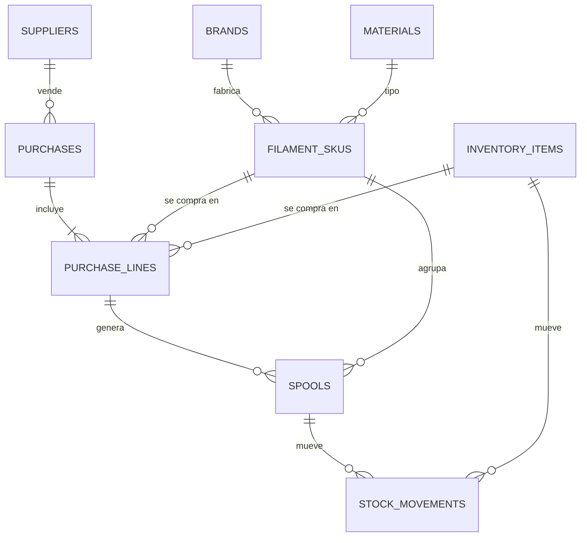
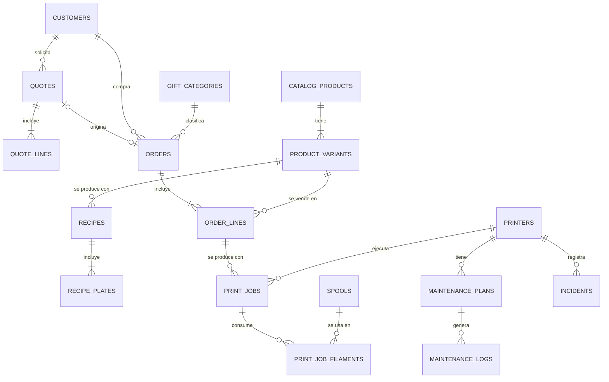
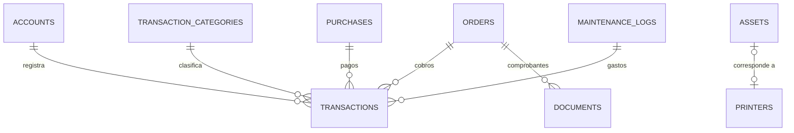

# 3. Modelo de datos (conceptual)

> Es un modelo **conceptual**, no SQL definitivo. Los nombres van en inglés (serán tablas reales) y las descripciones en español.

## 3.1 Convenciones

| Tema | Convención |
|---|---|
| Nombres | `snake_case`, tablas en plural y en inglés |
| Identificadores | `id uuid` |
| Multi-taller | **Todas** las tablas de negocio llevan `workspace_id` y políticas RLS por membresía, aunque hoy haya un solo usuario |
| Auditoría | `created_at`, `created_by`, `updated_at` |
| Borrado | **Nunca se borra un registro financiero.** Se usa `archived_at` o una operación inversa (anulación) |
| Dinero | `numeric(12,2)` en soles; decimales exactos en TypeScript, nunca `float` |
| Gramos | `numeric(10,2)` |
| Tiempo | `integer` en segundos |
| Porcentajes | `numeric(5,4)` (0.1800 = 18 %) |
| Datos flexibles | `jsonb` para atributos de catálogo, copias de parámetros y metadatos del 3MF |
| Saldos | **Vistas** calculadas a partir de movimientos, no columnas editables |
| Numeración | Función por taller y año (`COT-2026-0001`, `ORD-2026-0001`) |

## 3.2 Tablas por módulo

### Núcleo y parámetros

| Tabla | Columnas clave |
|---|---|
| `workspaces` | name, currency (`PEN`), timezone, tax_regime (`none`, `nrus`, `rer`, `rmt`, `general`), ruc, legal_name |
| `workspace_members` | workspace_id, user_id, role (`owner`, `operator`, `viewer`) |
| `cost_profiles` | valid_from, energy_rate_kwh, labor_rate_hour, failure_rate, material_waste_rate, target_margin, min_order_price, rounding_step, igv_rate, material_valuation (`weighted_avg`, `last_cost`, `replacement`) |

### Materiales e inventario

| Tabla | Columnas clave |
|---|---|
| `brands` | name |
| `materials` | code (PLA, PETG…), density_g_cm3, hygroscopic, abrasive |
| `filament_skus` | brand_id, material_id, finish (Basic, Matte…), color_name, color_hex, net_weight_g, diameter_mm, spool_tare_g, is_refill, min_stock_g |
| `suppliers` | name, contact, notes |
| `purchases` | supplier_id, purchased_at, shipping_cost, other_costs, allocation_method (`by_amount`, `by_weight`), account_id, document_ref |
| `purchase_lines` | purchase_id, item_kind (`filament`, `item`, `asset`), filament_sku_id \| inventory_item_id, quantity, unit_price, allocated_extra_cost |
| `spools` | filament_sku_id, purchase_line_id, code, initial_weight_g, unit_cost, status, opened_at, last_dried_at, location |
| `inventory_items` | kind (`supply`, `packaging`, `spare_part`, `finished_good`), name, unit, min_stock, product_variant_id |
| `stock_movements` | spool_id \| inventory_item_id, type, quantity (con signo), unit_cost, source_type, source_id, occurred_at, note |
| *vista* `spool_balances` | Gramos restantes y costo restante por rollo |
| *vista* `filament_sku_stock` | Gramos en mano, reservados, disponibles y costo promedio ponderado por SKU |
| *vista* `inventory_balances` | Existencias por artículo |

### Impresoras y mantenimiento

| Tabla | Columnas clave |
|---|---|
| `printers` | name, model, serial, asset_id, avg_power_w, initial_hours_s, status |
| `printer_components` | printer_id, kind (`nozzle`, `plate`, `ams`…), description, installed_at, hours_at_install |
| `maintenance_plans` | printer_id, task, every_hours, every_days, checklist (jsonb), expected_parts (jsonb) |
| `maintenance_logs` | printer_id, plan_id, performed_at, printer_hours_at, duration_min, cost, notes |
| `incidents` | printer_id, print_job_id, occurred_at, symptom, cause, fix, downtime_min, cost |
| *vista* `printer_usage` | Horas acumuladas por impresora |
| *vista* `maintenance_due` | Tareas vencidas o próximas |

### Catálogo

| Tabla | Columnas clave |
|---|---|
| `catalog_products` | name, slug, description, category, tags, status, bot_visible, specs (jsonb), care_notes, lead_time_days |
| `product_variants` | product_id, name, options (jsonb: color, tamaño, material), list_price, active |
| `product_media` | product_id, variant_id, storage_path, sort_order |
| `recipes` | variant_id, version, valid_from, prep_min, post_min |
| `recipe_plates` | recipe_id, plate_index, units_per_plate, print_time_s, source_file_name, thumbnail_path, slicer_metadata (jsonb) |
| `recipe_plate_filaments` | recipe_plate_id, slot, material_id, color_hex, filament_sku_id, grams |
| `recipe_items` | recipe_id, inventory_item_id, quantity_per_unit |
| `price_history` | variant_id, list_price, valid_from, reason |

### Clientes, cotizaciones y órdenes

| Tabla | Columnas clave |
|---|---|
| `customers` | kind (`person`, `company`), name, doc_type (`dni`, `ruc`, `ce`, `none`), doc_number, phone, email, notes |
| `sales_channels` | name, commission_rate |
| `quote_requests` | channel_id, contact, description, attachments, status (`new`, `awaiting_slicing`, `quoted`, `discarded`), quote_id |
| `quotes` | number, version, parent_quote_id, customer_id, channel_id, status, valid_until, cost_profile_snapshot (jsonb), subtotal, discount, tax, total |
| `quote_lines` | quote_id, kind (`catalog`, `custom`, `service`), product_variant_id, description, quantity, plates (jsonb), items (jsonb), prep_min, post_min, unit_cost, unit_price, line_total |
| `gift_categories` | name, accounting_treatment (`marketing`, `owner_draw`, `other`) |
| `orders` | number, purpose (`sale`, `personal`, `gift`), gift_category_id, recipient, customer_id, quote_id, channel_id, status, due_date, total |
| `order_lines` | order_id, product_variant_id, quote_line_id, description, quantity, unit_price, estimated_cost |

### Producción

| Tabla | Columnas clave |
|---|---|
| `print_jobs` | order_line_id, printer_id, plate_label, started_at, finished_at, estimated_time_s, actual_time_s, result, failure_cause, percent_complete, slicer_metadata (jsonb), material_cost, energy_cost, machine_cost, notes |
| `print_job_filaments` | print_job_id, spool_id, slot, estimated_g, actual_g |

### Finanzas y comprobantes

| Tabla | Columnas clave |
|---|---|
| `accounts` | name, kind (`cash`, `bank`, `wallet`), opening_balance, opening_balance_on, default_payment_method, active |
| `transaction_categories` | name, direction (`income`, `expense`) |
| `transactions` | account_id, **counter_account_id**, type (`income`, `expense`, `transfer`, `owner_contribution`, `owner_draw`), category_id, amount (siempre positivo), occurred_at, payment_method, order_id, purchase_id, maintenance_log_id, counterparty, reference, note, **voided_at / void_reason** |
| `assets` | name, acquired_at, cost, useful_life_hours, printer_id |
| `documents` | order_id, type (`internal_note`, `boleta`, `factura`, `credit_note`), series, number, issued_at, customer_doc_type, customer_doc_number, taxable_amount, igv_amount, total, sunat_status, pdf_path, xml_path, provider_ref |
| *vista* `transaction_entries` | El libro, cuenta por cuenta: desdobla la transferencia en sus dos patas |
| *vista* `account_balances` | Saldo por cuenta |
| *vista* `order_payment_summary` | Total, cobrado y saldo por pedido de venta |
| *vista* `receivables` | Órdenes entregadas con saldo pendiente |
| *vista* `monthly_income_statement` | Ventas, costo de ventas, gastos y utilidad por mes |

Construido el 2026-10-04 (migración `20261004130000_finance.sql`). Las reglas de este módulo están en [ADR-014](05-decisiones.md): el saldo se deriva, la transferencia es **una** fila con dos cuentas, nada se borra sino que se anula con motivo, y `orders.payment_status` es una proyección que recalcula un disparador y que la aplicación nunca escribe. Queda fuera `documents` (boletas y facturas): el taller todavía no tiene RUC.

Dos reglas se declaran en el esquema para que la aplicación no pueda saltárselas: un movimiento no puede apuntar a una cuenta de otro taller (clave foránea compuesta contra `accounts (id, workspace_id)`) y un ingreso no puede caer en una categoría de egreso (columna generada `expected_direction` con clave foránea compuesta contra `transaction_categories (id, direction)`).

### Transversales

| Tabla | Columnas clave |
|---|---|
| `attachments` | entity_type, entity_id, storage_path, mime_type, size_bytes |
| `activity_log` | actor_kind (`user`, `mcp_private`, `mcp_public`), actor_id, action, entity_type, entity_id, summary, occurred_at. **Auditoría de lo que hacen los agentes de IA** |

## 3.3 Diagramas

### Inventario

### Ventas, catálogo y producción

### Finanzas

## 3.4 Operaciones atómicas

Estas operaciones escriben en varias tablas y deben hacerlo **todo o nada**. Serán funciones de Postgres (RPC):

| Operación | Escribe en |
|---|---|
| `register_purchase` | `purchases`, `purchase_lines`, `spools`, `stock_movements`, `transactions` |
| `accept_quote` | `quotes` (estado), `orders`, `order_lines`, `stock_movements` (reserva) |
| `complete_print_job` | `print_jobs`, `print_job_filaments`, `stock_movements` (consumo o merma, liberación de reserva) |
| `record_payment` | `transactions`, estado de la orden |
| `log_maintenance` | `maintenance_logs`, `stock_movements` (repuestos), `transactions` |
| `cancel_order` | Estado de la orden, liberación de reservas, reembolso si corresponde |

Escritas hasta hoy: `complete_print_job` y `record_payment`. Faltan `register_purchase`, `accept_quote`, `log_maintenance` y `cancel_order`; mientras tanto, una compra se paga registrando a mano un egreso con su `purchase_id`. Nota: `purchases.account_id` figura en este documento pero nunca se creó, y hace falta si el formulario de compra va a elegir cuenta.
