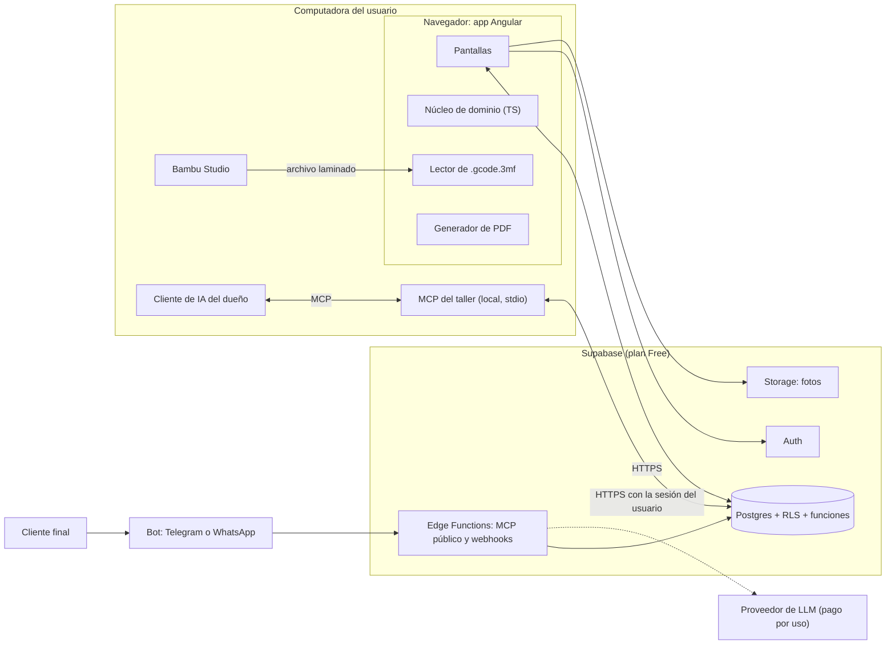
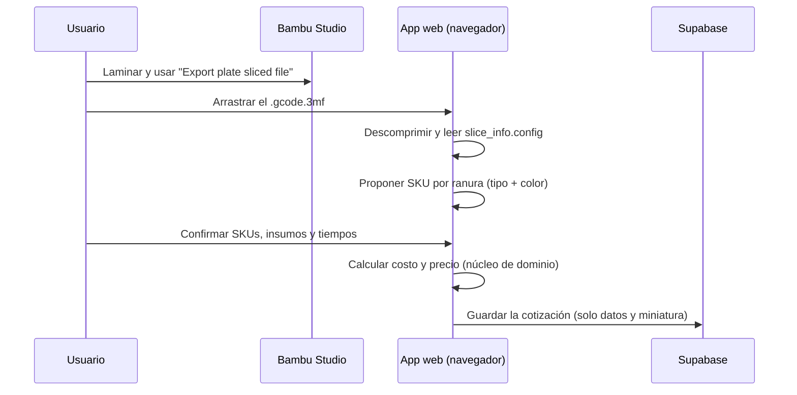

# 4. Arquitectura

## 4.1 Vista general



**Idea central:** todo lo que consume CPU (laminar, leer archivos, generar PDF, calcular) ocurre en la computadora del usuario. Supabase solo guarda datos, autentica y aplica permisos.

## 4.2 ¿Monolito? Sí: monolito modular

**Recomendación: un monolito modular en un solo repositorio.**

Por qué:
- **Un solo desarrollador, poca carga y costo cero.** Los microservicios agregan despliegues, redes y costos sin ningún beneficio aquí.
- **Con Supabase casi no hay servidor propio que mantener.** El "monolito" es la app web, un núcleo de dominio compartido y el esquema de base de datos versionado.
- **Modular por dentro:** cada módulo del dominio (inventario, cotizador, catálogo, órdenes, producción, mantenimiento, finanzas, comprobantes) tiene su carpeta y su API pública. Las reglas de lint impiden importar las entrañas de otro módulo. Si algún día hiciera falta separar algo, las fronteras ya existen.

## 4.3 Dónde vive cada cosa

| Capa | Qué contiene | Por qué ahí |
|---|---|---|
| **Núcleo de dominio** (`packages/domain`, TypeScript puro) | Fórmulas de costo y precio, IGV, redondeo, máquinas de estados, validaciones | Se escribe una vez y lo usan la web, el MCP y las Edge Functions. Se prueba sin navegador ni base de datos |
| **Lector de archivos** (`packages/slicer-files`) | Descomprime el ZIP y lee `slice_info.config` | Corre en el navegador y en Node; el archivo nunca se sube |
| **App web** (`apps/web`, Angular) | Pantallas, formularios, PDF, orquestación | Todo el procesamiento es del cliente |
| **Postgres** (Supabase) | Integridad: claves foráneas, restricciones, **RLS**, vistas de saldos, numeración, **operaciones atómicas** (ver [§3.4](03-modelo-de-datos.md#34-operaciones-atómicas)) | Garantías que no dependen de que el cliente se porte bien |
| **Edge Functions** | MCP público de catálogo, webhooks del bot | Lo único que necesita ejecutarse en un servidor. Los precios públicos se calculan ahí con el núcleo de dominio, nunca en el cliente ni en el LLM |
| **MCP local** (`apps/mcp`) | Herramientas para el agente de IA del dueño | Corre en tu PC; no le cuesta nada a la plataforma |

> **Por verificar en la prueba de concepto:** que el mismo paquete TypeScript del dominio se pueda importar desde Angular (Node) y desde las Edge Functions (Deno).

## 4.4 Estructura del repositorio (conceptual)

```
/
├── apps/
│   ├── web/                  Angular 22 (standalone, signals, zoneless)
│   └── mcp/                  MCP del taller (Node + TypeScript, stdio)
├── packages/
│   ├── domain/               Costos, precios, IGV, estados, validaciones
│   └── slicer-files/         Lector de .gcode.3mf
├── supabase/
│   ├── migrations/           Esquema, RLS, funciones y vistas versionadas
│   ├── functions/            MCP público y webhooks
│   ├── seed.sql              Materiales, marcas y plan de mantenimiento de la A1 mini
│   └── tests/                Pruebas de RLS y de funciones
└── docs/
```

Herramienta del monorepo: **pnpm workspaces** ([ADR-012](05-decisiones.md#adr-012--pnpm-workspaces-como-monorepo)).

**Estado al 2026-09-29:** ya existen `packages/domain` y `packages/slicer-files`, con pruebas en Vitest. `apps/` y `supabase/` están pendientes.

## 4.5 Equipo, accesos y consumo del plan Free

### Dos personas, dos accesos

- **Ingreso con Google** mediante Supabase Auth, incluido en el plan Free. Cada persona entra con su cuenta y no se manejan contraseñas.
- Ambas son miembros del mismo taller (`workspace_members`) con rol `owner`. Quedan disponibles `operator` y `viewer` para cuando entre alguien más.
- Cada registro guarda `created_by`, y `activity_log` anota quién hizo qué, sea una persona o su agente de IA.
- **Cada persona instala su propio MCP local**, que entra con su misma cuenta y queda sujeto a RLS. No hay nada que alojar ni que pagar.

### ¿Aguanta el plan Free un año?

Sí, con holgura. Supuestos: 2 personas, unas 40 órdenes y 80 impresiones al mes, y agentes de IA consultando a diario.

| Recurso | Límite Free | Estimación a un año | Holgura |
|---|---|---|---|
| Usuarios activos al mes | 50,000 | 2 | Enorme |
| Base de datos | 500 MB | 20–60 MB (unas 20,000 filas, bitácora incluida) | Enorme |
| Storage | 1 GB | ~50 MB (200 fotos comprimidas) | Amplia, **si no guardamos los 3MF** |
| Transferencia (egress) | 5 GB al mes | 0.3–0.9 GB al mes | Amplia |
| Invocaciones de Edge Functions | 500,000 al mes | 0 hoy; miles cuando exista el bot | Enorme |
| Proyectos activos | 2 | 1 en producción; el desarrollo es local con Docker | Suficiente |

Para dimensionar la transferencia: aunque **cada persona hiciera 500 consultas al día** con respuestas de 30 KB, entre las dos serían unos **0.9 GB al mes**, menos de la quinta parte del límite. Cada llamada de un agente por MCP mueve entre 2 y 50 KB, así que 5,000 llamadas mensuales suman unos 250 MB.

Lo que ocupa espacio en este negocio son las **imágenes y los archivos**, no los datos: un año de operación en texto son decenas de megabytes.

### Reglas para no quemar el plan

1. **No guardar los `.3mf` en Storage.** Los dos archivos de prueba pesaban 2.5 y 2.7 MB: unos 400 llenarían el giga. Se guardan los metadatos y la miniatura.
2. Comprimir las fotos en el navegador (WebP de unos 150 KB) y servir miniaturas en los listados.
3. Las herramientas MCP devuelven **listas paginadas y columnas limitadas**, con `ttlMs` para que el cliente cachee en lugar de repreguntar.
4. La app web se aloja **fuera** de Supabase (Cloudflare Pages, Netlify o similar), así que su descarga no consume la transferencia del proyecto.
5. `activity_log` con retención: archivar o depurar lo anterior a 12 meses. No aplica a los registros financieros, que no se borran.

### Los dos riesgos reales

| Riesgo | Mitigación |
|---|---|
| **No hay backups en el plan Free** | Botón **"Exportar respaldo"** (JSON o CSV de todo el taller) en el cierre de mes y, opcionalmente, un `pg_dump` programado hacia un lugar **privado y cifrado**. Nunca en un repositorio público |
| **El proyecto se pausa tras 1 semana sin actividad** | Con dos personas usándolo a diario no ocurre. Si coinciden las vacaciones, basta una tarea semanal que haga una consulta liviana, o reactivarlo desde el panel |

Si algún día se aloja una instancia para otros talleres, o el tráfico de imágenes crece mucho, el salto es al plan Pro (desde USD 25 al mes) y nada del diseño cambia.

## 4.6 Importación de archivos laminados



## 4.7 MCP y agentes de IA

Se apunta a la especificación **2026-07-28** ([resumen en Investigación](01-investigacion.md#13-mcp-estado-a-septiembre-de-2026)): sin estado, `server/discover`, MRTR (`input_required`) para pedir datos que falten y resultados estructurados. No se usarán Roots, Sampling, Logging ni HTTP+SSE, que están obsoletos. Antes de implementar hay que confirmar qué versión soporta el SDK oficial de TypeScript.

### Dos servidores con niveles de confianza distintos

| | **MCP del taller (privado)** | **MCP público de catálogo** |
|---|---|---|
| Quién lo usa | El cliente de IA de cada socio (por ejemplo, Claude) | El bot que atiende a clientes |
| Dónde corre | **La PC de cada persona**, por stdio | Supabase Edge Function (Streamable HTTP) |
| Identidad | **La sesión de cada persona** (una instalación por cabeza), sujeta a RLS. **Nunca** la clave `service_role` | Anónimo, con límite de peticiones |
| Ve costos y márgenes | Sí | **No** |
| Escribe datos | Sí (compras, impresiones, cobros…) | Solo crea **solicitudes de cotización** |
| Quién paga el LLM | La suscripción de cada quien a su cliente de IA | Quien opere el bot (a decidir en la fase 4) |

### Herramientas previstas (nombres en inglés, como en el código)

**Privado:** `search_catalog`, `get_product`, `quote_catalog_items`, `create_quote_draft`, `list_quotes`, `register_purchase`, `get_stock`, `log_print_job`, `log_maintenance`, `get_maintenance_due`, `record_payment`, `list_receivables`, `get_financial_summary`.
- Recursos: perfil de costos vigente, fichas de catálogo.
- Prompts: `monthly_close`, `register_purchase_from_receipt`. En este último, tu cliente de IA lee la foto de la boleta y envía datos estructurados; el servidor no procesa imágenes.

**Público:** `search_catalog` (solo campos públicos), `get_product`, `quote_catalog_items` (precio de lista, descuentos, disponibilidad por color, plazo) y `create_quote_request`.

### Reglas para la IA

1. **El LLM nunca calcula precios.** Llama a herramientas que usan el núcleo de dominio.
2. **Las piezas a medida no se cotizan automáticamente.** El bot crea una solicitud `awaiting_slicing`; tú laminas, importas el archivo y cotizas.
3. **Todo lo que hace un agente queda en `activity_log`.**
4. **El texto de un cliente no es de confianza.** El bot público no tiene herramientas que modifiquen datos del negocio, así que una inyección de instrucciones no puede causar daño.
5. **Si falta información, el servidor responde `input_required`** en lugar de adivinar.
6. El MCP público usa una **vista pública del catálogo** sin columnas de costos, no las tablas internas.

## 4.8 Seguridad

- RLS en **todas** las tablas, por membresía en el taller.
- Secretos fuera del repositorio; `.env.example` documentado.
- Las Edge Functions públicas validan las entradas con esquemas y limitan las peticiones.
- Los respaldos nunca van a lugares públicos.
- Los registros financieros no se borran; se anulan con un movimiento inverso.

## 4.9 Calidad

| Nivel | Herramienta | Qué se prueba |
|---|---|---|
| Dominio | Vitest | Fórmulas con **casos de referencia** (el ejemplo de [§2.5](02-dominio.md#ejemplo) será una prueba), IGV, redondeo, transiciones de estado |
| Lector de archivos | Vitest + archivos `.gcode.3mf` reales | Un color, multicolor, varias placas, archivos inválidos |
| Base de datos | `supabase test db` (pgTAP) | Políticas RLS, operaciones atómicas, vistas de saldos |
| Extremo a extremo | Playwright (más adelante) | Flujos A–E de [§2.11](02-dominio.md#211-flujos-principales) |

Otras convenciones:
- Dinero con una librería decimal y formato `es-PE` (`S/ 25.00`).
- Código en inglés, interfaz en español, con i18n preparado para inglés.

## 4.10 Distribución open source

**Modelo recomendado: cada taller despliega su propia copia.**
1. Hace un fork del repositorio.
2. Crea su propio proyecto en Supabase (plan Free).
3. Aplica las migraciones (`supabase db push`).
4. Publica la app web estática en un hosting gratuito (Cloudflare Pages, Netlify, Vercel o GitHub Pages).

Así **nadie más te cuesta dinero** y cada taller es dueño de sus datos. El modelo de datos con `workspace_id` deja abierta la opción de una instancia compartida si algún día tiene sentido.

---

## 4.11 Desarrollo local con contenedores

Todo el backend local corre en Docker, levantado por el CLI de Supabase, que vive como dependencia del repositorio para que nadie tenga que instalarlo aparte.

| Comando | Qué hace |
|---|---|
| `pnpm supabase start` | Levanta Postgres, Auth, Storage, PostgREST y Studio en contenedores |
| `pnpm supabase db reset` | Recrea la base, aplica las migraciones en orden y carga `supabase/seed.sql` |
| `pnpm supabase status` | Muestra las URLs y llaves locales |
| `pnpm supabase stop` | Apaga los contenedores |
| `pnpm test` | Dominio, lector de archivos y **sintaxis de las migraciones** |

La primera vez descarga varios gigabytes de imágenes y necesita el daemon de Docker corriendo.

**Regla de las migraciones:** viven en `supabase/migrations`, se aplican en orden por nombre y **una migración ya aplicada no se edita**. Todo cambio va en una migración nueva.

Para no depender de Docker en cada cambio, `supabase/tests/sql-syntax.test.ts` valida las migraciones con el parser de PostgreSQL compilado a WebAssembly: corre en milisegundos y atrapa errores de tipeo. La prueba de verdad sigue siendo `db reset`.
