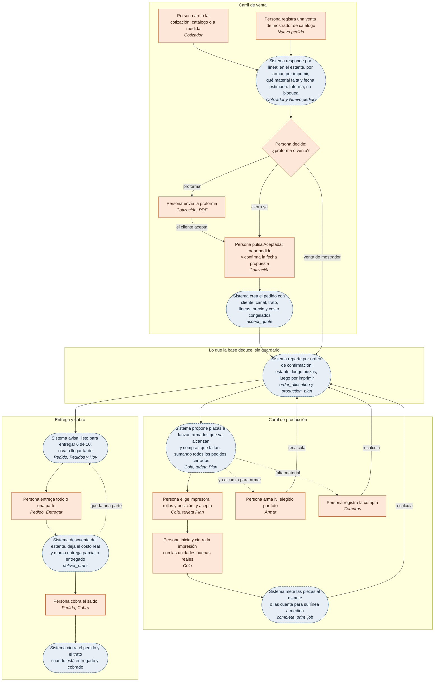

# Del pedido a la entrega — ronda 1

> Mirada: cotización → pedido → ¿hay stock? → cola de impresión → piezas → armar → entrega → cobro.
> Revisado el 2026-10-06 contra el código de la rama `nav-y-plan` y la base local. Incluye las dos aclaraciones del dueño que llegaron durante el trabajo: **al vender, el sistema informa y nunca bloquea**, y **la opción B vive en la pantalla de producción** (ya decidida).
> Parte de la evidencia "en vivo" usa el pedido de prueba `ORD-2026-0001` (cliente "María Barrido") que el agente "Persona nueva" creó hoy entre las 20:40 y las 20:45 (UTC). Ese agente lo va a borrar al terminar; las consultas quedan escritas para repetirlas con cualquier otro pedido.

## En cinco líneas

1. La cadena no se corta en tres uniones sino en cuatro: la cotización no se vuelve pedido (y una pieza a medida **no cabe** en un pedido: la línea exige una variante del catálogo), lo prometido no se descuenta, producción ve un número sin plan, y entregar no existe. Hoy, en local, un pedido se marcó "Entregado" y sus 10 botellas siguen en el estante restándose de lo que deben otros cuatro pedidos.
2. Hay además un error que corrompe el stock en silencio: al cerrar una impresión, "Unidades producidas" se guarda **después** de mover el stock, así que siempre entra la placa completa.
3. Propuesta central: **una sola cuenta derivada en la base** (el *plan*) que explota la receta, reparte el estante entre los pedidos cerrados por orden de confirmación y lo compara con piezas, cola y material. Ventas la lee como "capaz de prometer" (en el estante · por armar · por imprimir · qué falta · fecha) y producción la lee como placas propuestas (opción B). No hacen falta movimientos de reserva: lo comprometido se calcula, como en inFlow y Katana.
4. Cuatro funciones cierran el resto: `accept_quote`, `deliver_order` (con entregas parciales), `cancel_order` y un `complete_print_job` corregido. La pieza suelta se resuelve como *kit* (la receta dice "no se arma" y la entrega consume la pieza), sin convertir el stock que ya existe.
5. Tres respuestas del dueño cambian lo que se construye: en qué horario se puede empezar una placa (la fecha prometida depende de eso), si un pedido en espera conserva lo apartado, y si manda el primero en confirmar o el que vence antes.

## Hallazgos

### H1. "Acepté la cotización y tengo que escribir el pedido otra vez; y si es a medida, no puedo"

- **Qué pasa:**
  - "Aceptada" solo cambia el estado: `cotizacion.page.ts:220-238` llama a `setStatus`, que es un `update` de la columna (`cotizador.data.ts:929-932`). En la tarjeta no hay ningún botón que lleve al pedido (`cotizacion.page.html:31-44`).
  - **Una línea a medida no puede entrar a un pedido.** `pedido-linea.ts:21` hace obligatoria la variante y el error dice "Elige una variante del catálogo." (`:163`). La base sí lo permitiría: `order_lines.variant_id` admite nulo y ya existe `quote_line_id` (`20260930010000_sales_and_production.sql:210-211`).
  - `createOrder` (`pedidos.data.ts:389-417`) no escribe `quote_id`, `quote_line_id`, `channel_id` ni `opportunity_id`. Eso trae cuatro consecuencias:
    - Ningún pedido creado desde la app tiene canal, así que la "rentabilidad por canal" de §2.9 no puede salir.
    - El trato no pasa solo a "Ganado": `normalize_opportunity_stage` lo deduce de `orders.opportunity_id`, que solo se escribe a mano desde el tablero (`oportunidades.data.ts:277-284`).
    - El precio se vuelve a sugerir con la escalera de hoy, no con el que aceptó el cliente.
    - El costo estimado se recalcula con los costos de hoy, no con el `unit_cost` congelado en la cotización.
  - Las placas de la pieza a medida (gramos por rollo, tiempo, unidades por placa) ya están guardadas en `quote_lines.plates` (`cotizador.data.ts:781-800`), y nada las vuelve a leer después de cotizar.
  - `docs/03-modelo-de-datos.md` §3.4 ya preveía `accept_quote` como operación de todo o nada, y sigue sin escribirse. Mientras tanto, `createOrder` hace tres llamadas sueltas y, si fallan las líneas, **borra** el pedido (`pedidos.data.ts:419-421`): queda un hueco en la numeración y se contradice "nada se borra".
  - "Hoy" no consulta `quotes` (`panel.data.ts`), así que una cotización aceptada y sin pedido no aparece en ningún lado.
  - En vivo: `ORD-2026-0001` tiene `quote_id`, `channel_id` y `quote_line_id` nulos.
- **Qué tarea traba:** la persona quiere convertir el "sí, acepto" en trabajo, y tiene que volver a elegir en otra pantalla cliente, productos, cantidades y precios. Para una pieza a medida tiene que inventarse una variante de catálogo o dejar el pedido sin registrar.
- **Cómo lo resuelven otros:** MRPeasy usa **un solo documento** que cambia de estado: Quotation → Waiting for confirmation → Confirmed → … ([manual de pedidos de cliente](https://www.mrpeasy.com/resources/user-manual/crm/customer-orders/)). Katana crea la fabricación desde el propio pedido con "+ Make → Make to order" ([Katana, make to order](https://support.katanamrp.com/en/articles/5908804-make-to-order-workflow)).
- **Propuesta:**
  - `accept_quote(p_quote_id, p_due_date)` en la base, todo o nada:
    - marca la cotización como aceptada;
    - crea el pedido con cliente, canal, trato y `quote_id`;
    - copia cada línea con `variant_id` (nulo si es a medida), `quote_line_id`, cantidad, `unit_price` y `estimated_unit_cost = unit_cost`;
    - el total del pedido es el de la cotización.
  - En la pantalla, "Aceptada" pasa a ser **"Aceptada: crear pedido"**, con un diálogo que propone la fecha calculada (H3) y deja corregirla.
  - El pedido dice "Viene de COT-… v1" con enlace, y la cotización dice "Pedido ORD-…".
  - "Nuevo pedido" se queda para la venta de mostrador de catálogo.
- **Tamaño:** M · **Gravedad:** bloquea

### H2. "Saqué 7 tapas buenas de 9 y el estante dice 9"

- **Qué pasa:**
  - `closeJob` llama a `complete_print_job` (`produccion.data.ts:395`) **antes** de guardar `units_produced` (`:414`, `saveOutcomeDetails`).
  - La función usa `coalesce(nullif(v_job.units_produced, 0), rp.units_per_run)` (`20261008110000_parts_and_assembly.sql:210`). En ese momento la columna todavía vale 0, que es su valor por defecto (`createJob` no la escribe), así que **siempre entra `units_per_run`**.
  - El campo "Unidades producidas" (`print-job-close.ts:76`) llega a `print_jobs` pero nunca al estante, y el trabajo y el kardex dicen cosas distintas. Por el `nullif`, un 0 escrito a propósito también se convierte en una placa completa.
  - Además, las piezas siguen entrando como `purchase` (`:226`). Los tres cierres de hoy en local (20:43–20:44) entraron como `purchase` con origen `print_job`. ADR-018 lo dejó abierto.

  ```sql
  select j.units_produced, rp.units_per_run, m.quantity, m.type
  from print_jobs j join recipe_plates rp on rp.id = j.recipe_plate_id
  join stock_movements m on m.source_type = 'print_job' and m.source_id = j.id and m.inventory_item_id is not null
  where j.created_at > now() - interval '6 hours';
  -- 9 | 9 | 9 | purchase   ·   1 | 1 | 1 | purchase   ·   1 | 1 | 1 | purchase
  ```
  Hoy coinciden porque nadie cambió el valor que trae el formulario. El orden de las llamadas garantiza que, si alguien lo cambia, no va a coincidir.
- **Qué tarea traba:** el taller quiere saber cuántas piezas tiene. Todo lo que se calcule encima (lo que se puede prometer, lo que falta imprimir) hereda el error, y justo en el caso que importa: cuando una placa sale mal.
- **Cómo lo resuelven otros:** en Katana, el cierre parcial pide la cantidad realmente producida, y esa es la que cuenta ([Katana, partially deliver](https://support.katanamrp.com/en/articles/5914250-partially-deliver-a-sales-order)).
- **Propuesta:** `complete_print_job` recibe `p_units_produced` y lo usa tal cual (si dice 0, entra 0), y registra el movimiento como `production`. La pantalla lo manda en la misma llamada. Agregar una prueba de migración: placa de 9, se cierran 7, entran 7. Después de cerrar, "Stock que quedó" (`produccion.page.ts:80-101`) debe mostrar también las piezas que entraron, no solo los rollos.
- **Tamaño:** S · **Gravedad:** bloquea (el stock miente sin que nadie lo vea)

### H3. "Me piden 10 y no sé cuántas puedo prometer ni para cuándo"

- **Qué pasa:**
  - Ninguna pantalla de venta muestra producto armado, piezas o tiempos. La línea del pedido dice precio sugerido y costo, y nada más (`pedido-linea.ts:70-104`).
  - El cotizador solo avisa del filamento, y solo para **la línea que se está editando**, contra lo que hay en mano (`cotizador.page.ts:281-289`, `gramsBySku(this.draft(), …)`). En concreto:
    - dos líneas en rojo que juntas no alcanzan pasan las dos sin aviso;
    - no descuenta lo que ya prometieron los pedidos cerrados;
    - supone que todo se imprime aunque haya unidades armadas;
    - no mira dulces, frascos ni empaque;
    - no da fecha.
  - Los datos para responder existen, pero sueltos:
    - lo que le falta a la impresión en curso (`produccion.progress.ts`);
    - el tiempo de lo planificado (`print_jobs.estimated_time_s`) y de cada placa (`recipe_plates.print_time_s`);
    - los gramos por placa y rollo;
    - el plazo del proveedor (`suppliers.lead_time_days`, hoy nulo en local);
    - la tasa de fallos (`cost_profiles.failure_rate` = 0.10).
  - M5 sigue abierto (§M5 del plan), y la aclaración del dueño lo amplía: no alcanza con "disponible" (lo que hay); hace falta "capaz de prometer" (lo que se puede hacer y para cuándo).
- **Qué tarea traba:** el vendedor quiere decidir entre proforma y venta. Hoy tiene que mirar Armar, Piezas, Filamentos y la Cola por separado, y hacer la suma de cabeza.
- **Cómo lo resuelven otros:**
  - Katana pone tres columnas en cada pedido: producto, ingredientes y producción, cada una "In stock / Expected / Not available" ([Katana, workflow basics](https://support.katanamrp.com/en/articles/5908448-workflow-basics)).
  - MRPeasy marca "Possibly delayed / Delayed" cuando la fabricación termina después de lo prometido ([MRPeasy](https://www.mrpeasy.com/resources/user-manual/crm/customer-orders/)).
  - Business Central separa ATP (lo que hay) de CTP (lo que se puede hacer). Su ejemplo: "10 pedidas, 6 disponibles: el cálculo de capaz de prometer se hace sobre 4" ([Microsoft Learn](https://learn.microsoft.com/en-us/dynamics365/business-central/sales-how-to-calculate-order-promising-dates)).
- **Propuesta:** está en [Diseño: ¿cuándo puedo entregar?](#diseño-cuándo-puedo-entregar). Una función `capable_to_promise` en la base, que leen el cotizador, el nuevo pedido y la ficha del pedido. Responde con una frase y un desglose que se despliega. Informa y nunca bloquea.
- **Tamaño:** L · **Gravedad:** bloquea (es la idea no negociable del dueño y hoy no aparece en ninguna pantalla)

### H4. "Lo que ya vendí se lo vuelvo a ofrecer a otro" (segundo corte, a fondo)

- **Qué pasa** (además de lo que ya dice el encargo):
  - En vivo: `ORD-2026-0001` se armó (10 unidades, 20:44:45) y se marcó Entregado (20:45:05), pero las 10 botellas siguen en el estante. `production_needs` las resta de lo que deben los otros cuatro pedidos:

    ```sql
    select committed_units, assembled_units, missing_units, order_count from production_needs;
    -- 41 | 10.000 | 31.000 | 4      ← faltan 41, no 31
    ```
  - Aunque se arregle la entrega, la vista sigue contando dos veces: deja fuera de la demanda los pedidos `ready` (`production_needs.sql:40`) pero resta **todo** lo armado (`:25-26`). Las 3 de `PED-0007` (listo, sin entregar) se cuentan como disponibles para los demás.
  - `assemble_product` y `assembly_options` miran `on_hand`, no lo que queda libre (`20261009150000_assembled_goods.sql:96-103`, `20261009170000_assembly_views.sql:38`). Se pueden armar variantes con tapas que otro pedido ya necesita.
  - Cuando dos pedidos compiten por las mismas 10 botellas, nada decide quién se las lleva.
- **Qué tarea traba:** el vendedor quiere saber qué le queda libre para prometer, y el taller quiere saber qué es de quién en el estante. Ninguno de los dos puede, y el número que sí aparece está mal.
- **Cómo lo resuelven otros:**
  - inFlow calcula "Reserved" a partir de los pedidos abiertos, sin que nadie lo escriba, y define "Available" como "lo que te quedará si cumples todos los pedidos abiertos" ([inFlow](https://www.inflowinventory.com/support/cloud/quantity-breakdown)).
  - En Katana, "los pedidos de mayor prioridad reservan el stock antes", y "la disponibilidad se calcula dinámicamente según la prioridad" ([Katana, order priorities](https://support.katanamrp.com/en/articles/5913596-understanding-order-priorities)).
- **Propuesta:** **comprometido derivado, sin movimientos de reserva.**
  - Una vista `order_allocation` recorre las líneas abiertas en orden de confirmación y le asigna a cada una: primero del estante, después lo que se puede armar con piezas e insumos libres, y el resto queda "por imprimir" (con sumas acumuladas por artículo, una ventana de SQL).
  - Por qué no escribir `reservation`/`release`: habría que liberar en seis lugares (entregar, cancelar, en espera, cambiar la cantidad, cambiar la receta, borrar una línea), y cada olvido deja el disponible mintiendo para siempre. Lo derivado no puede quedar viejo, y es la regla de AGENTS.md ("los saldos no se guardan, se derivan").
  - Los dos tipos de movimiento se quedan en el enum sin usarse, y se documenta por qué.
  - La ficha del pedido muestra "6 de 10 en el estante para este pedido".
- **Tamaño:** L · **Gravedad:** bloquea

### H5. "La cola me dice 'faltan 31', pero no qué placas lanzar" (producción, opción B)

- **Qué pasa:**
  - "Falta producir para los pedidos" es una tabla sin acciones (`produccion.page.ts:34-77`). Su propio texto admite que "pide de más antes que de menos": no descuenta piezas ni lo que ya está en cola (`production_needs.sql:12-15`).
  - No explota la receta: dice "31 botellas", no "4 placas de tapas y 31 de botella".
  - Deja fuera las líneas a medida, porque el `join product_variants` (`production_needs.sql:31`) descarta las que no tienen variante.
  - El trabajo se crea desde una línea del pedido (`pedido.page.ts:116`), una corrida a la vez:
    - la placa se elige a mano (`print-job-form.ts:72-79`), y si la línea no tiene variante la lista trae todas las placas de todas las recetas (`:168-172`);
    - el rollo también se elige a mano (`:86-110`).
  - La pieza va al estante común, así que el vínculo con el pedido es solo de nombre. Los tres trabajos de `ORD-2026-0001` hicieron piezas que nadie puede atribuirle a ese pedido; el armado de las 10 se hizo aparte (`source_type = 'assembly'`, sin pedido).
  - La cola no tiene orden: se lista por `created_at` descendente (`produccion.data.ts:188`), con lo último creado arriba. No hay un "siguiente" ni un tiempo total de cola.
  - Hay dos definiciones de "receta vigente": `assemble_product` y `assembly_options` toman la última versión sin mirar `active` (`assembled_goods.sql:84`, `assembly_views.sql:27`), mientras que el cotizador, los pedidos y producción filtran por `active = true` (`cotizador.data.ts:661`, `cost-estimate.ts:139`, `produccion.data.ts:278`).
- **Qué tarea traba:** a las nueve de la mañana, el taller quiere saber qué placa lanzar. Tiene que abrir cada pedido, calcular cuántas corridas de cada placa salen restando lo que hay, y crearlas de a una.
- **Cómo lo resuelven otros:**
  - Stocksmith (antes Craftybase, para artesanos) muestra "lo que hay que hacer según los pedidos" y "cuántas puedes hacer con el stock y qué material falta"; la persona crea la tanda ([Stocksmith](https://stocksmith.io/features/production-scheduling-software)).
  - El informe de reposición de Odoo calcula lo que falta a partir de la demanda y deja un botón "Order" ([Odoo](https://www.odoo.com/documentation/18.0/applications/inventory_and_mrp/inventory/warehouses_storage/replenishment/report.html)).
  - En Katana, el botón "+ Make" solo aparece en lo que está "Not available" y permite crear en bloque para varios pedidos ([Katana](https://support.katanamrp.com/en/articles/295-workflow-for-make-to-order)).
- **Propuesta:** está en [Opción B en la pantalla de producción](#opción-b-en-la-pantalla-de-producción). En resumen:
  - el plan propone placas, armados y compras;
  - "Poner en cola" crea los trabajos con impresora, rollos y posición;
  - la cola gana orden explícito y fecha de fin por trabajo;
  - el pedido pierde "Crear trabajo" y gana su "situación".
- **Tamaño:** L · **Gravedad:** bloquea

### H6. "Entregué y el estante sigue igual" (tercer corte, a fondo)

- **Qué pasa** (además del corte):
  - No existe una cantidad entregada por línea, así que no hay entrega parcial posible.
  - El costo real de un pedido solo suma las impresiones ligadas a él (`order_production_summary`, en `sales_and_production.sql`). Un pedido servido del estante muestra "—" en "Real" (`pedido.page.ts:163`), y en `monthly_income_statement` cae al estimado (`20261004130000_finance.sql:402-431`). Con piezas en stock, lo que de verdad cuesta un pedido es el valor de lo que salió del estante.
  - En `ORD-2026-0001`, "Ganancia real" resta solo el filamento, la luz y la máquina de tres impresiones, sin dulces, bolsas ni armado (`pedido.page.ts:177`).
  - Entregar un regalo o algo de uso personal no deja ningún rastro: ni sale del stock, ni existe el asiento contable que promete §2.7. Ninguna migración usa `gift` fuera de la definición de la tabla (`grep gift supabase/migrations`). Esto se lo dejo al agente de finanzas.
  - Después de entregar, la pantalla no ofrece cobrar, aunque en el taller la entrega y el Yape suelen ser el mismo momento.
- **Qué tarea traba:** la persona quiere entregar 4 hoy y 6 el viernes. No puede registrarlo, y el estante no se entera de ninguna de las dos.
- **Cómo lo resuelven otros:**
  - Katana tiene "Deliver some" y el estado "Partially delivered", que mantiene el pedido abierto ([Katana](https://support.katanamrp.com/en/articles/5914250-partially-deliver-a-sales-order)).
  - En MRPeasy, un pedido despachado en parte "sigue en el tablero como Ready for shipment" ([MRPeasy](https://www.mrpeasy.com/resources/user-manual/crm/customer-orders/)).
- **Propuesta:**
  - `deliver_order(p_order_id, p_lines jsonb)`: recibe cuántas unidades se entregan de cada línea y descuenta el producto terminado (o los componentes, si la variante es un kit: ver la pieza suelta) con `consumption` y `source_type = 'order_line'`.
  - Deja un registro de entrega que solo se agrega y se anula con motivo. Ese registro también cubre las líneas a medida.
  - El estado pasa a `delivered` solo cuando se entregó todo; mientras tanto, "Entrega parcial: 4 de 10".
  - Al terminar, la misma tarjeta ofrece cobrar el saldo.
  - "Cerrado" se deduce (entregado y cobrado), igual que el trato.
  - El costo real del pedido pasa a ser lo que costó lo entregado más las impresiones de las líneas a medida.
- **Tamaño:** M · **Gravedad:** bloquea

### H7. "Muevo el pedido de estado a mano y no me dice qué le falta"

- **Qué pasa:**
  - Los siete estados se avanzan con el botón "Pasar a …" (`pedido.page.ts:79-81`).
  - En vivo: `ORD-2026-0001` pasó de En cola a Imprimiendo, Post-proceso, Listo y Entregado **en cinco segundos** (20:45:00 → 20:45:05, `order_status_history`), cuando sus tres impresiones ya estaban cerradas desde las 20:43–20:44. Estuvo "En cola" mientras se imprimía, e "Imprimiendo" cuando ya no se imprimía nada.
  - "Hoy" dice "Pedido X · vence en 2 días" (`panel.data.ts:228-249`) sin decir si toca armar, imprimir o entregar.
- **Qué tarea traba:** la persona quiere saber qué hacer con el pedido, y el estado responde algo que ella misma escribió.
- **Cómo lo resuelven otros:** en MRPeasy, estados como "Waiting for production", "In production" y "Ready for shipment" avanzan solos con la producción ([MRPeasy](https://www.mrpeasy.com/resources/user-manual/crm/customer-orders/)).
- **Propuesta:**
  - Una **situación** deducida del plan, que se muestra en el pedido, en la lista y en Hoy:
    - "Listo para entregar";
    - "Falta armar 2 (hay piezas)";
    - "Falta imprimir: 3 placas, terminan el jueves";
    - "Falta material: 36 g de dulces";
    - "Va a llegar tarde: prometido el 8, sale el 9".
  - A mano quedan solo: en espera, cancelar, entregar (que es una acción, H6) y post-proceso, si el dueño lo usa (pregunta 4).
  - El enum se queda como está (las migraciones son de ida). La pantalla deja de pedir que se muevan a mano "En cola", "Imprimiendo" y "Listo".
- **Tamaño:** M · **Gravedad:** confunde

### H8. "Cancelé el pedido y su trabajo sigue en la cola" (cancelar y poner en espera no tienen consecuencias)

- **Qué pasa:**
  - `set_order_status('cancelled')` no toca nada más:
    - los trabajos planificados de sus líneas siguen en la cola, porque la cola filtra por el estado del trabajo y no del pedido;
    - lo cobrado no tiene cómo devolverse (`pedido-cobro.ts:42-43` solo dice que un cancelado no admite cobros);
    - ese dinero desaparece del estado de resultados: los pedidos cancelados no suman a ventas, y un ingreso con `order_id` tampoco cuenta como "otros ingresos" (`20261004130000_finance.sql:422` y `:445`).
  - Cancelar no pide motivo, porque `cancelled` no tiene rango (`20261007110000_order_status_history.sql:73`).
  - **"En espera" es una puerta trasera al retroceso sin motivo.** `on_hold` tiene rango nulo, y la regla exige los dos rangos (`:73`), así que retomar en un paso anterior no pide motivo. La pantalla además ofrece todos los pasos (`pedido.page.ts:64-71`).
  - `production_needs` saca de la demanda los pedidos en espera (`:40`), pero nada decide qué pasa con lo que tenían en el estante.
- **Qué tarea traba:** la persona quiere cancelar o pausar sin dejar basura en la cola ni dinero sin explicar, y tiene que limpiar a mano en otras pantallas.
- **Cómo lo resuelven otros:** en Katana, el stock se reparte por prioridad y se recalcula solo ([Katana](https://support.katanamrp.com/en/articles/5913596-understanding-order-priorities)): al salir un pedido, lo suyo pasa a los demás sin que nadie lo libere.
- **Propuesta:**
  - `cancel_order(p_order_id, p_reason)`, con motivo obligatorio:
    - lo comprometido se libera solo, porque es derivado (H4);
    - si hay trabajos planificados de líneas a medida, la pantalla pregunta "¿cancelar los 2 trabajos planificados?";
    - si hubo cobros, avisa "S/ 50 cobrados: registra la devolución o déjalo como ingreso" (finanzas).
  - En espera:
    - pide motivo;
    - conserva lo que ya está en el estante (es la pregunta 3);
    - sale de la demanda de producción;
    - al retomarlo vuelve a su situación deducida, sin que nadie elija el paso.
- **Tamaño:** M · **Gravedad:** confunde

### H9. "Para armar lo de un pedido tengo que ir a otro menú", y la base deja armar de la nada

- **Qué pasa:**
  - A Armar solo se llega desde el menú y desde Piezas: `inventario/armar` aparece únicamente en `app.routes.ts`, `layout/shell.ts` y `piezas.page.ts`. M14 prometía llegar "desde el producto y desde el pedido". La pantalla no acepta variante ni cantidad por la URL.
  - **`assemble_product` no rechaza una receta sin componentes.** `v_shortage` queda nulo, `consumed` no inserta nada y `produced` mete `p_units` unidades a costo 0 (`20261009150000_assembled_goods.sql:91-145`). La pantalla lo evita, porque `assembly_options` da 0 y el botón se deshabilita, pero la base no. Llamar a la API con "Con chocolates premium", que en local tiene la receta vacía, crea botellas de la nada.
  - No bloquea filas: si dos personas arman a la vez, las dos pueden pasar el control.
- **Qué tarea traba:** la persona ve en el pedido que faltan 2 por armar, va a otro menú, busca el producto y vuelve a escribir la cantidad.
- **Cómo lo resuelven otros:** Stocksmith muestra cuántas unidades se pueden hacer y qué falta, en el mismo lugar donde se decide la tanda ([Stocksmith](https://stocksmith.io/features/production-scheduling-software)).
- **Propuesta:**
  - Un "Armar 2" directo desde la situación del pedido y desde el plan: `/inventario/armar?variante=…&cantidad=…`.
  - La base rechaza las recetas sin componentes y las de kit (ver la pieza suelta), y bloquea las filas de los artículos (`for update`) antes de comprobar.
  - El armado avisa cuando consume piezas comprometidas con otra variante.
- **Tamaño:** S · **Gravedad:** confunde

### H10. La pieza a medida y la placa no tienen foto, aunque el archivo la trae

- **Qué pasa:**
  - El `.gcode.3mf` trae `Metadata/plate_N.png` (`docs/01-investigacion.md:43`), pero ni `packages/slicer-files` ni `core/sliced-file.ts` lo leen.
  - `recipe_plates.thumbnail_path` existe y ninguna línea del frontend lo escribe. `quote_lines` no guarda imagen.
  - Por eso una pieza a medida no puede tener foto en el pedido ni en la cola. El cabo pendiente de M12, la foto en la tarjeta de impresión, "depende de saber qué variante produce cada trabajo", cuando la miniatura de la placa ya es exactamente lo que ese trabajo produce.
  - Tampoco hay foto en las líneas del pedido (`pedido.page.ts:107`) ni en el selector de la línea nueva (`pedido-linea.ts:50-55`). El plan ya lo anota como cabo 1 de 7.5.1.
- **Qué tarea traba:** en la cola, la persona quiere saber qué placa poner sin leer, y en el pedido, qué pieza es. Choca con la regla del dueño de que todo artículo lleva su foto.
- **Cómo lo resuelven otros:** no lo verifiqué en otras aplicaciones. El dato ya viene dentro del archivo.
- **Propuesta:** leer `plate_N.png` al importar el archivo (en el cotizador y en el editor de receta), subirla al cubo `media` y guardar la ruta en `recipe_plates.thumbnail_path` y en `quote_lines.plates[].thumbnailPath`. La tarjeta de impresión, la línea a medida y la propuesta de placas usan esa miniatura.
- **Tamaño:** M · **Gravedad:** confunde

### H11. "Un llavero no se arma, y hoy tengo que armarlo uno a uno" (pieza suelta, aprobado)

- **Qué pasa:** para vender una pieza sola hoy hay que crear un artículo de tipo pieza, hacer que la placa la produzca, ponerla en la receta ×1 y pasar por Armar, porque una placa solo produce artículos `part` (`parts_and_assembly.sql:42`).
- **Propuesta:** la receta lleva una marca de **kit**, "se entrega tal como sale de la impresora". El diseño completo y la comparación con la alternativa están en [La pieza suelta que no se arma](#la-pieza-suelta-que-no-se-arma).
- **Cómo lo resuelven otros:** Odoo tiene el BoM tipo *kit*: el producto no se fabrica ni tiene stock propio, y al venderlo se entregan sus componentes ([Odoo, kits](https://www.odoo.com/documentation/18.0/applications/inventory_and_mrp/manufacturing/advanced_configuration/kit_shipping.html)).
- **Tamaño:** M · **Gravedad:** confunde

### H12. "Al elegir la botella me dice que el costo es un mínimo porque las piezas no tienen costo"

- **Qué pasa:** `CostEstimator.supplyCosts` lee `inventory_item_costs` para todos los componentes (`cost-estimate.ts:111-128`), y esa vista devuelve nulo para una pieza. En local, "Botella impresa" y "Tapa impresa" salen con `cost_source = unknown`, mientras `part_stock` las tiene en S/ 0.6026 y S/ 0.1310. La línea del pedido muestra "Es un mínimo: Botella impresa, Tapa impresa no tienen costo registrado y no suman" (`pedido-linea.ts:90-95`). Es falso: el costo de esas piezas ya está en las placas de la receta. Es justo la excepción que advierte AGENTS.md. En el cotizador es peor: al cargar la receta, las piezas entran como insumos a S/ 0 (`cotizador.data.ts:538-573`, `:714-723`) con la marca "sin costo registrado: escríbelo a mano" (`cotizador.page.html:307`), que invita a cobrar la pieza dos veces.
- **Qué tarea traba:** el vendedor lee una advertencia en el momento exacto de poner el precio y desconfía del costo.
- **Cómo lo resuelven otros:** no aplica: es un error, no una decisión de diseño.
- **Propuesta:** dejar fuera del aviso, y de los insumos, los componentes `part` que salen de una placa de la misma receta. Le corresponde sobre todo al agente de dinero; lo dejo anotado porque aparece justo en el paso de vender.
- **Tamaño:** S · **Gravedad:** confunde

---

## Diseño: ¿cuándo puedo entregar?

### Lo que responde

Para una línea (variante V, cantidad Q), o para una cotización o un pedido entero, la respuesta tiene cinco partes. Siempre se calcula **después** de lo que ya prometieron los pedidos cerrados:

1. **En el estante:** armadas libres = armadas en mano − lo asignado a pedidos anteriores.
2. **Por armar:** lo que se puede armar con las piezas e insumos libres (descontando lo que los pedidos anteriores necesitan para sus propias unidades por armar).
3. **Por imprimir:** piezas que faltan → corridas = ⌈faltan ÷ unidades por placa⌉, menos lo que ya está en cola para esa pieza y nadie más reclamó.
4. **Material:** por rollo (SKU), los gramos de las corridas nuevas contra los gramos libres. Gramos libres = en mano − lo que consumirá la cola − lo que necesitan las corridas por lanzar de pedidos anteriores. Insumos y empaque, igual. Lo que falta va **con cantidad exacta**, costo y proveedor, con su plazo si lo tiene.
5. **Fecha:**
   - la cola por delante (lo que le falta a la impresión en curso, más lo planificado, más lo que el plan ya asignó a pedidos anteriores);
   - más las corridas nuevas, infladas por la tasa de fallos y acomodadas al horario en que alguien puede cambiar la placa;
   - más el armado (`minutes_per_unit` × unidades);
   - más el plazo de compra si falta material y el proveedor lo tiene registrado. Si no lo tiene, la respuesta lo dice y el vendedor decide, que es lo que pidió el dueño.

### Cómo se ve

Debajo de la cantidad, en el cotizador y en el nuevo pedido. Ejemplo con la **receta real** de "Con dulces surtidos":

- botella: 1 por placa, 43 min y 11.3 g;
- tapas: 9 por placa, 20 min y 15 g;
- por unidad: 66 g de dulces y 1 bolsa.

El estante del ejemplo, ya descontado lo de los pedidos cerrados, es supuesto: 4 armadas libres, 2 botellas y 4 tapas libres, y 360 g de dulces.

> **10 pedidas** · 4 en el estante · 2 se arman con lo que hay · 4 por imprimir (4 placas de botella + 1 de tapas, 3 h 12 min)
> Filamento: alcanza · **faltan 36 g de Dulces surtidos** (≈ S/ 1.08, Tienda local, sin plazo registrado)
> Cola por delante: 2 h 20 min · **Listo: miércoles 7, cerca de las 10:00** (preguntado el martes a las 18:00; las placas solo se empiezan de 8:00 a 22:00; incluye 10 % de fallos y 30 min de armado)
> [Ver desglose]

El desglose muestra cada componente **con su foto**, lo que hace falta, lo libre, y a qué pedido se le asignó lo que no está libre ("6 tapas: de PED-0005").

Para un pedido ya cerrado, la misma cuenta se lee desde su posición en la fila. Lo que contesta es la fecha estimada, y la compara con la prometida.

### Dónde vive

- **`order_allocation`** (vista con `security_invoker`): por cada línea abierta, en orden de confirmación, cuánto sale del estante, cuánto por armar y cuánto por imprimir. Las líneas a medida van directo a "por imprimir", con las placas de `quote_lines.plates`. La receta se lee de una sola definición de "vigente" (H5).
- **`production_plan`** (vista): lo "por imprimir" de todas las líneas, agrupado por placa → corridas que faltan − corridas ya en cola, más lo comprometido y lo libre por artículo y por SKU.
- **`capable_to_promise(p_lines jsonb)`** (función `stable`, que corre con los permisos de quien llama): la misma cuenta con las líneas hipotéticas puestas **al final** de la fila, detrás de todos los pedidos cerrados. Devuelve las cinco partes y el cuello de botella.
- `production_needs` pasa a ser una proyección de `production_plan`. Su propio comentario ya lo había decidido: "cuando M5 llegue con la explosión de la receta, esta vista crece ahí y no en otro sitio" (`production_needs.sql:8-10`).
- **Por qué en la base y no en `packages/domain`:**
  - las dos personas, y el bot del catálogo (ADR-007), tienen que ver la misma promesa;
  - los datos ya están ahí y no hay que bajarlos enteros al navegador;
  - el plan devuelve cantidades y tiempos, no dinero (el costo de lo que falta comprar sale de `inventory_item_costs`).
- **Datos nuevos que hacen falta:**
  - `print_jobs.queue_position`, para que la cola tenga orden;
  - un parámetro del taller con el horario en que se puede empezar una placa (pregunta 1);
  - la cantidad entregada por línea (H6).

### Qué sirve de `production_needs` y qué no

| Sirve | No sirve o falta |
|---|---|
| La demanda sale de `order_lines` × `orders` con filtro de estado | Excluye `ready` pero resta lo suyo del estante (cuenta dos veces, `:25-26` y `:40`) |
| Resta lo armado por variante (`finished_good` vía `product_variant_id`) | Resta también lo de pedidos ya entregados que no salió del estante (en vivo: dice 31 y son 41) |
| Primera fecha de entrega y número de pedidos | No explota la receta: dice "botellas", no "placas" |
| Foto de la variante | No descuenta piezas sueltas ni lo que está en cola (lo dice su comentario, `:12-15`) |
| Ya lleva `security_invoker` | Deja fuera las líneas a medida (`join product_variants`, `:31`) |
| | No reparte por pedido: no puede decirle a un pedido qué es suyo |
| | `having missing > 0` esconde lo que ya está cubierto, así que no puede decir "cubierto" |
| | Sin tiempos, sin material, sin entregas parciales; "en espera" sale sin decisión |

---

## Los siete casos

| Caso | Hoy | Con la propuesta |
|---|---|---|
| **Cancelar un pedido que ya tenía stock apartado** | No hay nada apartado. Sus botellas armadas se quedan en el estante, el pedido desaparece de `production_needs`, sus trabajos planificados siguen en cola y lo cobrado no tiene devolución (H8) | `cancel_order` con motivo. Como lo comprometido es derivado, sus 6 botellas pasan solas al siguiente pedido de la fila, y su situación cambia sola ("PED-0006: ahora 6 en el estante"). Pregunta por los trabajos de sus líneas a medida y avisa del dinero cobrado |
| **Poner un pedido en espera** | Sale de la demanda de producción; no pide motivo; al retomar se elige cualquier paso sin motivo (H8) | Motivo obligatorio. Conserva lo que ya está en el estante (pregunta 3) pero no pide producción. Hoy avisa si la espera pasa de N días. Al retomar vuelve a su situación deducida |
| **Entregar una parte** | Imposible: no hay cantidad entregada (H6) | "Entregar" pide cuántas de cada línea, por defecto las que tiene en el estante. Queda "Entrega parcial: 4 de 10". Lo pendiente sigue en el plan |
| **Regalo o uso personal** | Mismo formulario, total 0. Entregar no descuenta ni deja asiento (H6) | Mismo plan y misma entrega. Descuenta del estante y deja el costo real. El asiento de marketing o de retiro del dueño a costo queda para finanzas (§2.7) |
| **Pieza a medida sin receta** | No puede ser línea de pedido (H1); sus placas quedan muertas en `quote_lines.plates` | Entra por `accept_quote` como línea con `quote_line_id`. El plan la pone "por imprimir" con sus placas ("Placa 1 de «Soporte» × 2"). El trabajo queda ligado a esa línea; al cerrarse, sus unidades buenas cuentan para ella y no entran al estante común. Se entrega como cualquier otra. Al cerrar el pedido se ofrece "¿Añadir al catálogo?" (§2.6) |
| **Pedido que mezcla catálogo y piezas a medida** | Imposible (la línea a medida no entra) | Cada línea va por su camino y tiene su propia situación. El pedido está listo cuando lo están todas, pero se puede entregar por partes. La fecha estimada es la de la línea más lenta |
| **Dos pedidos que compiten por las mismas 10 botellas** | Los dos ven 10 y nadie decide | Primero en confirmar, primero servido: A (lunes, 6) se lleva 6; B (martes, 6) se lleva 4, y 2 quedan por armar o imprimir. Una venta C ve 0 libres. Si B vence antes que A, el plan imprime primero lo de B y, si aun así llega tarde, lo dice: "B vence el miércoles y sus 2 salen el jueves". Cambiar quién va primero es una acción explícita (pregunta 2) |

---

## Opción B en la pantalla de producción

Decidida por el dueño. Esta es la forma concreta.

**La tarjeta "Plan" reemplaza a "Falta producir".** Lee `production_plan` y propone tres tipos de fila, todas con foto:

1. **Placas por lanzar.** Ejemplo: "[miniatura] Tapas · 9 por placa · 2 corridas · 40 min · Negro 30 g (alcanza) · para PED-0005 (jue 8) y PED-0006 (dom 11)". Botón **Poner en cola**. Se ordenan por la primera fecha de entrega, y se marcan en rojo las que, aun lanzándose ya, llegan tarde.
2. **Armados que ya alcanzan.** Ejemplo: "Armar 6 «Con dulces surtidos» · hay piezas e insumos". Botón **Armar**, que abre Armar con la variante y la cantidad ya puestas.
3. **Compras que faltan.** Ejemplo: "Faltan 36 g de Dulces surtidos". Botón **Registrar compra**.

Aparte, y con menos prioridad, **"Para reponer el mínimo"**: piezas por debajo de su `min_stock`. El dueño imprime para tener stock (§7.2 del plan), y eso no es lo mismo que cumplir un pedido.

**"Poner en cola"** abre un diálogo corto:

- impresora (la única, ya elegida);
- rollos sugeridos (del mismo color, el que más tiene, como ya hace `suggestSpool` en `print-job-form.ts:297`);
- posición en la cola (al final, o antes de un trabajo).

Al aceptar crea N trabajos planificados:

- de catálogo, con `recipe_plate_id` y **sin pedido**: la pieza va al estante y el reparto decide de quién es; la tarjeta muestra, deducido, "cubre a PED-0005 y PED-0006";
- a medida, con `order_line_id` y el índice de la placa de la cotización.

**La cola** gana orden explícito (`queue_position`, que se mueve con subir y bajar), el tiempo acumulado y el fin estimado de cada trabajo. **El pedido** pierde "Crear trabajo" y gana su situación, con el enlace "Ver en el plan".

**Por qué B y no A ni C**, con lo que hacen otros:

- **C (crear sola):** Odoo con la ruta MTO "crea siempre una orden de reposición al confirmar, incluso si hay stock suficiente" ([Odoo, MTO](https://www.odoo.com/documentation/18.0/applications/inventory_and_mrp/inventory/warehouses_storage/replenishment/mto.html)). Printago tiene "auto-print" opcional ([Printago, Shopify](https://docs.printago.io/docs/integrations/shopify)), y su inventario de piezas, "cumplir pedidos con lo que hay en mano", sigue en estado "Exploring" ([Printago, roadmap](https://printago.io/roadmap)). Las dos imprimen aunque haya piezas en el estante, que es justo lo que ADR-016 vino a evitar.
- **B (proponer y que la persona acepte):** Katana muestra "+ Make" solo en lo que está "Not available" y permite crear en bloque ([Katana](https://support.katanamrp.com/en/articles/295-workflow-for-make-to-order)). En Stocksmith/Craftybase la persona crea la tanda a partir de lo que piden los pedidos ([Stocksmith](https://stocksmith.io/features/production-scheduling-software)). El informe de reposición de Odoo tiene el botón "Order" ([Odoo](https://www.odoo.com/documentation/18.0/applications/inventory_and_mrp/inventory/warehouses_storage/replenishment/report.html)). En Printago, "Print Order" abre un diálogo para revisar los trabajos que se agregan o cancelan y elegir impresora antes de confirmar ([Printago, orders](https://docs.printago.io/docs/commerce/orders)).
- **A (solo avisar):** es lo que hay hoy, y es lo que trabó al dueño: un número sin acción.

---

## La pieza suelta que no se arma

**Cómo lo dice la receta.** `recipes.assembled boolean not null default true`. En el editor aparece un interruptor, **"Se entrega tal como sale de la impresora (no se arma)"**, cuando los componentes de la receta son solo piezas impresas: es el "si no lleva nada más" del dueño. Para una pieza única, el interruptor hace en un paso lo que hoy son cuatro:

- crea la pieza (con el nombre y la foto de la variante) o reutiliza una que ya exista;
- la pone como lo que produce la placa;
- la agrega como componente ×1;
- marca la receta como kit.

**Qué cambia:**

| Dónde | Cambio |
|---|---|
| `complete_print_job` | Nada por esto: la placa sigue produciendo una pieza. Sí cambia por H2: recibe las unidades reales y registra `production` |
| `app.assemble_product` | Rechaza los kits ("«Llavero» no se arma: se entrega tal como sale de la impresora.") y las recetas vacías (H9) |
| `assembly_options` | Deja fuera los kits, o los muestra como "No se arma" |
| Reparto y capaz de prometer | Para un kit, "en el estante" = armadas que hubiera de antes + mín(componentes libres ÷ cantidad). No hay paso "por armar" ni minutos de armado |
| `deliver_order` | Para un kit descuenta los componentes al costo de `part_stock` |

**Una variante que hoy ya tiene stock como pieza.** No se mueve nada: al marcarla como kit, sus piezas cuentan como producto al instante. Si tenía unidades terminadas de armados 1 a 1 anteriores, esas también cuentan, y salen primero. No se toca la historia (AGENTS.md: no se migra hacia atrás). Si la misma pieza se usa en otra receta (la tapa que va en dos botellas y además se vende suelta como repuesto), el reparto la distribuye por orden de confirmación entre todos.

**Alternativa que descarto:** dejar que la placa produzca directamente un `finished_good`, aflojando el disparador de `parts_and_assembly.sql:42`. Se lee más simple, pero parte el estante en dos cuando la pieza también es componente de otra cosa, y obliga a convertir el stock que ya existe (un último "Armar"). El kit no necesita ni lo uno ni lo otro, y encaja con M7: un pack de dulces también puede ser un kit si no se embolsa antes.

---

## Referencias revisadas

| Aplicación | Por qué sirve de referencia | Qué tomar | Qué NO tomar | Enlace |
|---|---|---|---|---|
| Katana MRP | Fabricación contra pedido para empresas chicas | Disponibilidad por pedido en tres columnas; reparto de stock por prioridad que se recalcula solo; "+ Make" solo donde falta; "Deliver some" | Una fabricación atada 1:1 a cada pedido: aquí una placa de 9 tapas sirve a varios | [prioridades](https://support.katanamrp.com/en/articles/5913596-understanding-order-priorities) · [workflow](https://support.katanamrp.com/en/articles/5908448-workflow-basics) · [make to order](https://support.katanamrp.com/en/articles/295-workflow-for-make-to-order) · [entrega parcial](https://support.katanamrp.com/en/articles/5914250-partially-deliver-a-sales-order) |
| MRPeasy | Del presupuesto a la entrega en un solo documento | Cotización y pedido como el mismo documento; estados que avanzan con la producción; "Possibly delayed" | El "booking" explícito artículo por artículo; la cadena larga de estados | [pedidos de cliente](https://www.mrpeasy.com/resources/user-manual/crm/customer-orders/) |
| Odoo | Tiene las tres opciones (C con MTO, B con reposición) y los kits | El BoM tipo kit; el botón "Order" de la reposición | MTO, que fabrica aunque haya stock; rutas de varios pasos | [MTO](https://www.odoo.com/documentation/18.0/applications/inventory_and_mrp/inventory/warehouses_storage/replenishment/mto.html) · [reposición](https://www.odoo.com/documentation/18.0/applications/inventory_and_mrp/inventory/warehouses_storage/replenishment/report.html) · [kits](https://www.odoo.com/documentation/18.0/applications/inventory_and_mrp/manufacturing/advanced_configuration/kit_shipping.html) |
| inFlow | Inventario para pymes con definiciones claras | "Reserved" deducido de los pedidos abiertos; en mano / reservado / disponible / por llegar | "Picked" y la preparación en almacén | [cantidades](https://www.inflowinventory.com/support/cloud/quantity-breakdown) |
| Stocksmith (antes Craftybase) | Hecho para artesanos que fabrican y venden | "Qué hay que hacer según los pedidos" y "cuántas puedes hacer y qué falta" antes de la tanda | La sincronización con canales de venta (no la usan) | [producción](https://stocksmith.io/features/production-scheduling-software) |
| Printago | Impresión 3D: pedidos de Shopify o Etsy a la cola | "Print Order" con revisión de lo que se agrega o cancela y elección de impresora | Convertir todo pedido en trabajos sin mirar el stock (su inventario de piezas sigue en "Exploring"); el auto-print | [pedidos](https://docs.printago.io/docs/commerce/orders) · [Shopify](https://docs.printago.io/docs/integrations/shopify) · [roadmap](https://printago.io/roadmap) |
| Daedalus (código abierto) | Gestor de granja pequeña con pedidos de Etsy | Nada nuevo; confirma que lo común es crear el trabajo a mano desde el pedido | No mira el stock | [paquete](https://pkg.go.dev/github.com/philjestin/daedalus) |
| Microsoft Business Central | Define con precisión ATP y CTP | El vocabulario; "10 pedidas, 6 disponibles → capaz de prometer sobre 4"; aceptar la fecha calculada | Hojas de requisición, tiempos de almacén, artículos "críticos" | [promesa de pedidos](https://learn.microsoft.com/en-us/dynamics365/business-central/sales-how-to-calculate-order-promising-dates) |

## Lo que no hay que copiar

- **Las reservas como movimiento que alguien escribe** (el booking de MRPeasy, la reserva en el albarán de Odoo): obligan a liberar en seis lugares, y cada olvido deja el disponible mintiendo. Aquí se deduce.
- **Fabricar o imprimir automáticamente al confirmar** (MTO de Odoo, auto-print de Printago): imprime aunque haya stock y deshace ADR-016. Además, el dueño ya decidió B.
- **Una orden de fabricación por pedido** (MTO de Katana): con placas de 9 tapas, una corrida sirve a varios pedidos.
- **Reordenar por arrastre todos los pedidos** (Katana): con cinco a diez pedidos abiertos alcanzan el orden de confirmación y un "pasar adelante" explícito.
- **Capacidad por centros de trabajo y operaciones** (MRPeasy, Odoo): hay una impresora y dos personas. La fecha solo necesita la cola y un horario.
- **Bloquear la venta si no hay componentes**: Odoo dice de sus kits que "no se pueden vender si falta un componente". El dueño quiere que el sistema informe y que el vendedor decida.
- **Estados de almacén** (preparado, embalado, despachado frente a entregado): aquí la entrega es una sola persona dándole la bolsa al cliente.

## Preguntas para el dueño

1. **¿En qué horario se puede empezar una placa?** ¿Corre de noche? ¿Quién retira la placa terminada? *Recomiendo* un parámetro del taller, por ejemplo "de 8:00 a 22:00". Sin él, la fecha prometida sale optimista justamente en los pedidos grandes.
2. **Cuando dos pedidos quieren las mismas botellas, ¿manda el que se confirmó primero o el que vence primero?** *Recomiendo* que lo que está en el estante se lo quede el primero en confirmar (lo prometido no se toca) y que la cola imprima primero lo que vence antes. Cambiar ese orden es una acción explícita, "pasar adelante", que deja rastro.
3. **Un pedido en espera, ¿conserva lo que ya tiene en el estante?** *Recomiendo* que sí lo conserve pero no pida producción, y que Hoy avise cuando la espera pase de una semana.
4. **¿Usan "Post-proceso" como un paso real (lijar, pintar, pegar)?** *Recomiendo*: si no, los estados intermedios se deducen y a mano solo quedan en espera, cancelar y entregar. Si sí, que sea un paso marcable en la situación, no un estado que se empuja.
5. **¿Existen juegos de varias piezas que se entregan sin armar?** De eso depende si "no se arma" es solo para una pieza o es un kit general. *Recomiendo* el kit general, con el interruptor visible cuando los componentes son solo piezas impresas.
6. **Si se cancela un pedido con adelanto, ¿se devuelve o se retiene?** *Recomiendo* preguntarlo en el momento y registrar la devolución como egreso ligado al pedido. Que lo cierre el agente de finanzas.

---

## Flujo propuesto

Dos carriles que no se empujan: **venta** promete con información, **producción** decide qué imprimir viendo la demanda de todos los pedidos cerrados. Los une una cuenta que la base deduce y no guarda.

Leyenda: rectángulo naranja = **decide la persona** · cápsula azul punteada = **lo hace el sistema solo** · en cursiva, la pantalla o la función donde ocurre.



| Paso | Pantalla | Qué hay hoy | Qué falta |
|---|---|---|---|
| 1. Cotizar (catálogo o a medida) | Cotizador | Precio, costo y aviso de filamento solo para la línea que se edita | Capaz de prometer por línea y por cotización, después de lo comprometido; material completo; fecha (H3) |
| 2. Proforma | Cotización (PDF) | PDF y estados | Que la fecha estimada pueda ir en la proforma (opcional) |
| 3. Aceptar → pedido | Cotización | Solo cambia el estado; el pedido se reescribe y lo a medida no cabe | `accept_quote`, botón "Aceptada: crear pedido", fecha confirmada (H1) |
| 3b. Venta de mostrador | Nuevo pedido | Selector de texto y precio por escalera; aviso falso de costo | Foto y capaz de prometer en cada línea; lo a medida, por el cotizador (H1, H10, H12) |
| 4. Apartar | Ficha del pedido (deducido) | Nada se aparta; `available = on_hand` | `order_allocation`; "6 de 10 en el estante para este pedido" (H4) |
| 5. Plan de producción | Cola → Plan | Tabla "Falta producir" sin acción, que cuenta de más o de menos | `production_plan`; propuestas de placas, armados y compras; "Poner en cola" (H5) |
| 6. Cola ordenada | Cola de impresión | Orden por fecha de creación, avance por tiempo | `queue_position`, tiempo acumulado, fin estimado, miniatura de la placa (H5, H10) |
| 7. Cerrar la impresión | Cola de impresión | Las unidades reales no llegan al estante; las piezas entran como `purchase` | `p_units_produced`, tipo `production`, mostrar las piezas que entraron (H2) |
| 8. Armar | Armar | Por foto, todo o nada | Entrada desde el plan y el pedido con la cantidad puesta; rechazo de receta vacía; bloqueo de filas; kits fuera (H9, H11) |
| 9. Situación del pedido | Pedido, Pedidos, Hoy | Estados movidos a mano, que no reflejan nada | Situación deducida y aviso de "va a llegar tarde" (H7) |
| 10. Entregar | Pedido | "Pasar a Entregado", que no descuenta | `deliver_order`, entregas parciales, costo real (H6) |
| 11. Cobrar | Pedido, tarjeta Cobro | Cobro con control de sobrepago | Ofrecerlo al entregar; devolución si se cancela (H6, H8) |
| 12. Cerrar | (deducido) | A mano | Cerrado = entregado y cobrado, igual que el trato (H6) |
