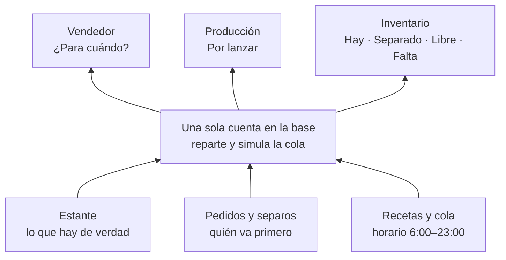

# Barrido — síntesis y caminos

2026-10-06. Junta los doce informes de `ronda-1/` y `ronda-2/` y las decisiones que el dueño tomó durante el barrido. Este es el documento que se lee primero; los informes son la evidencia.

## En una frase

Las seis miradas llegaron por separado al mismo diagnóstico. **Cada pantalla funciona sola, pero el sistema no sabe de quién es lo que hay ni para cuándo puede estar lo que falta.** Además, varios sitios escriben mal en la base todos los días, y en algunos casos eso ya está publicado.

Quien usó la aplicación sin saber nada (`1-persona-nueva`) hizo sus siete tareas con unos **130 clics, 47 dudas y 9 datos escritos dos veces**. Con lo que se propone aquí, estima unos 65 clics y 12 dudas.

## Lo que está mal y ya está publicado (toca los datos reales)

> **P1, P2 y P3 se corrigieron y publicaron el 2026-10-06** (rama `arreglo-dinero-publicado`, tres commits, y ADR-019). P4 sigue abierto y entra con `accept_quote`.

Todo esto se comprobó en `main`:

| # | Qué pasa | Dónde | Efecto en los datos del dueño |
|---|---|---|---|
| P1 | Registrar una compra no registra el pago, y Caja no deja ligar un egreso a una compra | `inventario.data.ts:624` solo escribe `purchases` y `purchase_lines` | O el saldo de la cuenta está inflado, o el pago se anotó aparte como gasto operativo y la utilidad sale baja |
| P2 | El costo de ventas se reemplaza por el de la impresión en cuanto hay **una** ligada al pedido: desaparecen dulces, frasco, empaque y mano de obra | `20261004130000_finance.sql:431` | Resultados muestra más utilidad de la real en esas ventas |
| P3 | El cotizador carga la escalera de precios y no la usa: calcula desde el costo | `cotizador.data.ts:582`, sin ningún lector de `tiers` | La misma poción sale S/ 17.00 cotizada y S/ 10.00 en el pedido |
| P4 | Una pieza a medida no cabe en un pedido: la línea exige una variante | `pedido-linea.ts:21` | Lo cotizado a medida no se puede convertir en pedido |

## Lo que está mal en la rama `nav-y-plan` (se arregla antes de publicarla)

| # | Qué pasa | Dónde |
|---|---|---|
| R1 | Cerrar una impresión mete la placa completa: salen 7 tapas de 9 y entran 9, con el costo repartido entre 9 | `units_produced` se guarda en `produccion.data.ts:414`, después del RPC de `:395`, que lo lee en `parts_and_assembly.sql:210` |
| R2 | Armar con una receta sin artículos crea unidades de la nada, a costo cero | `20261009150000_assembled_goods.sql`: `produced` no depende de que `consumed` tenga filas |
| R3 | Armar no bloquea filas: dos armados al mismo tiempo pasan la revisión de stock | Ningún `for update` en `app.assemble_product` |
| R4 | La misma impresora puede tener dos trabajos "Imprimiendo" a la vez | `produccion.data.ts:374-381` |
| R5 | `production_needs` cuenta como faltante lo que está en post-proceso o ya entregado | `20261009160000_production_needs.sql:40` |

## Los cortes del flujo

1. **Aceptar no crea el pedido** (y una pieza a medida no cabe en uno, P4).
2. **Nadie sabe de quién es lo que hay.** Los movimientos `reservation`/`release` existen, pero nadie los escribe. Cuatro pantallas le ponen cuatro nombres al mismo número.
3. **Producción ve un número, no un plan.** "Faltan 41 botellas", cuando la impresora imprime placas de piezas.
4. **Entregar no existe.** No saca nada del estante ni fija el costo de ventas. Una venta de S/ 85 quedó con S/ 2.70 de costo.

## Lo que converge

- **Una sola cuenta derivada en la base.** No se escribe ninguna reserva. Se guardan solo las decisiones: `priority_at` (quién va primero) y `hold_until` (hasta cuándo dura un separo). El resto se calcula: el reparto por prioridad, la simulación de la cola con el horario y la promesa. El vendedor y el taller leen el mismo número.
- **Funciones que cierran los cortes:**
  - `accept_quote`
  - `deliver_order`, con entregas parciales y el costo de ventas sacado de lo que salió del estante
  - `cancel_order`, con el adelanto: devolverlo, quedárselo o pasarlo a otro pedido
  - `complete_print_job` corregido
  - `register_purchase`, que registra la compra y su pago
- **Base visual común:**
  - `pp-item`: una fila de artículo con foto;
  - una cabecera de ficha con título humano y una sola acción, la siguiente;
  - una escala de letra y otra de fotos;
  - una miniatura de 256 px generada al subir cada foto;
  - la miniatura de la placa (`plate_N.png`) como foto inicial de la pieza;
  - un solo vocabulario.

## Decisiones del dueño (tomadas durante el barrido)

1. **Una pieza suelta no pasa por "Armar".** La receta dice si se arma o no.
2. **Venta y producción van por carriles distintos.** Al vender, el sistema informa y nunca bloquea: cuántas hay, cuántas hay que fabricar, si alcanza el material o qué falta, y para cuándo estaría. El vendedor decide.
3. **Opción B, en producción.** El sistema suma lo que falta de todos los pedidos cerrados y propone las placas. La persona elige impresora, rollos y orden.
4. **Horario de impresión:** una placa empieza entre las 6:00 y las 23:00 y termina antes de medianoche. Es configurable.
5. **Separo con plazo.** Una proforma o un pedido en espera aparta el material por un tiempo corto. Después se libera, y se puede acortar a cero a mano.
6. **Prioridad:** manda el que confirma primero. Se puede elegir otro pedido, con un aviso de quién hizo un separo antes.

## Lo que propongo decidir así, salvo que el dueño diga otra cosa

- **La reserva se calcula, no se escribe.** Un `check` impide escribir `reservation`/`release`, y las vistas viejas dejan de exponer `reserved` y `available` (hay que soltarlas y recrearlas).
- **Los estados del pedido se deducen.** A mano quedan solo "en espera", "cancelar" y "entregar". El botón principal de la ficha es la acción real que sigue: *Registrar adelanto*, *Armar 2*, *Entregar* o *Cobrar saldo*. Nunca "Pasar a…".
- **Producción en bolsa común.** Los trabajos de catálogo no se atan a un pedido; lo hecho a medida sí. El costo de ventas sale de la entrega. Estas dos cosas se publican juntas.
- **Foto:** la foto real manda, después la miniatura de la placa y al final un icono por tipo. Nunca la inicial. La foto no es obligatoria al crear un artículo: la fila dice "Sin foto · Agregar".
- **Tamaños:** 48 px en una fila de artículo, 40 px en un selector, 96 px en lo que está en la impresora y 240 px en la ficha. Cuadrícula donde la decisión es *cuál*; tabla donde la decisión es *cuánto*.
- **Vocabulario:** *Hay · Separado · Libre · Falta* para un artículo, y *en el estante · por armar · por imprimir* para una línea de venta. El nombre del cliente va antes que el número del documento.
- **La compra crea su egreso.** "¿Cómo pagaste?" no viene elegido de antemano, y tiene la opción "Todavía no". Caja liga egresos a compras solo para reparar lo que ya existe.
- **Rollos:** se propone el que está en la ranura del AMS, después uno abierto y al final uno sellado. Se confirman al **iniciar** la impresión, no al encolarla.
- **Por cobrar** muestra dos cifras que no se suman: lo que ya se entregó y los saldos de pedidos en curso.
- **Color solo para lo que pide hacer algo**, con una insignia de color por fila como máximo. El tono `--info` tiene que ser el mismo en todas las paletas.

## Respuestas del dueño a la síntesis (2026-10-06)

1. **Camino 1.**
2. **Se publica ya el arreglo de P1, P2 y P3**, en una rama desde `main`, antes que todo lo demás.
3. **El separo se puede fijar a mano, con día y hora concretos**, además del plazo por defecto y de "soltar ya". Por defecto vence a las 23:00 del día siguiente (lo que se recomendó; el dueño no lo objetó). Siempre se muestra como fecha y hora.
4. **El cambio de placa es variable:** otra persona retira las piezas y sus tiempos no son constantes. No se configura un número: **se mide**. El tiempo de cambio es lo que pasa entre el fin estimado de una impresión (inicio más el tiempo del archivo) y el inicio de la siguiente. No se usa el cierre, porque se registra cuando alguien lo ve, no cuando terminó. Para prometer se usa un valor que se cumpla la mayoría de las veces (por ejemplo, el percentil 75), no el promedio. Mientras no haya mediciones, se usan 15 min.
5. **Archivo real:** `Skull_-_AMS.gcode.3mf`, con 9 placas. Lo que muestra está en "Lo que enseñó el archivo real", abajo.

## Lo que enseñó el archivo real

- **Cada placa trae su miniatura** (`Metadata/plate_N.png`), de 512 × 512 px, con fondo transparente y los colores del proyecto: los ojos negros de la calavera se ven negros.
- **Las piezas ocupan entre el 19 % y el 39 % del cuadro.** Mostrada tal cual a 48 px, la calavera mediría unos 18 px. Al importarla hay que **recortarla a lo que no es transparente**, y es fácil, porque el fondo ya lo es.
- **`plate_N.json` dice qué objetos hay en cada placa, con su nombre.** La placa 6 tiene 7 `Cap` y 7 `Body1`. Con eso se pueden **proponer las unidades por corrida** al importar, en lugar del 1 fijo de hoy. Hay que descartar `wipe_tower` (la torre de purga).
- **Una placa puede producir dos piezas distintas** (la placa 6: tapas y cuerpos). **El modelo de hoy no lo admite:** `recipe_plates.produces_item_id` es una sola pieza con un solo `units_per_run`. Hay que resolverlo antes de la cuenta única, porque el plan de producción explota placas en piezas.
- **Por eso la miniatura de la placa sirve como foto de la pieza solo cuando la placa produce un solo tipo de pieza.** En las placas mixtas manda la foto que suba una persona. Hay una posibilidad que no está en el plan: `pick_N.png` es una máscara con un color por objeto, y en principio permitiría recortar una pieza sola.

## Los caminos

Los seis informes coinciden en *qué* hay que hacer. Lo que hay que decidir es **en qué orden**.

### Camino 1 — La verdad primero, después la fluidez (recomendado)

| Etapa | Qué | Qué tarea destraba | Tamaño |
|---|---|---|---|
| 0 | P1, P2 y P3, en una rama desde `main` | Que las cuentas reales cuadren desde ya | S |
| 1 | R1 a R5, `deliver_order`, la base visual y la foto de la pieza | Que el estante diga la verdad; que la rama se pueda publicar | M |
| 2 | La cuenta única: separo, prioridad, horario y promesa. Además, `accept_quote` con líneas a medida | "¿Para cuándo?" y del "sí" del cliente al pedido sin reescribir | L |
| 3 | Las pantallas que la leen: "¿Para cuándo?" en la venta, "Por lanzar" en la cola, la posición en inventario y los vencimientos en Hoy | "¿Qué imprimo ahora?" y "¿qué compro?" | L |

Las etapas 0 y 1 se pueden repartir con Codex: el trabajo en la base y el trabajo visual tocan archivos distintos.

### Camino 2 — Una venta de punta a punta

Se toma la venta de pociones y se hace entera de una vez: separo, "¿Para cuándo?", aceptar, "Por lanzar" y entregar. Después vienen las piezas a medida, y al final las compras y el dinero.

- **A favor:** se ve antes la experiencia completa.
- **En contra:** P1 y P2 siguen ensuciando los datos reales mientras tanto, y la cuenta se diseña para un solo caso y después hay que generalizarla.

### Camino 3 — Primero lo que se ve

Primero la base visual y las fotos en las 26 pantallas; después los cimientos y los flujos.

- **A favor:** el cambio se nota de inmediato.
- **En contra:** las pantallas quedan pulidas encima de un estante que miente. Cinco de los seis informes lo desaconsejan, y el visual pide su base antes de los bloques nuevos, no antes que los arreglos de datos.

## Estado de la etapa 1 (2026-10-06, noche)

Hay tres ramas en juego, ninguna publicada:

- **`etapa1-estante`**, que sale de `nav-y-plan`: la base de datos y los flujos. Dos commits, `30ed61d` (base) y `70d3323` (pantallas).
- **`etapa1-visual`**: la base visual, la hace un agente en su propio worktree (`.claude/worktrees/`). Se integra cuando termine.
- **`nav-y-plan`**: recibe las dos al final.

**Hecho y probado contra la base** (en transacciones que se deshacen, con los casos que importan y sus mensajes de error):

| | Qué | Dónde |
|---|---|---|
| R1 | Cerrar una impresión registra lo que salió de verdad, en una sola llamada (piezas, porcentaje y nota). Las piezas entran como `production` | `20261010110000_plate_outputs.sql`, `produccion.data.ts` (`outputsOf`) |
| — | Una placa produce una **lista** de piezas (`recipe_plate_outputs`). El costo se reparte por igual entre todo lo que salió | misma migración; `placa-editor.ts` y `salida-fila.ts` |
| R2, R3 | Armar rechaza una receta vacía y bloquea lo que va a consumir | `20261010130000_assembly_guards.sql` |
| — | La receta dice si el producto se arma (`recipes.assembled`). Lo que no se arma no aparece en Armar | misma migración; `receta-editor.ts` |
| R4 | Una impresora imprime una placa a la vez | `20261010120000_one_print_at_a_time.sql` |
| — | `deliver_order`: entregar saca del estante, también por partes, y guarda cuánto costó lo que salió. Lo que no se arma descuenta directo sus piezas y su empaque | `20261010140000_deliveries.sql` |
| — | "Entregado" y "Cerrado" no se alcanzan a mano mientras quede algo por entregar | `20261010150000_delivered_means_delivered.sql` |
| R5 | `production_needs` cuenta lo que falta **entregar** en todo pedido abierto, incluidos los "listos" | `20261010140000_deliveries.sql` |
| — | Movimiento `delivery` ("Entrega"), y el kardex nombra en español "Armado" y "Entrega de pedido" | `20261010100000`, `inventario.format.ts` |

**Falta para cerrar la etapa 1:**

1. **El botón "Entregar" en la ficha del pedido.** Muestra las líneas con lo pendiente, ya lleno con el total (lo parcial a un clic), y debajo la historia de entregas. Al terminar ofrece cobrar el saldo. El paso a "Entregado" pasa por `deliver_order`: la base ya rechaza hacerlo a mano.
2. **Cerrar una placa mixta pieza por pieza,** con la foto de cada pieza. Hoy el formulario pide un solo número, y en una placa mixta cuenta el rendimiento completo.
3. **Importar el `.gcode.3mf` como corresponde:** la miniatura `Metadata/plate_N.png` recortada a lo que no es transparente y guardada en `recipe_plates.thumbnail_path`; y las piezas y cantidades propuestas a partir de `Metadata/plate_N.json` (`bbox_objects[].name`, descartando `wipe_tower`).
4. **Verificar en la aplicación** el editor de placas con su lista, la pregunta "¿Cómo se entrega?" y el cierre de 7 tapas de 9. *Hecho en el navegador el editor de placas (guardar una salida) y «¿Cómo se entrega?» (la variante sale de «Armar» y vuelve). El cierre se verifica cuando entre el trabajo del agente B, que rehace ese formulario.*
5. **Integrar `etapa1-visual`.** Va a chocar en las plantillas de `pedidos/pedido.page.ts`, `produccion/` y quizás `inventario.format.ts`.
6. *Hecho:* ADR-020, `docs/03` y las trampas en `AGENTS.md`. **Documentar:** un ADR-020 con las decisiones de la etapa (lista de piezas por placa, reparto del costo por igual, cómo se valoriza lo entregado, `recipes.assembled`, la regla de "entregado"), el modelo de datos en `docs/03` y las trampas nuevas en `AGENTS.md`.

**Trampas nuevas que hay que pasar a `AGENTS.md`:**

- `sum()` de un `bigint` devuelve `numeric`, y recrear una vista con ese cambio de tipo falla. Hay que castear.
- La prueba de sintaxis de SQL parte por cada `;`: un punto y coma dentro de un comentario `/* … */` la rompe.
- Una tabla temporal dentro de una función que llama la API depende de permisos del proyecto alojado. Mejor una variable `jsonb`.
- En una prueba, una consulta de afuera no ve lo que una función creó o cambió dentro de la misma instrucción. Hay que leerlo en otra.
- Mientras existan worktrees de agentes, las pruebas de la raíz se corren con `pnpm exec vitest run --exclude "**/.claude/**" --exclude "**/node_modules/**" --exclude "**/dist/**" --exclude "apps/**"`.

## La etapa 1, cerrada (2026-10-06, noche)

Todo está integrado en `etapa1-estante`, con 188 pruebas de la raíz y 268 de la aplicación en verde y el build compilando. Tres agentes trabajaron en paralelo y yo revisé e integré cada rama:

| Rama | Qué trajo | Verificado |
|---|---|---|
| `etapa1-entregar` (agente A) | «Entregar» en la ficha: lo pendiente ya lleno, por partes, la historia de entregas y el cobro que sigue. «Pasar a Entregado» ya no ofrece un paso que la base rechaza | En el navegador y en la base: entrega parcial, el resto, los dos rechazos y el cobro |
| `etapa1-placas` (agente B) | Cierre pieza por pieza con foto. Al importar el `.gcode.3mf`, la vista recortada de cada placa, «El archivo dice: Cap ×7, Body1 ×7» y las piezas propuestas. Los productos por corrida salen de las piezas confirmadas (7, no 14 ni 1) | Con el archivo real de la calavera: la placa 6 se cerró con 7 tapas y 6 cuerpos, y entraron 7 y 6 |
| `etapa1-visual` (agente visual) | Miniatura de 256 px, una sola escala de fotos, ícono por tipo en vez de la inicial, `pp-item`, `pp-resource-header`, selectores con foto y utilidades globales | En el navegador a 1100 y 375 px, en oscuro y en claro |
| `etapa1-estante` (yo) | «Contar el estante» (`count_shelf`), decidido por el dueño para el arranque. «Entregar» como acción principal de la ficha. «Hoy» en hora de Lima en cinco lugares | En el navegador y en la base; los datos de prueba se borraron |

**Para publicar** (lo decide el dueño):

1. Llevar `etapa1-estante` a `nav-y-plan`, y `nav-y-plan` a `main`.
2. Aplicar en el proyecto alojado **25 migraciones**, de `20261007100000_opportunities` a `20261010160000_shelf_count`, siempre primero con `--dry-run`. Van antes que la web.
3. **Contar el estante una vez**, antes de entregar el primer pedido: los pedidos abiertos de hoy se trabarían con «No alcanza para entregar» porque el estante de la aplicación no sabe lo que el taller ya tiene hecho.
4. Volver a importar los `.gcode.3mf` de las recetas que ya existen, si se quieren la miniatura de cada placa y las piezas propuestas: no se rellenan hacia atrás.

**Pendientes menores que dejaron los agentes:**

- `catalogo.data.ts` (`fail()`) tapa los mensajes `P0001` de la base con uno genérico, contra lo que pide AGENTS.md.
- Una receta «no se arma» sin ítems se entrega sin mover nada y con costo nulo.
- «Crear trabajo» sigue apareciendo en un pedido ya entregado.
- La traducción que propone piezas al importar (`importacion.ts`) es una lista corta escrita a mano. Aprende de lo que la persona confirma.
- El selector todavía no permite crear un artículo desde ahí.
- Unas 150 declaraciones `font-size` sueltas en `features/` todavía no usan los tokens nuevos.
- En Safari, `canvas.toBlob(…, 'image/webp')` devuelve PNG, pero se sube etiquetado como WebP. Ya pasaba antes.
- El paquete inicial pesa 506 kB y el presupuesto es de 500 kB. Ya se pasaba antes; los 3 kB nuevos son el CSS de la base visual.

**Lo que sigue en el camino 1:** la etapa 2 (la cuenta única con separo, prioridad, horario y promesa) y la etapa 3 (`accept_quote` con líneas a medida, «¿Para cuándo?» y «Por lanzar»).
